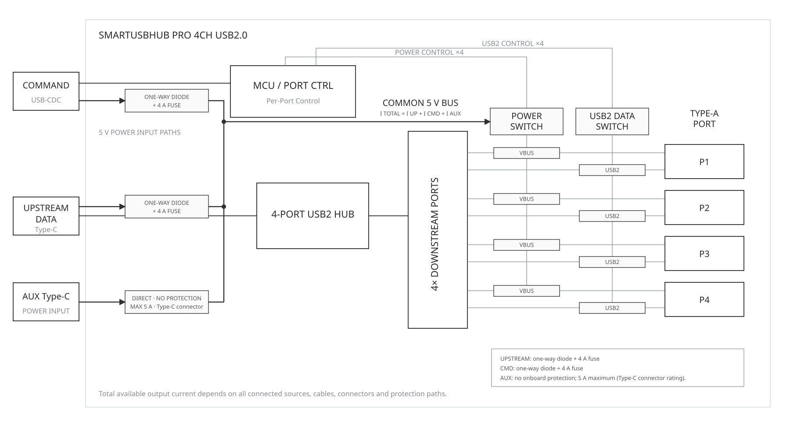
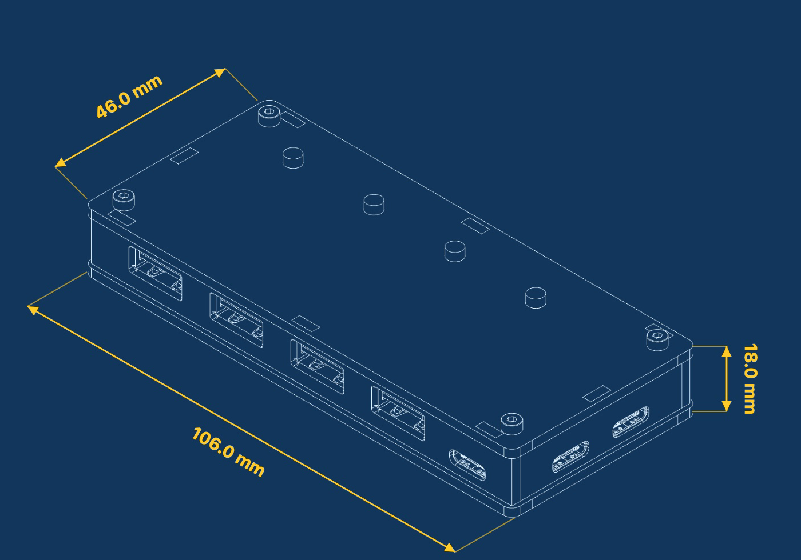

# SmartUSBHub Pro 4CH USB2.0 Technical Specifications

[简体中文](./datasheet_cn.md)

[Download PDF](./downloads/datasheet-en.pdf)

| Document item | Details |
| --- | --- |
| Applicable product | SmartUSBHub Pro 4CH USB2.0 |
| Order codes | `HBP_USB2_4CH`, `HBP_USB2_4CH_PSU` |
| Document version | v1.0 |
| Release date | 2026-07-23 |

## 1 Product Overview

SmartUSBHub Pro 4CH USB2.0 is a four-port programmable USB 2.0 High-Speed hub. It independently controls VBUS and USB 2.0 D+ / D- on every downstream port and measures each channel's VBUS voltage and output current. It is designed for R&D debugging, automated testing, production validation and remote USB device management.

### 1.1 Model Differences

| Variant | Order code | Voltage/current measurement | Included power supply |
| --- | --- | --- | --- |
| Standard | `HBP_USB2_4CH` | Yes | Not included |
| Power-adapter bundle | `HBP_USB2_4CH_PSU` | Yes | 5 V / 2 A |

### 1.2 Key Features

- Four USB-A downstream ports with independent VBUS and D+ / D- control.
- USB 2.0 High-Speed link rate up to 480 Mbps; compatible with Full-Speed, Low-Speed and USB 1.1 devices.
- MTT architecture with an independent transaction translator for each downstream port.
- Independent VBUS voltage and output-current measurement on every channel.
- USB BC 1.2 CDP support with up to 1.5 A charging current per port; QC, USB PD and other fast-charging protocols are not supported.
- Normal mode, interlock mode, configurable power-on defaults and state restoration after power loss.
- Four local channel-control buttons.

## 2 System Architecture

### 2.1 System Block Diagram

The DATA port carries USB traffic between downstream devices and the host. The CMD port enumerates as a USB CDC serial interface and receives control commands. DATA, CMD and AUX POWER can all feed the internal 5 V rail.

### 2.2 Interfaces and Indicators

| Interface or component | Quantity | Function |
| --- | ---: | --- |
| USB-C DATA | 1 | Connects to the USB host and carries downstream-device data |
| USB-C CMD | 1 | Connects to the control host and provides the USB CDC command interface |
| USB-C AUX POWER | 1 | Accepts a protected external 5 V DC supply |
| USB-A downstream ports | 4 | Connect controlled USB devices |
| Channel buttons | 4 | Control the corresponding channels |
| Status indicator | 1 | Indicates device operation and command processing |
| Channel indicators | 4 | Indicate the VBUS state of the corresponding channels |

## 3 Functional Specifications

### 3.1 USB Data Path

| Parameter | Specification |
| --- | --- |
| USB standard | USB 2.0 High-Speed |
| Maximum link rate | 480 Mbps |
| Compatible speeds | Full-Speed 12 Mbps, Low-Speed 1.5 Mbps, USB 1.1 |
| Upstream data port | 1 × USB-C |
| Downstream ports | 4 × USB-A |
| Hub architecture | MTT, independent TT for every downstream port |

### 3.2 Channel Control

| Parameter | Specification |
| --- | --- |
| Channel numbers | CH1–CH4 |
| VBUS control | Independent on every downstream port |
| D+ / D- control | Independent on every downstream port |
| Power/data relationship | USB data can be disconnected while VBUS remains powered |
| Batch control | Supported |
| Normal mode | Supported |
| Interlock mode | Supported; only one channel can be enabled at a time |
| Power-on default state | Configurable |
| State restoration after power loss | Configurable |

### 3.3 Charging and Output Path

| Parameter | Specification |
| --- | --- |
| Charging protocol | USB BC 1.2 CDP |
| BC 1.2 charging current | Up to 1.5 A per port |
| Per-channel output-path capability | Up to 4 A; this is not a guaranteed charging current |
| Other fast-charging protocols | QC, USB PD and other fast-charging protocols are not supported |

### 3.4 Voltage and Current Measurement

| Measurement | Range | Resolution | Accuracy |
| --- | --- | --- | --- |
| VBUS voltage | 0–5.5 V per channel | 1.48 mV | ±(0.91% × reading + 36 mV) |
| Output current | 0–4.0 A per channel | 1.15 mA | ±(2.5% × reading + 50 mA) |

## 4 Electrical Specifications

:::{admonition} Warning: input overvoltage can cause overheating or fire
:class: warning

Only connect a regulated 5 V DC supply to any power input. No input may exceed 5.5 V. Never use a PD trigger, boost cable or other method to apply 9 V, 12 V, 15 V or 20 V to AUX POWER.
:::

| Parameter | Minimum | Typical | Maximum | Unit | Notes |
| --- | ---: | ---: | ---: | --- | --- |
| 5 V input voltage | 4.75 | 5.00 | 5.25 | V | Recommended operating range |
| Absolute maximum input | 0 | - | 5.5 | V | Applies to all power inputs |
| Downstream-port VBUS | 4.5 | 5.0 | 5.5 | V | Without overload |
| Total input current | - | - | <10 | A | Sum of DATA, CMD and AUX POWER currents |
| Per-channel output-path capability | - | - | 4 | A | Does not represent charging-protocol current |
| Included adapter output | - | 2 | - | A | Shared by all four ports |

:::{admonition} Important: size the power supply for the actual load
:class: important

If four devices each draw the USB BC 1.2 CDP maximum of 1.5 A, the theoretical load is approximately 5 V / 6 A. The combined capacity of the three power inputs must cover the actual load, and total input current must remain below 10 A.
:::

## 5 Protection and Safety Limits

| Item | Specification |
| --- | --- |
| DATA and CMD power paths | Reverse-current, overvoltage and overcurrent protection |
| Downstream ports | Resettable fuse on every port |
| AUX POWER | No independent onboard overcurrent protection; the external supply must provide current limiting and short-circuit protection |
| Input voltage | Regulated 5 V DC only; 5.5 V absolute maximum |

- The 4 A per-channel rating is the output-path capability, not a guaranteed charging current.
- USB BC 1.2 CDP charging current is limited to 1.5 A per port.
- Available output current depends on the supply, cables, connectors, ambient temperature and cooling.
- Turning off VBUS or D+ / D- is equivalent to unplugging a device. Stop file writes, firmware updates and other non-interruptible operations first.

## 6 Mechanical and Environmental Specifications

| Parameter | Specification |
| --- | --- |
| Dimensions | 106 mm × 46 mm × 18 mm |
| Device weight | 52 g |
| Enclosure material | PMMA |
| Mounting | Supports stacked mounting with standoffs |
| Operating temperature | 0–50 °C, non-condensing |
| Storage temperature | -10–85 °C, non-condensing |

## 7 Related Documentation

| Document | Link |
| --- | --- |
| SmartUSBHub Pro 4CH USB2.0 User Manual | [View manual](./user_guide.md) |
| SmartUSBHub communication protocol | [View documentation](../../protocol.md) |
| SmartUSBHub documentation center | [View documentation](../../README.md) |
| SmartUSBHub Python library guide | [View documentation](../../../README.md) |
