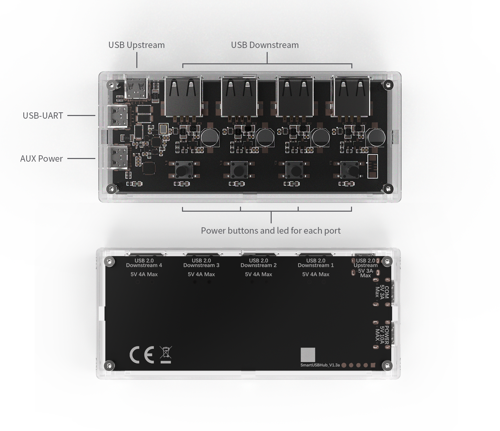
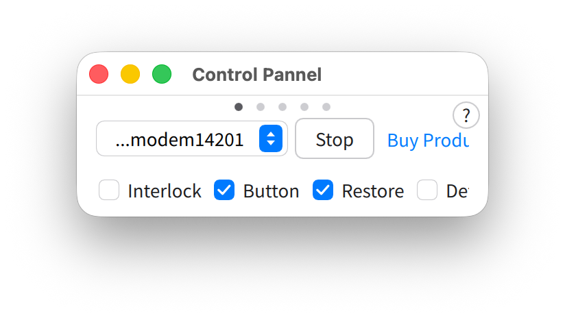
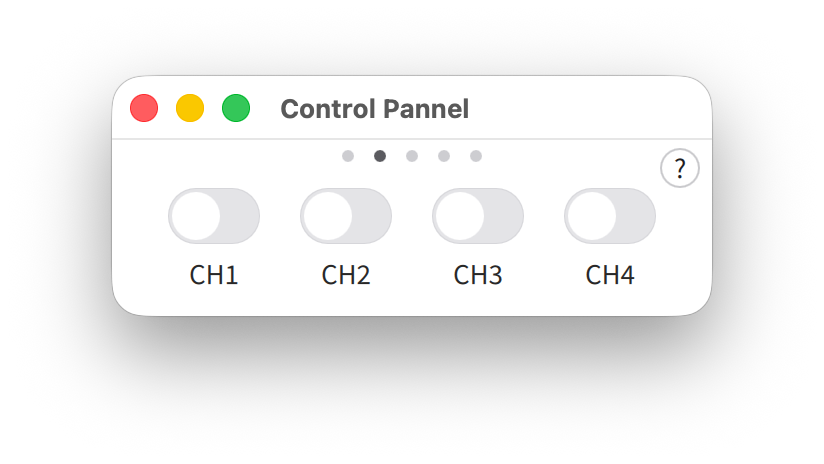
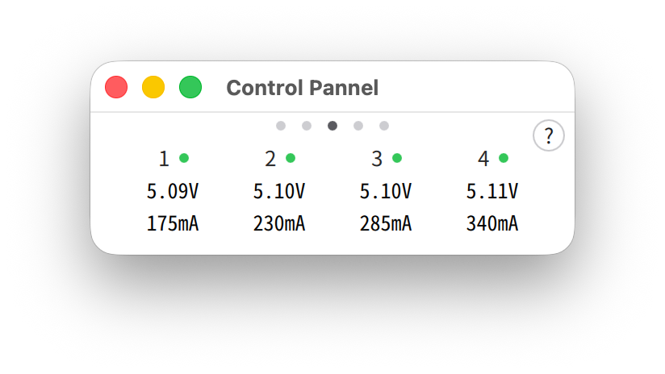
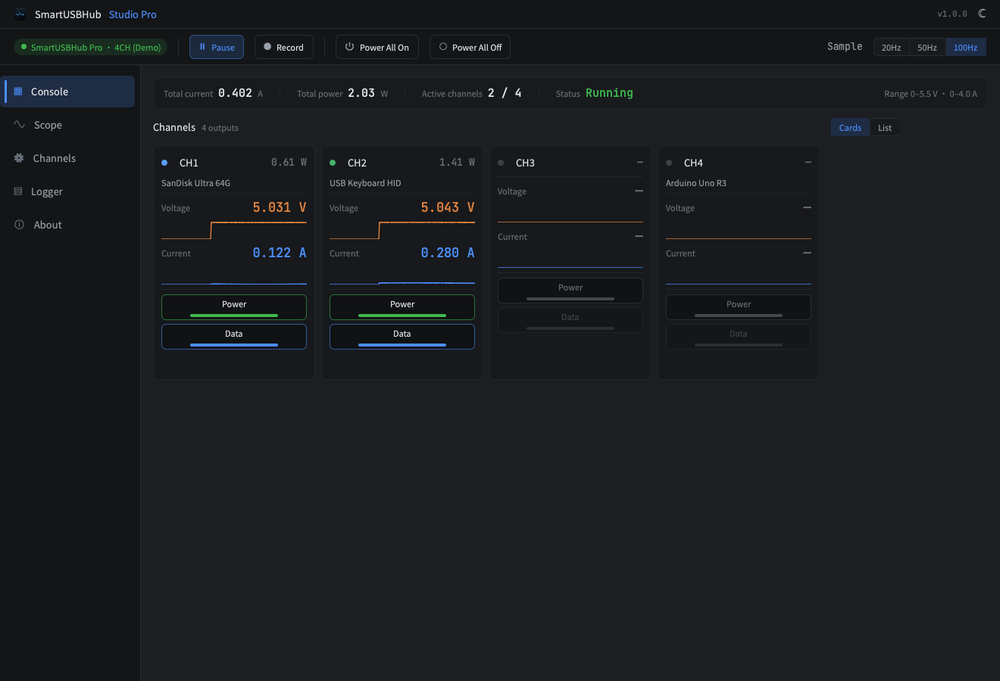

# SmartUSBHub Pro 4CH USB2.0

[Download PDF](./downloads/user-guide-en.pdf)


:::{admonition} NOTE: Quick start
:class: note

Before first use, read Chapters 2, 3, 5 and 6 in order. If a fault occurs, stop the affected operation and refer to Chapter 10.
:::


## 1 About This Manual


### 1.1 Purpose and scope

This manual applies to SmartUSBHub Pro 4CH USB2.0. HBP_USB2_4CH and HBP_USB2_4CH_PSU provide the same functions; the PSU version includes a 5 V / 2 A power adapter.


### 1.2 Intended readers


| Reader | Expected knowledge | Permitted tasks |
| --- | --- | --- |
| Operator | Basic USB identification and electrical-safety awareness | Connect devices, use buttons and observe LEDs |
| R&D / test engineer | USB, serial communication and automation scripts | Configure ports, read measurements and use the SDK/protocol |
| System integrator | Power-budget calculation and test-topology design | Product selection, installation and multi-device integration |
| Service technician | Manufacturer authorization and electronics-service skills | Service only within the manufacturer-authorized scope |


### 1.3 Document conventions


:::{admonition} WARNING: Personal and equipment safety
:class: warning

Failure to comply may cause personal injury, fire or serious equipment damage.
:::


:::{admonition} CAUTION: Product and data protection
:class: caution

Failure to comply may damage the product, the device under test or data.
:::


:::{admonition} NOTE: Additional information
:class: note

Information that helps you use the product correctly and efficiently.
:::


:::{admonition} EXPECTED RESULT: Operation confirmation
:class: note

The state that should be observed after a step, confirming that the operation succeeded.
:::


### 1.4 Document and product versions

Before use, check the product label, order code, hardware version and firmware version. For communication commands, use the released protocol document that matches the installed firmware.


## 2 Safety Information


### 2.1 Intended use

This product is intended for indoor management of USB 2.0 devices. Buttons or software can independently control VBUS and D+ / D- on four downstream ports and read the voltage and current of each port.


### 2.2 Reasonably foreseeable misuse

- Connecting a supply above 5.5 V, or an unstable supply without current limiting.

- Treating the 4 A per-channel output-path capability as guaranteed charging current.

- Disconnecting power or data during file writes, firmware programming or device updates.

- Using the product in wet, condensing, conductive-dust or flammable environments.

- Touching exposed circuitry with metal objects, or modifying the product.

- Operating near or above 10 A total input current, or using underrated supplies, cables or connectors.


:::{admonition} WARNING: Input overvoltage can cause overheating or fire
:class: warning

Connect only regulated 5 V DC supplies. The voltage at every power input must remain at or below 5.5 V. Check the supply label and actual output before connection.
:::


:::{admonition} WARNING: Do not apply any voltage other than 5 V to AUX POWER
:class: warning

AUX POWER accepts nominal 5 V DC only. Never use a PD trigger, boost cable or other method to apply 9 V, 12 V, 15 V or 20 V; an incorrect voltage can damage SmartUSBHub and connected devices.
:::


:::{admonition} CAUTION: Use a protected 5 V supply on AUX POWER
:class: caution

AUX POWER has no independent overcurrent protection. Use a qualified 5 V supply with current limiting and short-circuit protection.
:::


:::{admonition} CAUTION: Keep liquids and conductive debris out
:class: caution

Liquid or metal debris can cause a short circuit or malfunction. If liquid ingress, odor, smoke or abnormal heating occurs, disconnect DATA, CMD and AUX POWER immediately, stop use and contact support.
:::


:::{admonition} CAUTION: Disconnection can corrupt data or firmware
:class: caution

Turning off VBUS or D+ / D- is equivalent to unplugging the device. Stop file writes, firmware updates and other non-interruptible tasks first.
:::


### 2.3 User responsibilities

- Use 5 V supplies and cables rated for the planned load.

- Confirm that the device under test can stop safely before disconnecting port power or data.

- For unattended operation, add fault detection and automatic stop conditions to test scripts.

- Use voltage and current readings for observation and troubleshooting only; they are not medical, safety or legal-metrology measurements.


## 3 Product Description


### 3.1 Functions

- Four USB-A downstream ports supporting USB 2.0 High-Speed at 480 Mbps.

- Independent VBUS and USB 2.0 D+ / D- control for every port.

- Independent VBUS voltage and output-current sensing for every port.

- Normal mode for independent channels; Interlock mode permits only one active channel at a time.

- USB CDC command control on Windows, macOS and Linux.

- Configurable power-on defaults, power-loss state restore and device address.




Figure 3-1 Product interface overview


### 3.2 System block diagram


Figure 3-2 System block diagram


### 3.3 Interfaces and controls


| No. | Name | Purpose |
| --- | --- | --- |
| 1 | Channel buttons | Short press toggles VBUS on the corresponding downstream port. |
| 2 | Channel LEDs | Indicate VBUS state for each port. |
| 3 | Status LED | Indicates normal operation, identification and command processing. |
| 4 | AUX POWER | Connect a regulated 5 V supply with current limiting and short-circuit protection. |
| 5 | CMD port | Connect to the host; enumerates as a USB CDC serial port. |
| 6 | USB 2.0 DATA upstream port | Connect to a USB host to provide a data path for the four downstream devices. |
| 7 | USB-A downstream ports | Connect controlled USB devices; numbered CH1-CH4. |


## 4 Unpacking, Transport and Storage


### 4.1 Package contents


| Order code | Product | Power adapter |
| --- | --- | --- |
| HBP_USB2_4CH | SmartUSBHub Pro 4CH USB2.0 | Not included |
| HBP_USB2_4CH_PSU | SmartUSBHub Pro 4CH USB2.0 | 5 V / 2 A |

Ordering: [Official Taobao product page](https://item.taobao.com/item.htm?id=687666588208)

USB cables and accessories are supplied according to the order and packing list. If anything is missing, wet or damaged in transit, do not apply power; keep the packaging and contact sales or technical support.


### 4.2 Inspection

- Check the enclosure, connectors and circuit board for cracks, deformation, foreign matter or liquid.

- Check USB connectors for bent or loose contacts and possible shorts.

- Verify that each supply is rated 5 V DC and includes current limiting and short-circuit protection.

- Verify that cable current ratings meet the planned load.


### 4.3 Storage and transport

Storage temperature: −10–85 °C, non-condensing. Protect the product against moisture, electrostatic discharge and impact. After moving it from a cold environment, wait until all condensation has evaporated before applying power.


## 5 Installation and Connection


### 5.1 Installation conditions

- Indoor, dry, non-condensing environment; operating temperature 0–50 °C.

- Stable, insulated surface without significant vibration.

- No strain on connectors or cables; leave space for inspection and heat dissipation.

- Do not cover the product or place it near heat sources, liquids or flammable materials.


### 5.2 Calculate the power budget

The product may be powered through the USB 2.0 DATA upstream port, the CMD port and AUX POWER. The current available to the four downstream ports depends on the total continuous current that these three inputs can actually supply.

- Maximum output-path capability is 4 A per downstream port.

- Keep the combined current through all three inputs below 10 A.

- No input or output branch may exceed the rating of its supply, cable or connector.

- With only the included 5 V / 2 A adapter connected, less than 2 A is available to the four downstream ports after product consumption and conversion losses.


:::{admonition} NOTE: USB BC 1.2 CDP
:class: note

A Charging Downstream Port allows a device to draw power while maintaining USB data. This product supports up to 1.5 A per port under BC 1.2 CDP; QC and USB PD fast charging are not supported.
:::


:::{admonition} CAUTION: Size the supply for the actual load
:class: caution

The 4 A figure is output-path capability, not guaranteed charging current. Four devices drawing 1.5 A each require about 5 V / 6 A. Ensure the three inputs can supply the load while total input current remains below 10 A.
:::


:::{admonition} NOTE: Recommended high-current supply
:class: note

For higher power, the Raspberry Pi 45W USB-C Power Supply can provide up to 5 A at 5.1 V. Use its USB-C output directly; never use a PD trigger to request 9 V, 12 V, 15 V or 20 V.
:::

Product information: [Raspberry Pi 45W USB-C Power Supply](https://www.raspberrypi.com/products/45w-power-supply/)


Figure 5-1 Raspberry Pi 45W USB-C Power Supply (source: Raspberry Pi)


:::{admonition} WARNING: External power must not exceed 5.5 V
:class: warning

Confirm the supply output before connection. Never apply more than 5.5 V to AUX POWER.
:::


### 5.3 Standard connection

1. Confirm that the product, host and all downstream devices are safe to connect.

2. Connect the USB 2.0 DATA upstream port to the host.  
Expected result: The host detects a generic USB hub and downstream devices can enumerate through it.

3. Connect the CMD port to the host.  
Expected result: A USB CDC serial port appears: normally COMx on Windows and a device file on macOS/Linux.


:::{admonition} WARNING: Check the supply before connecting AUX POWER
:class: warning

Confirm that output is regulated 5 V and never above 5.5 V. Do not use a PD trigger or boost cable.
:::

4. If the load exceeds the host USB power capability, connect a regulated 5 V supply with current limiting and short-circuit protection to AUX POWER.

5. Connect downstream devices to CH1-CH4 one at a time and watch for abnormal heating, disconnection or overcurrent.


:::{admonition} NOTE: Two host-side connections are required
:class: note

For simultaneous USB data transfer and software control, connect both DATA and CMD to the host.
:::


## 6 First Use


### 6.1 Initial button check

1. Complete the Chapter 5 connections and confirm that the status LED flashes at the normal rate.  
Expected result: The product is operating normally.

2. Short-press the CH1 button.  
Expected result: The CH1 LED turns on and CH1 VBUS is enabled.

3. Confirm that the host recognizes the USB device connected to CH1.

4. Short-press the CH1 button again.  
Expected result: The CH1 LED turns off; the downstream device loses power and disconnects from the USB bus.

5. Repeat the check for the remaining channels.


### 6.2 Connect control software or the Python library

CMD uses USB CDC. Windows 10/11, macOS and common Linux distributions require no dedicated driver. Windows 7 and earlier require the CDC driver. On first connection, read the hardware version, firmware version and port state before sending control commands.

Windows 7: [Download SmartUSBHub Windows 7 CDC Driver Installer 1.0.0](https://update.mixedsignallab.com/downloads/driver/SmartUSBHub_Windows7_CDC_Driver_Setup-1.0.0.exe)


| Platform | Example device name | Notes |
| --- | --- | --- |
| Windows 10/11 | COMx | Find the port number in Device Manager. |
| macOS | /dev/cu.usbmodem\* | The exact name is assigned by the operating system. |
| Linux | /dev/ttyACM\* | The user account may require serial-port permission. |


:::{admonition} CAUTION: Confirm the target device
:class: caution

When multiple SmartUSBHub units are connected, read and verify the device address or serial information before switching any port off.
:::


## 7 Routine Operation


### 7.1 Port-state combinations


| VBUS | D+ / D- | Effect | Typical use |
| --- | --- | --- | --- |
| On | Connected | Device is powered and communicates with the host | Normal operation |
| On | Disconnected | Device remains powered but is removed from the USB bus | Simulate data unplug while retaining power |
| Off | Auto-disconnected | Firmware disconnects data when VBUS is turned off | Power-cycle reset or simulate full unplug |


### 7.2 Normal mode

Normal mode is the default. CH1-CH4 can be enabled or disabled independently.


### 7.3 Interlock mode

Interlock mode permits only one active channel at a time. Hold Button 1 for three seconds to switch between Normal and Interlock modes, or read and set the mode through software or the API. The setting is retained. In Interlock mode, use the interlock command or its software/API equivalent to control channel power.


### 7.4 Power-on defaults and power-loss state restore

Power-on defaults define channel state at startup. Power-loss state restore returns channels to the state that existed before power was lost. If both features are enabled, the power-on defaults take priority. Validate restart behavior before unattended use so that connected equipment cannot start unexpectedly.


### 7.5 Voltage and current monitoring

Use port voltage and current readings for trend observation and troubleshooting. Cable drop, load changes and measurement accuracy affect the result. Use a calibrated instrument for acceptance decisions.


## 8 Software and Programming Control


### 8.1 Select a control method


| Method | Users | Main purpose |
| --- | --- | --- |
| Control Pannel | Operators and debug engineers | Connect to devices, control ports, view voltage/current, configure modes and update firmware. |
| Studio Pro | R&D, test and device-management teams | Multi-device control, live waveforms, logging, settings and firmware updates. |
| Python API | R&D, test and system integrators | Integrate port control and measurement into scripts, test platforms and production systems. |
| USB CDC protocol | Developers using other languages or custom drivers | Send protocol frames and access low-level device commands. |


### 8.2 Control Pannel

Control Pannel is the lightweight SmartUSBHub desktop application. Connect both CMD and DATA, then start the application; it normally discovers and connects automatically. Use the dots at the top of the window, or swipe horizontally, to move between Connection/Settings, Control, Monitor and Information pages.




Figure 8-1 Control Pannel connection/settings page




Figure 8-2 Control Pannel control page




Figure 8-3 Control Pannel voltage/current monitor

- Enable or disable channels on the Control page; disabling a channel disconnects both power and data.

- Configure Interlock mode, physical-button control, power-loss state restore and power-on defaults on Connection/Settings.

- View per-channel voltage and current on the Monitor page.

- Verify hardware version, firmware version, device address and current mode on Information.

- Check application and device-firmware updates on Software.

Downloads and separate software manuals: [MixedSignalLab software page](https://www.mixedsignallab.com/software.html)


:::{admonition} CAUTION: Keep the connection active during update
:class: caution

When Control Pannel updates firmware, do not disconnect CMD, close the application or allow the computer to sleep.
:::


### 8.3 Studio Pro

Studio Pro is intended for R&D and automated testing. It adds multi-device management, independent power and data control, live measurements and waveforms, data logging, device settings, firmware updates and software updates. After automatic discovery, verify the model, hardware version and firmware version before performing control or update operations.




Figure 8-4 Studio Pro console


### 8.4 Python API quick example

The Python API is intended for automation. The package name is smartusbhub. Confirm the target device and channel before issuing control commands.

1. Install the library:

pip install smartusbhub

2. Run this example to connect the first available unit, enable CH1, read voltage/current and release the serial port:


```python
from smartusbhub import SmartUSBHub

# Scan and connect to the first available SmartUSBHub
hub = SmartUSBHub.scan_and_connect()
if hub is None:
    raise RuntimeError("SmartUSBHub not found")

try:
    # Enable CH1 power; firmware also connects its data lines
    hub.set_channel_power(1, state=1)
    voltage_mv = hub.get_channel_voltage(1)
    current_ma = hub.get_channel_current(1)
    if voltage_mv is None or current_ma is None:
        raise RuntimeError("Failed to read CH1 measurements")
    print(f"CH1: {voltage_mv / 1000:.3f} V, {current_ma} mA")
finally:
    hub.disconnect()
```


| API | Purpose |
| --- | --- |
| scan_and_connect() | Scan and connect to the first available device. |
| set_channel_power(\*channels, state) | Enable or disable power on selected channels. |
| set_channel_usb2_dataline(\*channels, state) | Connect or disconnect USB 2.0 data lines. |
| get_channel_voltage(channel) | Read voltage on one channel. |
| get_channel_current(channel) | Read current on one channel. |
| disconnect() | Close the control connection and release the serial port. |

[Full API reference, parameters, return values and examples](https://www.mixedsignallab.com/docs/software/python-library.html)


### 8.5 Minimal serial-byte example

CMD is a 115200-baud USB CDC serial port. This 6-byte V1 frame enables CH1 power; a valid device echoes the same bytes:


```text
55 5A 01 01 01 03
```


| Bytes | Meaning |
| --- | --- |
| 55 5A | V1 frame header |
| 01 | Channel-power command |
| 01 | CH1 bit mask |
| 01 | Enable |
| 03 | Checksum: 01 + 01 + 01 |


```python
import serial

# Replace COM3 with the actual CMD serial-port name
with serial.Serial("COM3", 115200, timeout=1) as port:
    port.write(bytes.fromhex("55 5A 01 01 01 03"))
    response = port.read(6)
    print(response.hex(" "))
```


:::{admonition} NOTE: Protocol compatibility
:class: note

This is only the simplest V1 frame. Batch measurement, names and streaming use other frame formats. Use the communication protocol that matches the installed firmware.
:::


### 8.6 Communication interface


| Item | Value |
| --- | --- |
| Interface | USB CDC virtual serial port |
| Baud rate | 115200 baud |
| Control model | Request-response command frames |
| Python package | smartusbhub |
| Complete command set | [Open the SmartUSBHub communication protocol](https://www.mixedsignallab.com/docs/) |


### 8.7 Recommended control sequence

1. Discover and open the device.

2. Query hardware version, firmware version and device address.

3. Read the operating mode and current port states.

4. Confirm that the target channel and device may be powered off or disconnected.

5. Send the command and validate the response.

6. Read back the state to confirm completion.

7. On failure, record time, command, response, versions and connection topology.


### 8.8 Safety in automated systems

- Specify the exact target device and channel for every power or data disconnection.

- Use a software interlock to prevent power-off during critical writes or updates.

- Set a cycle count, minimum interval and stop conditions for repetitive power cycling.

- Monitor sustained overcurrent, undervoltage, disconnects and temperature rise, and stop safely.

- Log at least device identity, firmware version, commands, responses and timestamps.


## 9 Maintenance and Firmware Upgrade


### 9.1 Cleaning

1. Disable all channels and stop related tasks on the host and devices under test.

2. Disconnect DATA, CMD, AUX POWER and all downstream devices.

3. Wipe the exterior with a dry, soft, lint-free cloth; remove dust near connectors with dry low-pressure air.

4. Reconnect only after the product is completely dry and the connectors are free of debris.


:::{admonition} WARNING: Do not clean while powered
:class: warning

Do not apply liquid cleaners or use strong solvents that can damage the PMMA enclosure.
:::


### 9.2 Periodic inspection

- Loose, deformed or discolored connectors.

- Damaged or abnormally hot power and USB cables.

- Cracks, liquid or conductive debris on the enclosure or circuit board.

- Frequent disconnects, overcurrent or abnormal voltage drop with a known load.


### 9.3 Firmware upgrade

1. Stop all writes and updates on downstream devices and keep the SmartUSBHub CMD connection active.

2. Open Control Pannel or Studio Pro, connect the target and verify hardware and firmware versions.

3. Select firmware update and install the firmware that matches the product.

4. After restart, wait for reconnection, verify the firmware version and test buttons, ports and communication.


:::{admonition} WARNING: Maintain power during upgrade
:class: warning

Do not disconnect CMD or power and do not allow the host to sleep. Incorrect firmware or an interrupted update can prevent normal startup.
:::


## 10 Troubleshooting


| Symptom | Possible cause | Corrective action |
| --- | --- | --- |
| Host cannot detect a downstream device | DATA not connected; data lines disabled; charge-only or faulty cable | Connect DATA, check D+ / D- state and try a known-good data cable. |
| CMD serial port is missing | CMD not connected; permission issue; legacy-system driver missing | Reconnect CMD and check Device Manager/device files. For Windows 7, use the driver link in 6.2. |
| Port LED is on but device does not work | Insufficient power; data disconnected; device-driver fault | Check power budget and port voltage, connect data, and test the device directly on the host. |
| Hub disconnects as load increases | Host USB power is insufficient or cable voltage drop is excessive | Add a protected 5 V supply, reduce the load, or use a shorter higher-current cable. |
| Normal-mode control command has no effect | Product is in Interlock mode | Read the mode, use an Interlock command or return to Normal mode. |
| Measurements appear incorrect | Load variation, cable drop or accuracy expectation | Reduce the load, check contacts and verify with a calibrated instrument. |
| Abnormal heat, odor or smoke | Overvoltage, short circuit, overload or hardware damage | Disconnect all power immediately. Do not reapply power; contact technical support. |


### 10.1 Information to record before service

- Product model, order code and hardware version.

- Firmware, operating-system and control-software versions.

- Connection topology, cables, supply model and load.

- Time of failure, reproduction steps, commands and responses.

- LED state and, when safe, photographs or video.


## 11 Technical Specifications


### 11.1 USB and control


| Parameter | Specification |
| --- | --- |
| Downstream ports | 4 × USB-A |
| DATA upstream | 1 × USB-C |
| CMD port | 1 × USB-C, USB CDC |
| USB speed | High-Speed 480 Mbps; compatible with 12 Mbps, 1.5 Mbps and USB 1.1 |
| Hub architecture | MTT, one independent TT per port |
| Port control | Independent VBUS and D+ / D- per channel |
| Charging | USB BC 1.2 CDP, up to 1.5 A per port; no QC/PD |


### 11.2 Electrical specifications


| Parameter | Min. | Typ. | Max. | Unit | Notes |
| --- | --- | --- | --- | --- | --- |
| 5 V input voltage | 4.75 | 5.00 | 5.25 | V | Recommended operating range |
| Absolute maximum input | 0 | - | 5.5 | V | Must not be exceeded |
| Downstream VBUS | 4.5 | 5.0 | 5.5 | V | Not overloaded |
| Total input current | - | - | <10 | A | Sum of all three inputs |
| Per-channel output path | - | - | 4 | A | Not guaranteed charging current |
| Included adapter output | - | 2 | - | A | PSU model only |


### 11.3 Measurement specifications


| Quantity | Range | Resolution | Accuracy |
| --- | --- | --- | --- |
| VBUS voltage | 0–5.5 V/channel | 1.48 mV | ±(0.91% × reading + 36 mV) |
| Output current | 0–4.0 A/channel | 1.15 mA | ±(2.5% × reading + 50 mA) |


### 11.4 Mechanical and environmental


| Parameter | Specification |
| --- | --- |
| Dimensions | 106 × 46 × 18 mm |
| Weight | 52 g |
| Enclosure material | PMMA |
| Operating temperature | 0–50 °C, non-condensing |
| Storage temperature | −10–85 °C, non-condensing |
| Mounting | Supports stacked mounting with standoffs |


Figure 11-1 Product outline and dimensions (mm)


## 12 Decommissioning, Disposal and Support


### 12.1 Safe decommissioning

1. Stop all writes, updates and tests on downstream devices.

2. Disable all downstream ports.

3. Disconnect downstream devices, AUX POWER, CMD and DATA in that order.

4. Clean and package against ESD and moisture; record configuration and fault status.


### 12.2 Disposal

Do not dispose of this product as household waste. Use a qualified electronic-waste collection route that complies with local regulations. Sort external supplies and cables separately.


### 12.3 Technical support


| Item | Information |
| --- | --- |
| Website | https://www.mixedsignallab.com |
| Technical support | support@mixedsignallab.com |
| Warranty | See Section 12.4 |
| Manufacturer / responsible party | MixedSignalLab |


### 12.4 Warranty and repair

This product has a one-year limited warranty from the date of receipt. Under normal use, MixedSignalLab will repair or replace products that fail because of defects in materials or workmanship and will cover reasonable round-trip shipping costs for warranty service. Contact technical support and obtain shipping confirmation before returning the product.

Free warranty service excludes damage caused by overvoltage, overload or short circuit; liquid, corrosion, drop, crushing or other external force; use contrary to this manual; unauthorized disassembly, modification or repair; force majeure; or other causes unrelated to product quality. Responsibility is determined by inspection.

After the one-year warranty, repair may be provided at cost. Parts and labor are quoted after inspection, and the user pays shipping both ways. If repair is impossible or uneconomical, work stops after user confirmation and the product is returned.


## Appendix A LED and Button Quick Reference


### A.1 LEDs


| LED | State | Meaning |
| --- | --- | --- |
| Status | On 100 ms, off 900 ms, repeating | Normal operation |
| Status | On/off 80 ms each for about 10 s | Device identification |
| Status | Toggles once while processing a command | Command received and processed |
| Channel | On | Corresponding channel VBUS enabled |
| Channel | Off | Corresponding channel VBUS disabled |


### A.2 Buttons


| Action | Function | Default |
| --- | --- | --- |
| Short-press Button 1-4 | Toggle corresponding channel VBUS | - |
| Hold Button 1 while powering on | Enter firmware-upgrade mode | - |
| Hold Button 1 for 3 s | Toggle Normal / Interlock mode | Normal mode |
| Hold Button 1 for 6 s | Restore factory settings | - |
| Hold Button 2 for 3 s | Enable/disable power-loss state restore | Disabled |


## Appendix B Glossary


### B.1 Terms


| Term | Definition |
| --- | --- |
| USB 2.0 DATA upstream port | Port that connects to the USB host and carries hub data. |
| CMD port | Port that connects to the control host and enumerates as USB CDC serial. |
| Downstream port | Physical port connected to a controlled USB device. |
| Channel | Controllable logical unit associated with one downstream port; numbered CH1-CH4. |
| VBUS | USB bus power. |
| D+ / D- | USB 2.0 differential data lines. |
| USB CDC | Standard USB device class that appears as a virtual serial port. |
| Interlock mode | Operating mode that permits only one active channel at a time. |
| Power-loss state restore | Saves channel states before power loss and restores them at the next startup. |
