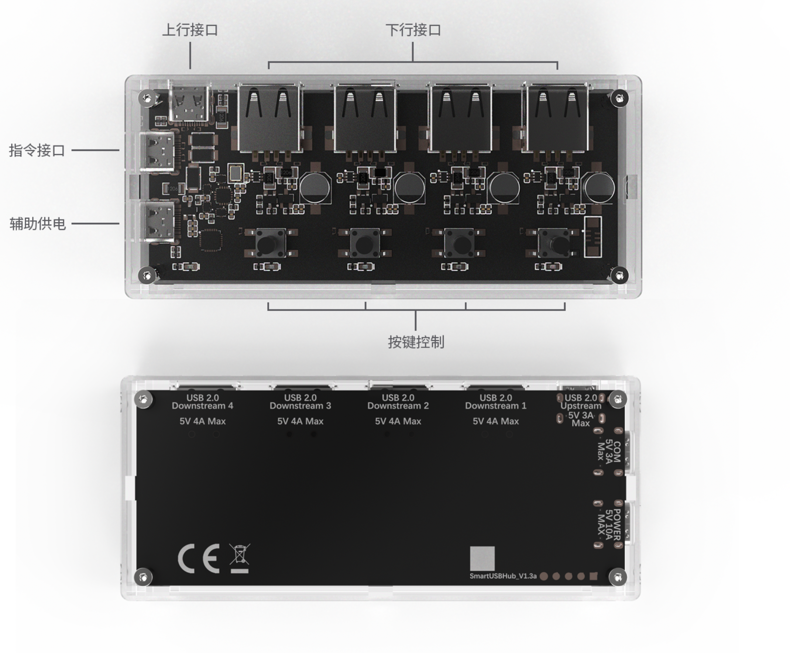
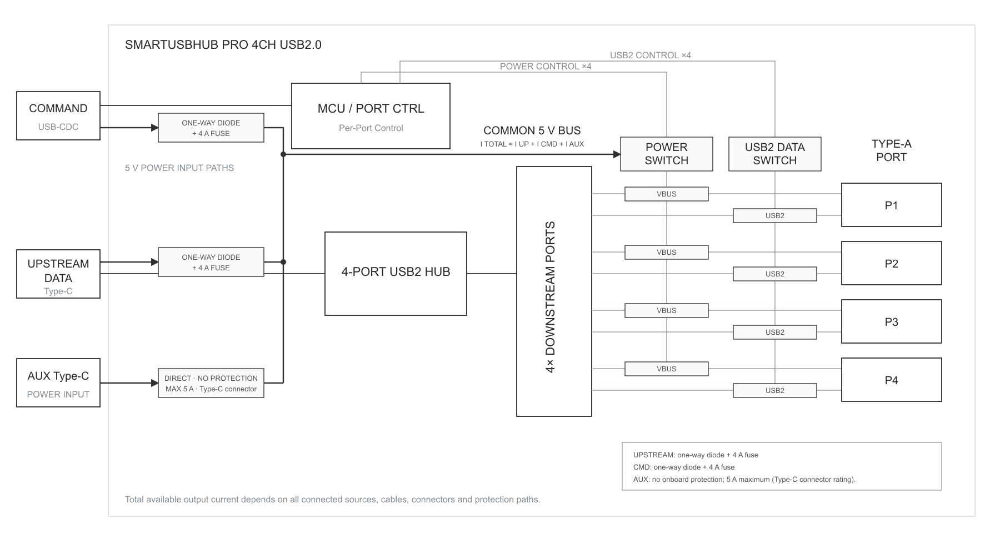
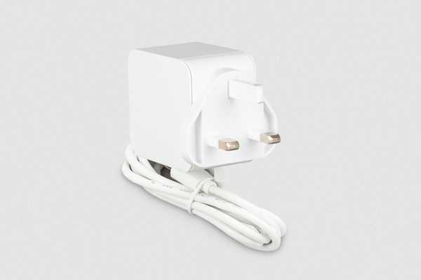
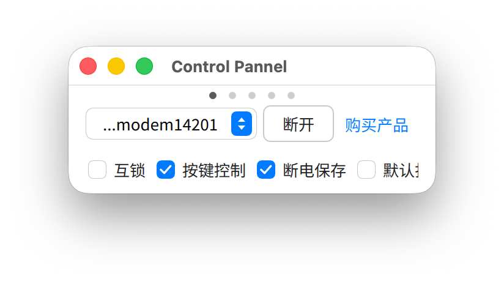
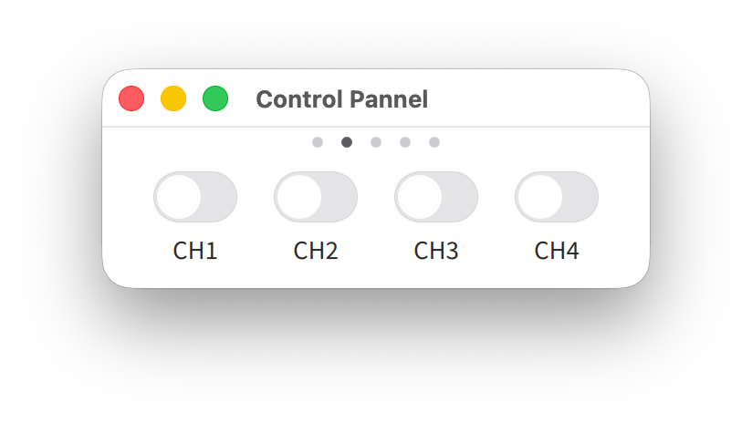
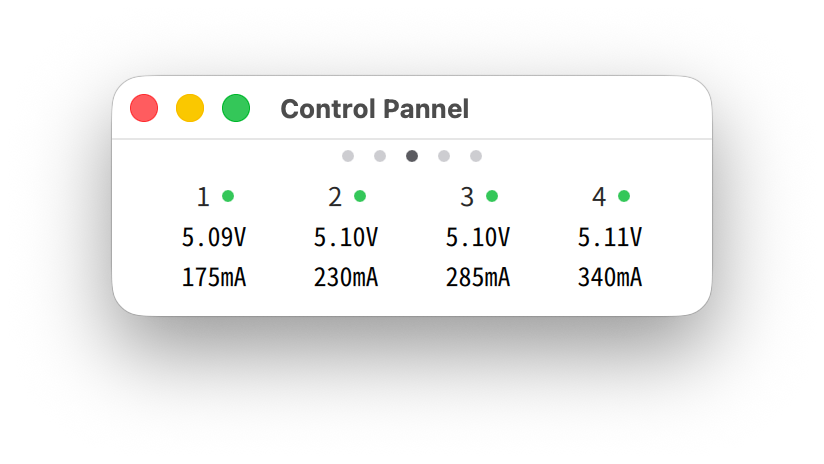
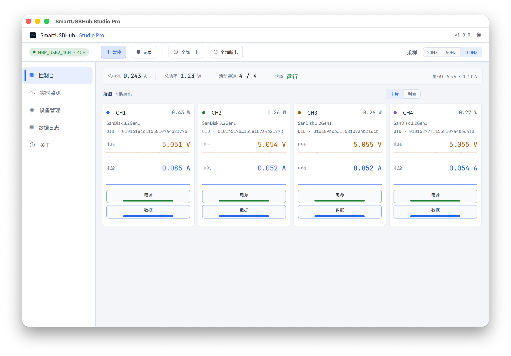

# SmartUSBHub Pro 4CH USB2.0

[下载 PDF](./downloads/user-guide-zh.pdf)


:::{admonition} 提示：快速查找
:class: note

首次使用请依次阅读第 2、3、5、6 章。出现异常时先停止相关操作，并查阅第 10 章。
:::


## 1 关于本说明书


### 1.1 目的和适用范围

本说明书适用于 SmartUSBHub Pro 4CH USB2.0。HBP_USB2_4CH 与 HBP_USB2_4CH_PSU 的功能相同；后者随附 5 V / 2 A 电源适配器。


### 1.2 目标用户


| 用户 | 预期能力 | 允许任务 |
| --- | --- | --- |
| 普通操作人员 | 能识别 USB 接口并遵守基本电气安全要求 | 连接设备、使用按键、观察指示灯 |
| 研发/测试工程师 | 了解 USB、串口与自动化脚本 | 配置端口、读取测量值、使用 SDK/协议 |
| 系统集成人员 | 能够核算电源预算并设计测试拓扑 | 选型、安装、多设备集成 |
| 维修人员 | 由制造商授权并具备电子维修能力 | 制造商授权范围内的检修 |


### 1.3 文档约定


:::{admonition} 警告：人身与设备安全
:class: warning

不遵守可能造成人身伤害、火灾或严重设备损坏。
:::


:::{admonition} 小心：产品与数据保护
:class: caution

不遵守可能造成产品、被测设备或数据损坏。
:::


:::{admonition} 提示：补充信息
:class: note

有助于正确、高效使用的补充信息。
:::


:::{admonition} 正常结果：操作确认
:class: note

完成某一步骤后应观察到的状态，用于确认操作成功。
:::


### 1.4 文件与产品版本

使用前核对产品标签、订购代码、硬件版本和固件版本。通信命令以对应固件版本的正式协议文档为准。


## 2 安全信息


### 2.1 预期用途

本产品用于室内 USB 2.0 设备管理。用户可通过按键或软件分别控制四个下行端口的 VBUS 和 D+ / D-，并读取各端口的电压、电流。


### 2.2 可合理预见的误用

- 接入超过 5.5 V 的电源，或接入不稳定、无电流限制的外部电源。

- 把单通道 4 A“输出路径能力”误认为充电协议保证电流。

- 在固件写入、磁盘写入或设备升级期间断开电源或数据连接，造成数据或固件损坏。

- 在潮湿、凝露、存在导电粉尘或易燃物的环境中使用。

- 用金属物接触裸露电路，或自行拆解、改装产品。

- 总输入电流接近或达到 10 A，或使用额定电流不足的电源、线缆和连接器。


:::{admonition} 警告：输入过压可能引起过热或起火
:class: warning

所有供电入口仅允许接入稳压 5 V 直流电源，任何入口均不得超过 5.5 V。接线前检查电源铭牌和实际输出。
:::


:::{admonition} 警告：辅助供电口禁止输入 5 V 以外的电压
:class: warning

辅助供电口只允许接入标称 5 V 的直流电源。禁止通过 PD 诱骗器、升压线或其他方式向该接口输入 9 V、12 V、15 V 或 20 V；错误电压会损坏 SmartUSBHub 及其连接设备。
:::


:::{admonition} 小心：辅助供电口须使用带保护的 5 V 电源
:class: caution

辅助供电口本身不提供独立过流保护。请使用具有限流和短路保护的合格 5 V 电源。
:::


:::{admonition} 小心：避免液体和导电异物进入设备
:class: caution

液体或金属屑进入设备可能造成短路或工作异常。发现进液、异味、冒烟或异常发热时，立即断开 USB 2.0 上行数据口（DATA）、指令控制口（CMD）和辅助供电口（AUX POWER），停止使用并联系技术支持。
:::


:::{admonition} 小心：断连可能损坏数据或固件
:class: caution

关闭 VBUS 或 D+ / D- 等同于拔出设备。操作前停止文件写入、固件升级及其他不可中断任务。
:::


### 2.3 安全责任边界

安全使用本产品时，请做到：

- 使用满足负载要求的 5 V 电源和线缆。

- 断开端口电源或数据线前，确认被测设备可以安全停止。

- 无人值守运行时，为测试脚本设置异常检测和自动停止条件。

- 端口电压、电流读数只用于观察和排查故障，不可作为医疗、安全或法定计量依据。


## 3 产品说明


### 3.1 产品功能

- 4 个 USB-A 下行端口，支持 USB 2.0 High-Speed（480 Mbps）。

- 每个端口均可独立控制 VBUS 与 USB 2.0 D+ / D-。

- 每个端口均可独立测量 VBUS 电压和输出电流。

- 普通模式支持多通道独立工作；互锁模式同一时间仅允许一个通道开启。

- 通过 USB CDC 指令控制，兼容 Windows、macOS 和 Linux。

- 支持配置上电默认状态、断电状态记忆和设备地址。




图 3-1 产品接口概览


### 3.2 系统框图




图 3-2 系统框图


### 3.3 接口和控制件


| 编号 | 名称 | 用途 |
| --- | --- | --- |
| 1 | 通道按键 | 短按切换对应下行端口的 VBUS 状态。 |
| 2 | 通道指示灯 | 显示对应端口的 VBUS 状态。 |
| 3 | 状态指示灯 | 显示运行、识别和指令处理状态。 |
| 4 | 辅助供电口（AUX POWER） | 连接具有限流和短路保护的稳压 5 V 外部电源。 |
| 5 | 指令控制口（CMD） | 连接主机，并枚举为 USB CDC 串口。 |
| 6 | USB 2.0 上行数据口（DATA） | 连接 USB 主机，为四个下游设备提供数据通路。 |
| 7 | USB-A 下行端口 | 连接被控 USB 设备，编号为 CH1-CH4。 |


## 4 开箱、运输与储存


### 4.1 包装内容


| 订购代码 | 产品 | 电源适配器 |
| --- | --- | --- |
| HBP_USB2_4CH | SmartUSBHub Pro 4CH USB2.0 | 不随附 |
| HBP_USB2_4CH_PSU | SmartUSBHub Pro 4CH USB2.0 | 5 V / 2 A |

订购链接：[淘宝官方商品页](https://item.taobao.com/item.htm?id=687666588208)

USB 线缆及附件以订单和装箱清单为准。发现缺件、受潮或运输损坏时，不要通电；保留包装并联系销售或技术支持。


### 4.2 检查

- 确认外壳、接口和电路板无裂纹、变形、异物或液体痕迹。

- 确认 USB 接口内无弯曲、松动或短路风险。

- 确认所用电源标称输出为 5 V DC，并具有限流/短路保护。

- 确认线缆额定电流满足计划负载。


### 4.3 储存和运输

储存温度：−10～85 °C，非冷凝。运输和储存时应采取防潮、防静电和防冲击措施。设备从低温环境移入室内后，应待凝露完全消失再通电。


## 5 安装与连接


### 5.1 安装条件

- 室内、干燥、非冷凝环境；工作温度为 0～50 °C。

- 放置在平稳、绝缘且无明显振动的表面。

- 避免接口和线缆承受拉力，并在设备周围留出检查和散热空间。

- 不要覆盖设备，也不要将设备放置在热源、液体或易燃物附近。


### 5.2 连接前计算电源预算

设备可通过 USB 2.0 上行数据口（DATA）、指令控制口（CMD）和辅助供电口（AUX POWER）获得 5 V 电源。四个下行端口的可用电流取决于这三个输入口实际可持续提供的电流总和。

- 每个下行端口的输出路径能力最大为 4 A。

- 三个输入口的总输入电流必须小于 10 A。

- 任何输入或输出支路都不得超过对应电源、线缆和连接器的额定电流。

- 仅连接配套 5 V / 2 A 电源时，扣除设备自身功耗和转换损耗后，四个下行端口的可用总电流小于 2 A。


:::{admonition} 提示：参考：USB BC 1.2 CDP
:class: note

CDP（Charging Downstream Port，充电下行端口）允许设备在保持 USB 数据通信的同时取电。本产品每端口最多按 BC 1.2 CDP 提供 1.5 A，不支持 QC 或 USB PD 快充。
:::


:::{admonition} 小心：按实际负载核算供电能力
:class: caution

4 A 是单通道输出路径能力，不是充电协议保证电流。连接四台手机同时充电时，应按每台手机的实际电流核算总功率；按 BC 1.2 CDP 的 1.5 A/端口估算，四端口约需 5 V / 6 A。确保三个输入口合计供电能力满足负载，并使总输入电流小于 10 A。
:::


:::{admonition} 提示：推荐电源
:class: note

需要较大供电能力时，可选用 Raspberry Pi 45W USB-C Power Supply。其 5.1 V 档最高可提供 5 A。只可直接使用 USB-C 输出，禁止使用 PD 诱骗器请求 9 V、12 V、15 V 或 20 V。
:::

产品信息：[Raspberry Pi 45W USB-C Power Supply](https://www.raspberrypi.com/products/45w-power-supply/)




图 5-1 Raspberry Pi 45W USB-C Power Supply（图片来源：Raspberry Pi 官方网站）


:::{admonition} 警告：外部电源电压不得超过 5.5 V
:class: warning

接入前确认电源输出规格，不得将任何高于 5.5 V 的电压接入辅助供电口。
:::


### 5.3 标准连接

1. 确认设备、主机和所有下游设备均处于可安全连接状态。

2. 将 USB 2.0 上行数据口（DATA）连接到主机。  
正常结果：主机可检测到通用 USB 集线器；下游设备可通过该数据通路枚举。

3. 将指令控制口（CMD）连接到主机。  
正常结果：系统中出现 USB CDC 串口：Windows 通常显示为 COMx，macOS/Linux 显示为相应的设备文件。


:::{admonition} 警告：接入辅助供电前核对电源
:class: warning

接入前确认电源输出规格，不得将任何高于 5.5 V 的电压接入辅助供电口。禁止使用 PD 诱骗器或升压线。
:::

4. 如负载超过主机 USB 口能力，将具有限流和短路保护的稳压 5 V 电源接到辅助供电口。

5. 将下游设备逐一接入 CH1-CH4，观察是否有异常发热、掉线或过流。


:::{admonition} 提示：需要连接两个主机侧接口
:class: note

如需同时进行 USB 数据传输和软件控制，USB 2.0 上行数据口（DATA）与指令控制口（CMD）必须同时连接到主机。
:::


## 6 首次使用


### 6.1 使用按键完成首次检查

1. 完成第 5 章的连接，并确认状态灯按正常节奏闪烁。  
正常结果：设备运行正常。

2. 短按 CH1 对应按键。  
正常结果：CH1 指示灯点亮，CH1 VBUS 开启。

3. 确认主机能够识别 CH1 上的 USB 设备。

4. 再次短按 CH1 按键。  
正常结果：CH1 指示灯熄灭，CH1 下游设备断电并从 USB 总线断开。

5. 对其余通道重复上述检查。


### 6.2 连接控制软件或 Python 库

控制口使用 USB CDC。Windows 10/11、macOS 和常用 Linux 发行版无需专用驱动；Windows 7 及更早版本需安装 CDC 驱动。首次连接时，先读取硬件版本、固件版本和端口状态，再发送控制命令。

Windows 7：[下载 SmartUSBHub Windows 7 CDC 驱动安装器 1.0.0](https://update.mixedsignallab.com/downloads/driver/SmartUSBHub_Windows7_CDC_Driver_Setup-1.0.0.exe)

驱动资源也保存在 workspace 的 apps/shared/windows7-cdc-driver/ 目录。


| 平台 | 设备名称示例 | 说明 |
| --- | --- | --- |
| Windows 10/11 | COMx | 在设备管理器中查看端口号。 |
| macOS | /dev/cu.usbmodem\* | 具体名称由系统分配。 |
| Linux | /dev/ttyACM\* | 用户可能需要串口访问权限。 |


:::{admonition} 小心：确认目标设备
:class: caution

多台 SmartUSBHub 同时连接时，先读取并核对设备地址或序列信息，再执行端口断电命令，防止误操作其他设备。
:::


## 7 日常操作


### 7.1 端口状态组合


| VBUS | D+ / D- | 效果 | 典型用途 |
| --- | --- | --- | --- |
| 开 | 连通 | 设备供电并与主机通信 | 正常工作 |
| 开 | 断开 | 设备保持供电，但从 USB 总线断开 | 模拟数据拔插、保留供电 |
| 关 | 自动断开 | 固件关闭通道 VBUS 时，同时断开该通道数据线；设备失去供电和 USB 连接 | 断电复位、模拟完全拔出 |


### 7.2 普通模式

普通模式是默认模式。CH1-CH4 可分别打开或关闭。


### 7.3 互锁模式

互锁模式下，同一时间只允许一个通道开启。可长按按键 1 三秒切换普通模式/互锁模式，也可通过控制软件或 API 读取和设置工作模式；设备会保存该设置。互锁模式下控制通道电源时，须使用互锁控制命令或对应的软件/API 操作。


### 7.4 上电默认状态与断电状态记忆

“上电默认状态”规定通道启动时的状态；“断电状态记忆”用于恢复掉电前的状态。当两项功能同时启用时，上电默认状态优先。用于无人值守系统前，应先验证设备重新上电后的通道状态，防止被测设备意外启动。


### 7.5 电压和电流监测

端口电压、电流读数用于趋势观察和故障定位。线缆压降、负载变化和测量精度都会影响读数。需要作合格判定时，使用经校准的仪器复核。


## 8 软件与编程控制


### 8.1 选择控制方式


| 使用方式 | 适用用户 | 主要用途 |
| --- | --- | --- |
| Control Pannel 控制面板 | 普通用户、调试人员 | 快速连接设备、控制端口、查看电压/电流、设置工作模式和升级固件。 |
| Studio Pro | 研发、测试和设备管理人员 | 多设备管理、实时波形、数据记录、设备设置及固件升级。 |
| Python API | 研发、测试和系统集成人员 | 将端口电源、数据线和测量功能集成到脚本、测试平台和产线系统。 |
| USB CDC 通信协议 | 需要自行开发驱动或使用其他编程语言的人员 | 直接发送协议帧，访问设备全部底层命令。 |


### 8.2 使用 Control Pannel 控制面板

Control Pannel 是 SmartUSBHub 的轻量桌面控制软件。连接设备的 CMD 与 DATA 接口后启动软件；软件通常会自动发现并连接设备。窗口顶部的圆点对应不同页面。点击圆点，或使用触控板/鼠标横向滑动，可在连接设置页、控制页、监控页和信息页之间切换。




图 8-1 Control Pannel 连接/设置页面




图 8-2 Control Pannel 控制页面




图 8-3 Control Pannel 电压/电流监控页面

- 在控制页开启或关闭各通道；关闭通道电源时，该端口的数据连接也会同时断开。

- 在连接/设置页配置互锁模式、物理按键控制、断电状态记忆和上电默认状态。

- 在监控页查看各通道的电压和电流。

- 在信息页核对硬件版本、固件版本、设备地址和当前工作模式。

- 在软件页检查控制软件和设备固件更新。

软件下载和独立使用说明书：[MixedSignalLab 软件页面](https://www.mixedsignallab.com/software.html)


:::{admonition} 小心：升级期间保持连接
:class: caution

使用 Control Pannel 升级固件时，不要断开 CMD 接口、关闭软件或让计算机进入睡眠。
:::


### 8.3 使用 Studio Pro

Studio Pro 是面向研发和自动化测试的桌面软件。在 Control Pannel 基础上，它进一步提供多设备管理、各通道电源与数据线控制、实时测量与波形查看、数据记录、设备参数设置、固件升级和软件更新。启动后软件会自动扫描 SmartUSBHub；连接成功后，先核对设备型号、硬件版本和固件版本，再执行控制或升级操作。




图 8-4 Studio Pro 控制台

软件下载和独立使用说明书：[MixedSignalLab 软件页面](https://www.mixedsignallab.com/software.html)


### 8.4 Python API 快速示例

Python API 适合自动化测试。安装包名为 smartusbhub；执行控制前，先确认连接的是目标设备和目标通道。

1. 在终端安装 Python 库：

pip install smartusbhub

2. 运行以下 Python 示例。示例连接第一台可用设备，开启 CH1 电源（固件会自动连通该通道的数据线），读取电压、电流，最后释放串口：


```python
from smartusbhub import SmartUSBHub

# 扫描并连接第一台可用的 SmartUSBHub
hub = SmartUSBHub.scan_and_connect()
if hub is None:
    raise RuntimeError("未找到 SmartUSBHub")

try:
    # 打开 CH1 电源；固件会自动连通该通道的数据线
    hub.set_channel_power(1, state=1)

    # 电压返回 mV，电流返回 mA
    voltage_mv = hub.get_channel_voltage(1)
    current_ma = hub.get_channel_current(1)
    if voltage_mv is None or current_ma is None:
        raise RuntimeError("读取 CH1 测量值失败")
    print(f"CH1: {voltage_mv / 1000:.3f} V, {current_ma} mA")
finally:
    # 无论脚本是否异常，都释放控制串口
    hub.disconnect()
```


| API | 作用 |
| --- | --- |
| scan_and_connect() | 扫描并连接第一台可用设备。 |
| set_channel_power(\*channels, state) | 打开或关闭指定通道电源。 |
| set_channel_usb2_dataline(\*channels, state) | 连通或断开指定通道 USB 2.0 数据线。 |
| get_channel_voltage(channel) | 读取指定通道电压。 |
| get_channel_current(channel) | 读取指定通道电流。 |
| disconnect() | 断开控制连接并释放串口。 |

[查看完整 API、参数、返回值和更多示例](https://www.mixedsignallab.com/docs/zh_CN/software/python-library.html)


### 8.5 最简串口字节示例

控制口是 115200 baud 的 USB CDC 串口。下面的 6 字节 V1 帧用于打开 CH1 电源；设备正常接收后返回相同字节：


```text
55 5A 01 01 01 03
```


| 字节 | 含义 |
| --- | --- |
| 55 5A | V1 帧头 |
| 01 | 控制通道电源 |
| 01 | CH1 位掩码 |
| 01 | 打开 |
| 03 | 校验和：01 + 01 + 01 |


```python
import serial

# 将 COM3 替换为控制口的实际串口号
with serial.Serial("COM3", 115200, timeout=1) as port:
    port.write(bytes.fromhex("55 5A 01 01 01 03"))
    response = port.read(6)
    print(response.hex(" "))
```


:::{admonition} 提示：协议兼容性
:class: note

此处只给出最简单的 V1 帧。批量测量、名称和流式数据等功能使用其他帧格式；完整定义以对应固件版本的通信协议为准。
:::


### 8.6 通信接口


| 项目 | 值 |
| --- | --- |
| 接口类型 | USB CDC 虚拟串口 |
| 波特率 | 115200 baud |
| 控制方式 | 请求-响应命令帧 |
| Python 库 | smartusbhub |
| 完整命令 | [打开 SmartUSBHub 通信协议](https://www.mixedsignallab.com/docs/zh_CN/) |


### 8.7 推荐控制流程

1. 发现并打开设备。

2. 查询硬件版本、固件版本和设备地址。

3. 读取工作模式和端口当前状态。

4. 确认目标通道及被测设备允许断电/断连。

5. 发送控制命令并校验响应。

6. 重新读取状态，确认动作完成。

7. 异常时记录时间、命令、响应、版本和连接拓扑。


### 8.8 自动化系统的安全设计

- 所有断电/断连操作设置明确的目标设备和目标通道。

- 关键写入或升级期间设置软件互锁，禁止端口断电。

- 为循环上下电设置次数、最小间隔和停止条件。

- 监测连续过流、低电压、掉线和温升，并触发安全停止。

- 保存测试日志，至少包含设备标识、固件版本、命令、响应和时间戳。


## 9 维护与固件升级


### 9.1 清洁

1. 关闭所有通道，停止主机和被测设备上的相关任务。

2. 断开上行数据、指令控制、辅助供电及所有下游设备。

3. 使用干燥、柔软、无绒布擦拭外表面；用干燥低压气流清除接口周围灰尘。

4. 确认设备完全干燥、接口无异物后再重新连接。


:::{admonition} 警告：禁止带电清洁
:class: warning

不要在通电状态清洁；不要喷洒液体，不要使用会损伤 PMMA 外壳的强溶剂。
:::


### 9.2 定期检查

- 接口是否松动、变形或变色。

- 电源线和 USB 线是否破损或异常发热。

- 外壳和电路板是否有裂纹、液体或导电异物。

- 在已知负载下是否频繁掉线、过流或出现异常压降。


### 9.3 固件升级

1. 停止下游设备的所有写入和升级任务，并保持 SmartUSBHub 的 CMD 接口连接。

2. 打开 Control Pannel 或 Studio Pro，连接目标设备并核对当前硬件版本和固件版本。

3. 点击软件中的固件升级按钮，按提示下载并安装与设备匹配的固件。

4. 升级完成并自动重启后，等待软件重新连接；核对固件版本，并验证按键、端口和通信功能。


:::{admonition} 警告：升级期间保持供电
:class: warning

升级过程中不要断开指令控制口或供电，不要让主机休眠。错误固件或升级中断可能使设备无法正常启动。
:::


## 10 故障排查


| 现象 | 可能原因 | 处理方法 |
| --- | --- | --- |
| 主机识别不到下游设备 | 未连接 DATA；数据线已断开；线缆不支持数据传输 | 连接 USB 2.0 上行数据口（DATA）；检查 D+ / D- 状态；更换已知正常的数据线。 |
| 找不到控制串口 | 未连接 CMD；系统权限不足或旧系统缺少驱动 | 重新连接指令控制口（CMD），并检查设备管理器或设备文件。Windows 7：[下载 CDC 驱动安装器 1.0.0](https://update.mixedsignallab.com/downloads/driver/SmartUSBHub_Windows7_CDC_Driver_Setup-1.0.0.exe) |
| 端口灯亮但设备不工作 | 供电不足；数据未连通；设备驱动异常 | 检查电源预算和端口电压；连通数据线；将设备直接连接主机进行验证。 |
| 负载增加后集线器掉线 | 主机 USB 供电不足或线缆压降过大 | 接入具有限流和短路保护的 5 V 辅助电源；降低负载；更换更短、额定电流更高的线缆。 |
| 普通控制命令无效 | 设备处于互锁模式 | 查询工作模式，使用互锁控制命令或切换回普通模式。 |
| 测量值异常 | 负载变化、线缆压降或超出精度预期 | 减小负载并检查接触状态；使用校准仪表复核。 |
| 设备异常发热、异味或冒烟 | 过压、短路、过载或硬件损坏 | 立即断开全部电源，不要再次通电，并联系技术支持。 |


### 10.1 报修前记录

- 产品型号、订购代码和硬件版本。

- 固件版本、操作系统和控制软件版本。

- 连接拓扑、线缆、电源型号及负载。

- 故障发生时间、复现步骤、命令与响应。

- 指示灯状态，以及在确保安全前提下拍摄的照片或视频。


## 11 技术规格


### 11.1 USB 与控制


| 参数 | 规格 |
| --- | --- |
| 下行端口 | 4 × USB-A |
| USB 2.0 上行数据口（DATA） | 1 × USB-C |
| 指令控制口（CMD） | 1 × USB-C，USB CDC |
| USB 速率 | High-Speed 480 Mbps；兼容 12 Mbps、1.5 Mbps 和 USB 1.1 |
| 集线器架构 | MTT，每端口独立 TT |
| 端口控制 | 每通道 VBUS 与 D+ / D- 独立控制 |
| 充电协议 | USB BC 1.2 CDP，最大 1.5 A/端口；不支持 QC/PD |


### 11.2 电气规格


| 参数 | 最小 | 典型 | 最大 | 单位 | 说明 |
| --- | --- | --- | --- | --- | --- |
| 5 V 输入电压 | 4.75 | 5.00 | 5.25 | V | 推荐工作范围 |
| 输入绝对最大值 | 0 | - | 5.5 | V | 任何输入口均不得超过 |
| 下行端口 VBUS | 4.5 | 5.0 | 5.5 | V | 未过载 |
| 总输入电流 | - | - | <10 | A | 三个输入口的电流总和 |
| 单通道输出路径能力 | - | - | 4 | A | 每个下行端口；非充电协议保证电流 |
| 配套电源输出 | - | 2 | - | A | 仅指随附适配器 |


### 11.3 测量规格


| 测量量 | 范围 | 分辨率 | 精度 |
| --- | --- | --- | --- |
| VBUS 电压 | 0-5.5 V/通道 | 1.48 mV | ±(0.91% × 读数 + 36 mV) |
| 输出电流 | 0-4.0 A/通道 | 1.15 mA | ±(2.5% × 读数 + 50 mA) |


### 11.4 机械和环境


| 参数 | 规格 |
| --- | --- |
| 外形尺寸 | 106 × 46 × 18 mm |
| 重量 | 52 g |
| 外壳材料 | PMMA |
| 工作温度 | 0～50 °C，非冷凝 |
| 储存温度 | −10～85 °C，非冷凝 |
| 安装 | 支持使用螺柱堆叠安装 |


图 11-1 产品外形线稿与尺寸（单位：mm）


## 12 停用、处置与售后


### 12.1 安全停用

1. 停止下游设备的写入、升级和测试任务。

2. 关闭所有下游端口的电源。

3. 依次断开下游设备、辅助供电口（AUX POWER）、指令控制口（CMD）和 USB 2.0 上行数据口（DATA）。

4. 清洁并装入防静电、防潮包装，记录设备配置和故障状态。


### 12.2 处置

不要将本产品作为生活垃圾处理。按销售地区的电子废弃物法规交由合格机构回收。外部电源和线缆应分别分类处理。


### 12.3 技术支持


| 项目 | 信息 |
| --- | --- |
| 网站 | https://www.mixedsignallab.com |
| 技术支持 | support@mixedsignallab.com |
| 保修政策 | 见第 12.4 节 |
| 制造商/责任主体 | 混合电子科技 |


### 12.4 保修与维修

本产品自用户收货之日起提供一年有限质量保证。在正常使用条件下，因材料或制造问题发生故障的，由混合电子科技提供免费维修或更换，并承担质保服务产生的合理双程运输费用。送修前须联系技术支持并取得寄送确认。

下列情况不属于免费质保：输入超过规定电压、过载或短路造成的损坏；进液、腐蚀、跌落、挤压等外力损坏；未按说明书使用；未经授权的拆解、改装或维修；不可抗力或其他非产品质量原因造成的损坏。具体责任以检测结果为准。

超过一年质保期后，可提供成本价维修服务。零件和维修费用在检测后确认；送修及寄回运费由用户承担。产品无法维修或维修费用不经济时，将在用户确认后停止维修并退回。


## 附录 A 指示灯与按键速查


### A.1 指示灯


| 指示灯 | 状态 | 含义 |
| --- | --- | --- |
| 状态灯 | 亮 100 ms、灭 900 ms，循环 | 正常运行 |
| 状态灯 | 亮灭各 80 ms，持续约 10 秒 | 设备识别 |
| 状态灯 | 处理指令时切换一次 | 收到并处理命令 |
| 通道灯 | 亮 | 对应通道 VBUS 开启 |
| 通道灯 | 灭 | 对应通道 VBUS 关闭 |


### A.2 按键


| 操作 | 功能 | 默认状态 |
| --- | --- | --- |
| 短按按键 1-4 | 切换对应通道 VBUS | - |
| 按住按键 1 再上电 | 进入固件升级模式 | - |
| 按键 1 长按 3 秒 | 切换普通/互锁模式 | 普通模式 |
| 按键 1 长按 6 秒 | 恢复出厂设置 | - |
| 按键 2 长按 3 秒 | 启用/禁用断电状态记忆 | 不保存 |


## 附录 B 术语


### B.1 术语


| 术语 | 说明 |
| --- | --- |
| USB 2.0 上行数据口（DATA） | 连接 USB 主机并承载集线器数据的端口。 |
| 指令控制口（CMD） | 连接控制主机并枚举为 USB CDC 串口的端口。 |
| 下行端口 | 连接被控 USB 设备的物理端口。 |
| 通道 | 与一个下行端口对应的可控逻辑单元，编号为 CH1-CH4。 |
| VBUS | USB 总线电源。 |
| D+ / D- | USB 2.0 差分数据线。 |
| USB CDC | 使 USB 设备表现为虚拟串口的标准设备类。 |
| 互锁模式 | 同一时间仅允许一个通道开启的工作模式。 |
| 断电状态记忆 | 保存掉电前的通道状态，并在再次上电时恢复。 |
