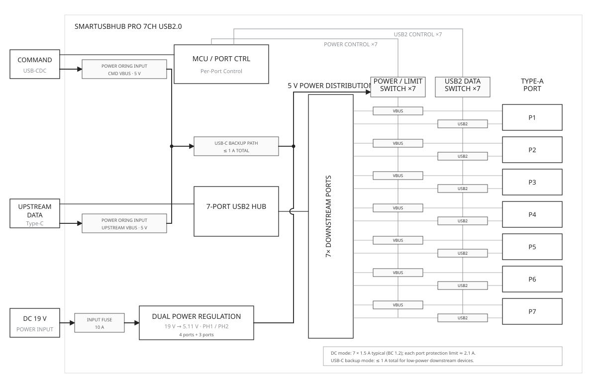

# SmartUSBHub Pro 7CH USB2.0 技术规格书

[English](./datasheet.md)

[下载 PDF](./downloads/datasheet-zh.pdf)

| 文档项 | 内容 |
| --- | --- |
| 适用产品 | SmartUSBHub Pro 7CH USB2.0 |
| 订购代码 | `HBP_USB2_7CH`、`HBP_USB2_7CH_ADV` |
| 文档版本 | v1.0 |
| 发布日期 | 2026-07-23 |

## 1 产品概述

SmartUSBHub Pro 7CH USB2.0 是一款七端口可编程 USB 2.0 High-Speed 集线器。设备可按通道独立控制下行端口的 VBUS 和 USB 2.0 D+ / D-，用于模拟插拔、断电重启、枚举顺序控制和异常恢复。ADV 版本还支持各通道的 VBUS 电压和输出电流测量。

### 1.1 型号差异

| 功能 | `HBP_USB2_7CH` | `HBP_USB2_7CH_ADV` |
| --- | --- | --- |
| 七路 VBUS 独立控制 | 支持 | 支持 |
| 七路 D+ / D- 独立控制 | 支持 | 支持 |
| 过流状态监控 | 支持 | 支持 |
| 各通道电压/电流测量 | 不支持 | 支持 |
| 测量数据流 | 不支持 | 最高 100 Hz |

### 1.2 主要特性

- 七个 USB-A 下行端口，每通道独立控制 VBUS 和 D+ / D-。
- USB 2.0 High-Speed 最高链路速率为 480 Mbps，兼容 Full-Speed、Low-Speed 和 USB 1.1 设备。
- DATA 与 CMD 使用独立 USB-C 接口，数据链路与控制链路分离。
- 支持 USB BC 1.2 CDP，单端口最大充电电流为 1.5 A；不支持 QC、USB PD 等快充协议。
- 每通道提供约 2.1 A 的过流保护阈值和过流状态监控。
- ADV 版本支持各通道电压/电流测量。
- 支持普通模式、互锁模式、默认电源状态、默认数据线状态、断电状态恢复和设备地址配置。

## 2 系统组成

### 2.1 系统框图

DATA 口承载七路集线器数据；CMD 口枚举为 USB CDC 串口并接收控制指令。外部 DC 输入经两组 5 V 电源轨向下行端口供电。

### 2.2 接口与指示

| 接口或部件 | 数量 | 功能 |
| --- | ---: | --- |
| USB-C DATA | 1 | 连接 USB 主机，承载下行设备数据 |
| USB-C CMD | 1 | 连接控制主机，提供 USB CDC 指令接口 |
| DC IN | 1 | DC5525，内正外负；接入受保护的直流电源 |
| USB-A 下行端口 | 7 | 连接被控 USB 设备 |
| 状态指示灯 | 1 | 指示设备工作状态 |
| 通道指示灯 | 7 | 指示对应通道的 VBUS 状态 |

## 3 功能规格

### 3.1 USB 数据通道

| 参数 | 规格 |
| --- | --- |
| USB 标准 | USB 2.0 High-Speed |
| 最高链路速率 | 480 Mbps |
| 兼容速率 | Full-Speed 12 Mbps、Low-Speed 1.5 Mbps、USB 1.1 |
| 上行数据口 | 1 × USB-C |
| 下行端口 | 7 × USB-A |
| 集线器模式 | 支持 MTT / STT |

### 3.2 通道控制

| 参数 | 规格 |
| --- | --- |
| 通道编号 | CH1～CH7 |
| VBUS 控制 | 每个下行端口独立控制 |
| D+ / D- 控制 | 每个下行端口独立控制 |
| 电源与数据关系 | 可保持 VBUS 供电并断开 USB 数据线 |
| 控制方式 | 支持单通道、批量、普通和互锁控制；互锁模式同一时间只允许一个通道开启 |
| 默认状态与恢复 | 支持配置默认电源状态、默认数据线状态和断电状态恢复 |
| 本地通道按键 | 无 |

### 3.3 充电与过流保护

| 参数 | 规格 |
| --- | --- |
| 充电协议 | USB BC 1.2 CDP |
| BC 1.2 充电电流 | 最大 1.5 A / 端口 |
| 单端口保护阈值 | 约 2.1 A |
| 最大总输出电流 | 10 A；七个端口共享 |
| 过流状态 | 支持按通道读取 |
| 其他快充协议 | 不支持 QC、USB PD 等快充协议 |

### 3.4 电压/电流测量（ADV 版本）

| 参数 | 范围 | 分辨率 | 精度 |
| --- | --- | --- | --- |
| VBUS 电压 | 0～5.5 V / 通道 | 8 mV | ±32.5 mV（5 V、25 °C） |
| 输出电流 | 0～2.7 A / 通道 | 1 mA | ±(1.25% × 读数 + 2.5 mA)，25 °C |
| 测量数据流 | - | 最高 100 Hz | 取决于主机和软件配置 |

## 4 电气规格

:::{admonition} 警告：仅使用规定的直流电源
:class: warning

正常工作输入范围为 9～20 V DC，建议使用 19～20 V、5 A、带限流和短路保护的合格电源。24.5 V 是绝对最大值，不是允许的工作电压。
:::

### 4.1 绝对最大额定值

超过本表条件可能导致设备永久损坏。不得在绝对最大额定值附近长期工作。

| 参数 | 最小值 | 最大值 | 单位 | 说明 |
| --- | ---: | ---: | --- | --- |
| DC 输入电压 | 0 | 24.5 | V | 绝对最大值，不是工作额定值 |
| 下行端口 VBUS | 0 | 5.5 | V | USB-A 下行端口 |
| USB D+ / D- 信号电压 | -0.3 | 5.3 | V | USB 信号引脚 |

### 4.2 推荐工作条件

| 参数 | 条件 | 最小值 | 典型值 | 最大值 | 单位 |
| --- | --- | ---: | ---: | ---: | --- |
| DC 输入电压 | 外部 DC 输入 | 9 | 19～20 | 20 | V |
| 推荐电源适配器 | 带限流和短路保护 | - | 20 V / 5 A | - | - |
| 5 V 输出电压 | 空载 | 4.97 | 5.11 | 5.25 | V |
| 端口 VBUS | 1.5 A 典型负载 | 4.87 | 5.00 | 5.25 | V |
| 最大总输出电流 | 七个端口合计 | - | - | 10 | A |
| 工作环境温度 | 非冷凝 | 0 | 25 | 50 | °C |
| 相对湿度 | 非冷凝 | 5 | - | 95 | %RH |
| 海拔 | 室内使用 | - | - | 2000 | m |

:::{admonition} 重要：请同时核算整机总输出电流
:class: important

单端口约 2.1 A 是保护阈值，不代表七个端口可以同时持续输出该电流。七个端口的输出电流总和不得超过 10 A。若七口均按 BC 1.2 的 1.5 A 满载，理论需求为 10.5 A，已经超过整机限制。
:::

## 5 保护与安全限制

| 项目 | 规格 |
| --- | --- |
| DC 输入 | 输入保险丝和过压保护 |
| 单端口限流 | 约 2.1 A |
| 短路与过温保护 | 支持；排除故障负载并冷却后恢复 |
| 过流状态信号 | 按通道监控 |
| USB 信号 ESD | 具有板级 ESD 保护；认证等级以正式报告为准 |
| 快充协议 | 不支持 QC、USB PD 等快充协商 |

- 七个端口的总输出电流不得超过 10 A。
- 接近最大总输出电流长时间运行时，必须保持通风，不得覆盖设备或靠近易燃物。
- 关闭 VBUS 或 D+ / D- 等同于拔出设备。执行前必须停止文件写入、固件升级和其他不可中断任务。
- 本产品用于 USB 自动化测试和设备控制，不得作为医疗、生命安全、车辆安全或其他高安全等级系统的单点保护装置。

## 6 机械与环境规格

| 参数 | 规格 |
| --- | --- |
| 外形尺寸 | 84 mm × 56.8 mm × 28 mm |
| 整机重量 | 约 142 g |
| 外壳材料 | 铝合金 |
| 安装方式 | 桌面放置；可使用定制支架固定 |
| 工作温度 | 0～50 °C，非冷凝 |
| 存储温度 | -10～85 °C，非冷凝 |
| 相对湿度 | 5%～95% RH，非冷凝 |
| 最大使用海拔 | 2000 m |

安装时应为线缆弯曲、插拔操作和散热预留空间，不得只按产品包络尺寸设计安装位置。

## 7 相关文档

| 文档 | 链接 |
| --- | --- |
| SmartUSBHub Pro 7CH USB2.0 使用指南 | [查看文档](./user_guide_cn.md) |
| SmartUSBHub 通信协议 | [查看文档](../../protocol_cn.md) |
| SmartUSBHub 文档目录 | [查看文档](../../README_cn.md) |
| SmartUSBHub Python 库说明 | [查看文档](../../../README_cn.md) |
