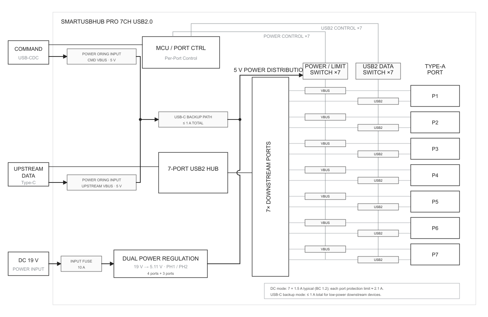
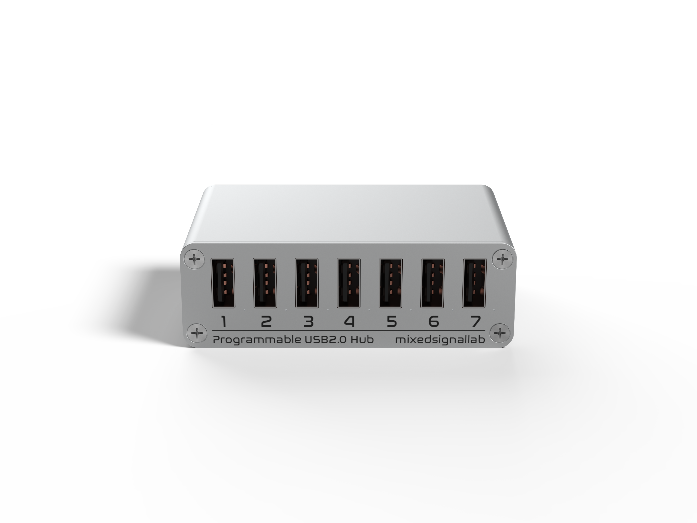
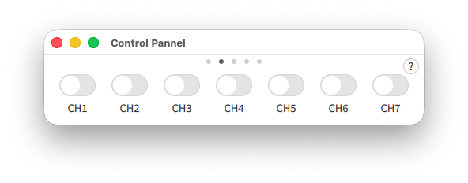
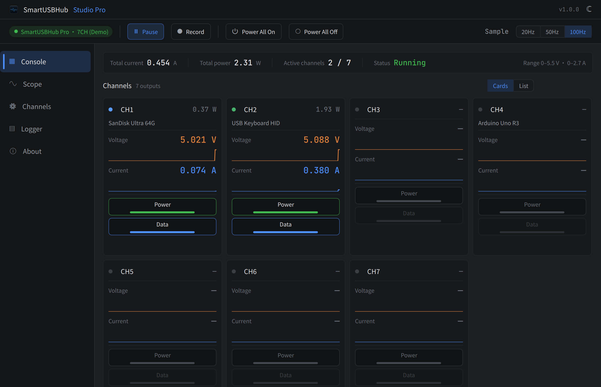
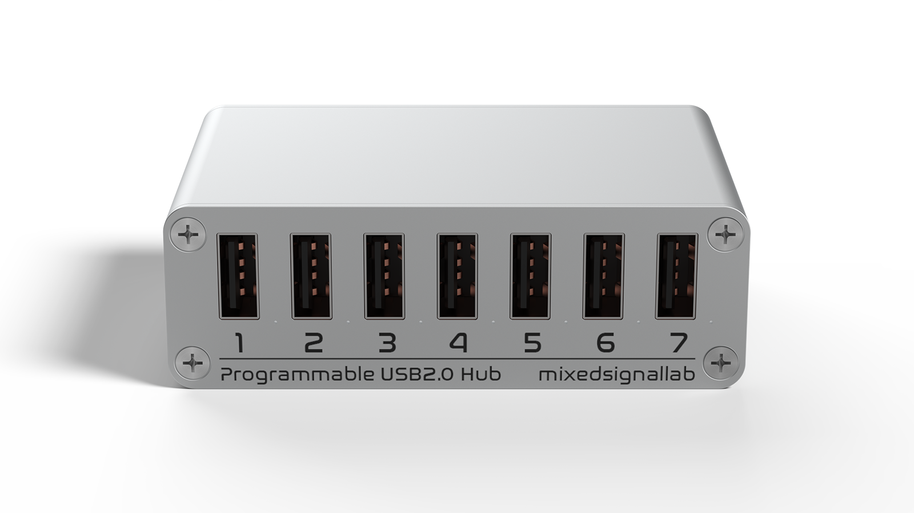

# SmartUSBHub Pro 7CH USB2.0

[Download PDF](./downloads/user-guide-en.pdf)


:::{admonition} NOTE: Quick start
:class: note

Before first use, read Chapters 2, 3, 5 and 6 in order. If a fault occurs, stop the affected operation and refer to Chapter 10.
:::


## 1 About This Manual


### 1.1 Purpose and scope

This manual applies to the standard HBP_USB2_7CH and the measurement-enabled HBP_USB2_7CH_ADV. Except for voltage and current measurement, both variants have the same port-control, connection and safety requirements.


### 1.2 Intended readers


| Reader | Expected knowledge | Main tasks |
| --- | --- | --- |
| Operator | Basic USB identification and electrical-safety awareness | Connect devices, control channels and observe LEDs |
| R&D / test engineer | USB, serial communication and automation scripts | Configure ports, read status and measurements, and use the API |
| System integrator | Power-budget calculation and test-topology design | Installation, product selection and multi-device integration |
| Service technician | Manufacturer authorization and electronics-service skills | Service within the authorized scope |


### 1.3 Document conventions


:::{admonition} WARNING: Personal and equipment safety
:class: warning

Failure to comply may cause personal injury, fire or serious equipment damage.
:::


:::{admonition} CAUTION: Product and data protection
:class: caution

Failure to comply may damage the product, the device under test or data.
:::


:::{admonition} NOTE: Additional information
:class: note

Information that helps you use the product correctly and efficiently.
:::


:::{admonition} EXPECTED RESULT: Operation confirmation
:class: note

The state expected after an operation, confirming that it succeeded.
:::


### 1.4 Variant comparison


| Feature | HBP_USB2_7CH | HBP_USB2_7CH_ADV |
| --- | --- | --- |
| Independent VBUS control on seven ports | Supported | Supported |
| Independent D+ / D− control on seven ports | Supported | Supported |
| Port overcurrent status | Supported | Supported |
| Per-port voltage/current measurement | Not supported | Supported |
| Measurement stream | Not supported | Up to 100 Hz |


## 2 Safety Information


### 2.1 Intended use

This product is intended for indoor USB 2.0 device management and automated testing. USB CDC commands independently control VBUS and D+ / D− on seven downstream ports. The ADV model also measures per-port voltage and current.


### 2.2 Prohibited and unsafe use

- Using a DC supply that is out of specification or lacks overcurrent and short-circuit protection.

- Treating the 24.5 V absolute maximum as a normal operating voltage.

- Switching VBUS or data during file writes, firmware updates or other non-interruptible tasks.

- Using the product in wet, condensing, conductive-dust or flammable environments.

- Opening or modifying the product, or allowing metal objects to contact ports or circuitry.

- Ignoring per-port current limiting or the total power budget and operating continuously under overload.


:::{admonition} WARNING: Use only the specified DC supply
:class: warning

Use a qualified regulated 19–20 V, 5 A supply with current limiting and short-circuit protection. Never exceed the 24.5 V absolute maximum; this value is not an operating rating.
:::


:::{admonition} CAUTION: Disconnection can corrupt data or firmware
:class: caution

Switching off VBUS or D+ / D− is equivalent to unplugging the device. Stop file writes, firmware updates and other non-interruptible tasks first.
:::


:::{admonition} CAUTION: Do not exceed 10 A total output
:class: caution

The approximately 2.1 A per-port protection threshold does not mean that all seven ports can continuously deliver this current. Total current across all seven ports must not exceed 10 A; full loading can trip power protection and restart the system.
:::


:::{admonition} WARNING: The enclosure can become hot under heavy load
:class: warning

Continuous heavy loading can make the enclosure hot. Do not touch it while operating or before it has cooled after power-off. Maintain ventilation and keep it away from flammable material.
:::


### 2.3 Abnormal conditions

If you notice odor, smoke, abnormal heat, liquid ingress, connector deformation or repeated overcurrent, stop all control tasks and disconnect DC power, DATA and CMD. Contact technical support.


## 3 Product Description


### 3.1 Product purpose

SmartUSBHub turns manual USB unplug/replug operations into scriptable actions for hardware debugging, automated testing, production validation, firmware programming and fault recovery. Power and USB 2.0 data are independently controlled on each channel.


### 3.2 System block diagram




Figure 3-1 SmartUSBHub Pro 7CH USB2.0 system block diagram

DATA carries hub traffic for all seven ports. CMD enumerates as a USB CDC serial port and receives control commands. The external DC input feeds two regulated 5 V rails for the downstream ports.


### 3.3 Interface overview




Figure 3-2 Front: seven USB-A downstream ports


Figure 3-3 Rear: DATA, CMD and DC input


| Marking | Type | Function |
| --- | --- | --- |
| CH1–CH7 | USB-A downstream | Connects USB 2.0 devices; VBUS and data are independently controlled |
| DATA | USB-C upstream | Connects the USB host and carries traffic for seven downstream ports |
| CMD | USB-C control | Connects the control host and enumerates as USB CDC serial |
| DC IN | DC input | Recommended 19–20 V / 5 A supply |


### 3.4 LEDs and local controls

The product has a status LED and seven channel LEDs. It has no physical channel buttons; use Control Pannel, Studio Pro, the Python API or the serial protocol to control channels.


## 4 Unpacking, Transport and Storage


### 4.1 Package inspection

- SmartUSBHub Pro 7CH USB2.0 unit

- Power adapter and cables included with the order, if applicable

- Product label and supplied documentation

Do not power a unit with enclosure deformation, loose connectors, liquid marks or shipping damage. Keep the packaging and contact sales or technical support.


### 4.2 Storage

Store in a clean, dry, non-condensing environment away from electrostatic discharge, corrosive gas, impact and crushing. Recommended storage temperature: −10 to 85 °C.


## 5 Installation and Connection


### 5.1 Location

Place the unit on a stable, ventilated surface. Prevent strain on connectors and cables and leave clearance for cooling.


### 5.2 Recommended connection sequence

1. Connect DC power  
Expected result: Verify 19–20 V output, adequate current rating, current limiting and short-circuit protection.

2. Connect CMD  
Expected result: Use a USB-C data cable to the control computer. A USB CDC serial port should enumerate.

3. Connect DATA  
Expected result: Use a USB-C data cable to the computer that hosts the downstream devices. DATA and CMD may connect to the same or different computers.

4. Connect downstream devices  
Expected result: Connect devices to CH1–CH7. Keep high-power loads off until they are needed.


:::{admonition} NOTE: Temporary low-power operation
:class: note

USB bus power from DATA/CMD is intended only for low-power or debugging use and has a limited combined capacity. Connect DC power for multiple devices or larger loads.
:::


## 6 First Use


### 6.1 Pre-power checks

- Model, enclosure and connectors are undamaged.

- The DC supply voltage, power rating and protection are suitable.

- DATA and CMD use USB-C cables that carry data.

- Steady-state and inrush current for all seven loads fit the power budget.


### 6.2 Establish control

1. Open the control application  
Expected result: Start Control Pannel or Studio Pro.

2. Select the device  
Expected result: Select the serial port for SmartUSBHub Pro 7CH USB2.0.

3. Read device state  
Expected result: Read VBUS, data and overcurrent status for CH1–CH7. The ADV model should also show voltage and current.


:::{admonition} EXPECTED RESULT: Connection established
:class: note

The application shows seven channels. Command results and the corresponding channel LEDs agree.
:::


## 7 Routine Operation


### 7.1 Control principles

VBUS controls device power; D+ / D− controls the USB 2.0 data connection. They can be switched independently. For recovery, normally enable VBUS first, wait for power to settle, and then enable data.


### 7.2 Safely disconnect a channel

1. Stop the task  
Expected result: Stop file access, programming, acquisition and other non-interruptible work.

2. Disable data  
Expected result: Open D+ / D− for the channel and allow the host to remove the device.

3. Disable power  
Expected result: Switch off VBUS when the device no longer needs power.


### 7.3 Overcurrent response

Disable a channel immediately when overcurrent is reported. Check for a short circuit, overload, damaged cable or excessive inrush current. Retry only after correcting the cause and allowing the protection device to recover.


### 7.4 ADV measurements

Voltage and current readings are intended for operational monitoring and automated pass/fail decisions; they do not replace calibrated laboratory instruments. Enable high-rate streaming only when required.


## 8 Software and Programming Control


### 8.1 Control Pannel and Studio Pro

Control Pannel provides lightweight channel switching and status display. Studio Pro is intended for multi-device management, measurement plots and complex tests. The interface adapts to seven channels; ADV-only measurements are hidden for the standard model.




Figure 8-1 Control Pannel seven-channel control view

Control Pannel displays CH1–CH7 on one control page and switches each channel independently.




Figure 8-2 Studio Pro seven-channel home page

With a seven-channel device connected, the Studio Pro home page displays controls and status for CH1–CH7. The ADV model also shows voltage, current and power; measurement data is hidden for the standard model.


### 8.2 Python API

The Python API is intended for automation. The package name is smartusbhub. Confirm the target device and channel before issuing control commands.

1. Install the library:

pip install smartusbhub

2. Run this example to connect the first available unit, enable CH1, read voltage/current and release the serial port:


```python
from smartusbhub import SmartUSBHub

# Scan and connect to the first available SmartUSBHub
hub = SmartUSBHub.scan_and_connect()
if hub is None:
    raise RuntimeError("SmartUSBHub not found")

try:
    # Enable CH1 power; firmware also connects its data lines
    hub.set_channel_power(1, state=1)
    voltage_mv = hub.get_channel_voltage(1)
    current_ma = hub.get_channel_current(1)
    if voltage_mv is None or current_ma is None:
        raise RuntimeError("Failed to read CH1 measurements")
    print(f"CH1: {voltage_mv / 1000:.3f} V, {current_ma} mA")
finally:
    hub.disconnect()
```


| API | Purpose |
| --- | --- |
| scan_and_connect() | Scan and connect to the first available device. |
| set_channel_power(\*channels, state) | Enable or disable power on selected channels. |
| set_channel_usb2_dataline(\*channels, state) | Connect or disconnect USB 2.0 data lines. |
| get_channel_voltage(channel) | Read voltage on one channel. |
| get_channel_current(channel) | Read current on one channel. |
| disconnect() | Close the control connection and release the serial port. |


### 8.3 Communication protocol

CMD uses USB CDC virtual serial at 115200 baud by default. V1, V2 and V3 frame formats are supported by the product family. Commands, framing and checksums are defined by the released protocol/API documentation for the installed firmware.

Online documentation: [https://www.mixedsignallab.com/docs/](https://www.mixedsignallab.com/docs/)


:::{admonition} CAUTION: Automation must handle failures
:class: caution

Validate device identity, the channel range 1–7, responses, overcurrent status and timeouts. On exit, return the system to an explicit safe state.
:::


## 9 Maintenance and Firmware Upgrade


### 9.1 Routine maintenance

Keep connectors clean and dry. Disconnect all power and USB cables before cleaning. Use a dry soft cloth; never spray liquid or use solvents or metal tools in connectors.


### 9.2 Firmware upgrade

1. Stop all writes and updates on downstream devices and keep the SmartUSBHub CMD connection active.

2. Open Control Pannel or Studio Pro, connect the target and verify hardware and firmware versions.

3. Select firmware update and install the firmware that matches the product.

4. After restart, wait for reconnection, verify the firmware version and test all seven ports and communication.


:::{admonition} WARNING: Maintain power during upgrade
:class: warning

Do not disconnect CMD or power and do not allow the host to sleep. Incorrect firmware or an interrupted update can prevent normal startup.
:::


## 10 Troubleshooting


| Symptom | Possible cause | Action |
| --- | --- | --- |
| Device not found | Charge-only CMD cable, port or driver issue | Use a known data cable and another USB port; verify the CDC serial device |
| Downstream device does not enumerate | DATA disconnected, data switch open or cable fault | Check DATA and enable D+ / D− for the channel |
| Device disconnects or resets | Total output exceeds 10 A, voltage drop or high inrush | Reduce total load below 10 A, use a suitable DC supply, shorten cables and stagger startup |
| Overcurrent reported | Short circuit, overload or connector damage | Disable the channel, inspect the load and cable, then retry |
| Enclosure becomes abnormally hot | Excessive load, inadequate ventilation or high ambient temperature | Stop the load, disconnect power and allow cooling; do not resume until the cause is known |


## 11 Technical Specifications


### 11.1 Main specifications


| Item | Specification |
| --- | --- |
| Downstream | 7 × USB-A, USB 2.0 High-Speed |
| Upstream | 1 × USB-C DATA; 1 × USB-C CMD/USB CDC |
| Control | Independent VBUS and D+ / D− per port |
| DC input connector | DC5525, center positive |
| Recommended DC input | 9–20 V DC; typical 20 V / 5 A protected supply |
| DC absolute maximum | 24.5 V; not a normal operating voltage |
| Per-port charging | BC 1.2 CDP, up to 1.5 A depending on host, device and supply |
| Per-port protection threshold | Approximately 2.1 A |
| Maximum total output current | 10 A; full loading can trip protection and restart the system |
| ADV voltage measurement | 0–5.5 V range; 8 mV resolution |
| ADV current measurement | 0–2.7 A range; 1 mA resolution |
| USB data rates | High-Speed 480 Mbps; Full-Speed 12 Mbps; Low-Speed 1.5 Mbps |
| Dimensions | 84 × 56.8 × 28 mm |
| Weight | Approximately 142 g |
| Operating temperature | 0–50 °C |
| Storage temperature | −10–85 °C |
| Relative humidity | 5%–95% RH, non-condensing |


### 11.2 Dimensions




Figure 11-1 Product outline

The enclosure envelope is 84 mm × 56.8 mm × 28 mm. Allow additional clearance for cable bend radius, connector access and cooling.


### 11.3 Power budget


:::{admonition} WARNING: Do not exceed 10 A across all seven ports
:class: warning

The combined output current of all seven ports must not exceed 10 A. Loading every port to the BC 1.2 value of 1.5 A would require 10.5 A, which exceeds the product limit and may trip power protection and restart SmartUSBHub and connected devices. Reduce the load or stagger startup.
:::


:::{admonition} WARNING: Hot surface under heavy load
:class: warning

Continuous operation near the maximum total output current can make the enclosure hot. Do not touch it while operating or before it has cooled after power-off. Maintain ventilation; do not cover the product or place it near flammable material.
:::


## 12 Decommissioning, Disposal and Support


### 12.1 Decommissioning

Stop all tasks and safely remove downstream devices. Disable channels, then disconnect downstream devices, DATA, CMD and DC power. Clean and dry the unit before long-term storage.


### 12.2 Disposal

This is electrical and electronic equipment. Follow local e-waste collection and recycling rules; do not dispose of it as unsorted household waste.


### 12.3 Support and warranty

Documentation: [https://www.mixedsignallab.com/docs/](https://www.mixedsignallab.com/docs/)

Brand website: [https://www.mixedsignallab.com](https://www.mixedsignallab.com)

The product has a one-year limited warranty from receipt. Free warranty service excludes damage caused by overvoltage, overload, short circuit, liquid, impact, unauthorized service, use contrary to this manual or force majeure. Contact technical support before return.


## Appendix A LED Quick Reference


| LED | State | Meaning |
| --- | --- | --- |
| Status | Periodic flashing | Normal operation |
| Status | Rapid flashing | Device identification or upgrade state |
| Channel | On | Corresponding channel VBUS enabled |
| Channel | Off | Corresponding channel VBUS disabled |

Flash patterns may change between firmware releases. For diagnosis, use the software-reported state and the release notes for the installed firmware.


## Appendix B Glossary


| Term | Definition |
| --- | --- |
| DATA | USB-C upstream port carrying USB 2.0 hub traffic for all seven ports. |
| CMD | Control interface that enumerates as USB CDC virtual serial. |
| Channel | Controllable logical unit associated with one downstream port, CH1–CH7. |
| VBUS | USB bus power. |
| D+ / D− | USB 2.0 differential data lines. |
| USB CDC | USB device class normally recognized as a virtual serial port without a dedicated driver. |
| ADV | Enhanced model with per-port voltage and current measurement. |
| Overcurrent status | Fault indication reported when port current exceeds the protection condition. |
