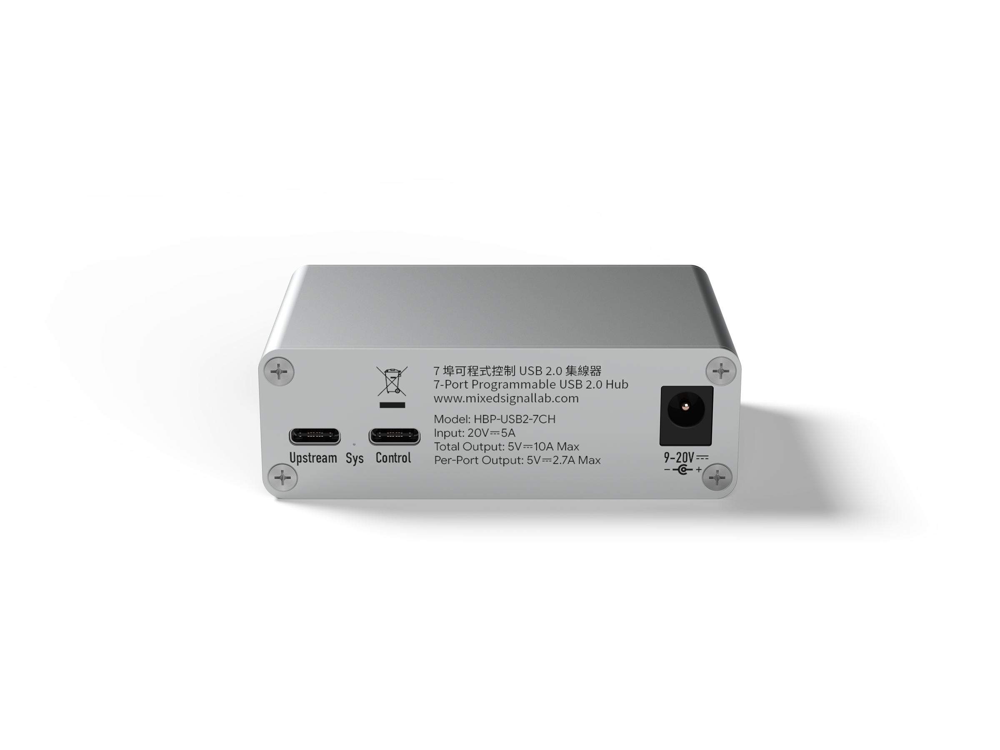
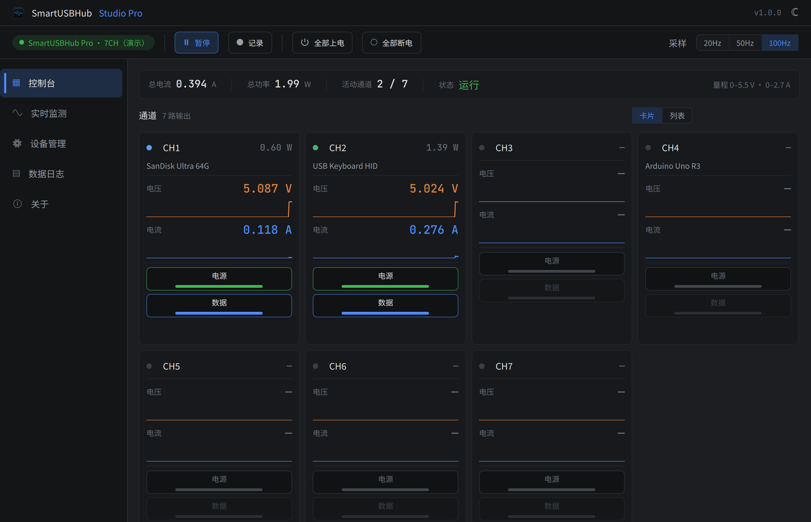

# SmartUSBHub Pro 7CH USB2.0

[下载 PDF](./downloads/user-guide-zh.pdf)


:::{admonition} 提示：快速查找
:class: note

首次使用请依次阅读第 2、3、5、6 章。出现异常时停止相关操作，并查阅第 10 章。
:::


## 1 关于本说明书


### 1.1 目的和适用范围

本说明书适用于 SmartUSBHub Pro 7CH USB2.0 标准版 HBP_USB2_7CH 和测量增强版 HBP_USB2_7CH_ADV。除电压、电流测量功能外，两种型号的端口控制、连接和安全要求相同。


### 1.2 目标用户


| 用户 | 预期能力 | 主要任务 |
| --- | --- | --- |
| 操作人员 | 能识别 USB 接口并遵守基本电气安全要求 | 连接设备、控制通道、观察指示灯 |
| 研发/测试工程师 | 了解 USB、串口和自动化脚本 | 配置端口、读取状态和测量值、使用 API |
| 系统集成人员 | 能够核算电源预算并设计测试拓扑 | 安装、选型和多设备集成 |
| 维修人员 | 由制造商授权并具备电子维修能力 | 授权范围内的检修 |


### 1.3 文档约定


:::{admonition} 警告：人身与设备安全
:class: warning

不遵守可能造成人身伤害、火灾或严重设备损坏。
:::


:::{admonition} 小心：产品与数据保护
:class: caution

不遵守可能造成产品、被测设备或数据损坏。
:::


:::{admonition} 提示：补充信息
:class: note

有助于正确、高效使用的补充信息。
:::


:::{admonition} 正常结果：操作确认
:class: note

完成操作后应观察到的状态，用于确认操作成功。
:::


### 1.4 型号差异


| 功能 | HBP_USB2_7CH | HBP_USB2_7CH_ADV |
| --- | --- | --- |
| 7 路 VBUS 独立控制 | 支持 | 支持 |
| 7 路 D+ / D− 独立控制 | 支持 | 支持 |
| 端口过流状态 | 支持 | 支持 |
| 各端口电压/电流测量 | 不支持 | 支持 |
| 测量数据流 | 不支持 | 最高 100 Hz |


## 2 安全信息


### 2.1 预期用途

本产品用于室内 USB 2.0 设备管理与自动化测试，可通过 USB CDC 指令分别控制七个下行端口的 VBUS 和 D+ / D−。ADV 型号还可读取各端口电压和电流。


### 2.2 禁止和注意事项

- 使用不符合规格、无过流或短路保护的直流电源。

- 将 24.5 V 绝对最大值误当作正常工作电压。

- 在文件写入、固件升级或其他不可中断任务期间关闭 VBUS 或数据线。

- 在潮湿、凝露、存在导电粉尘或易燃物的环境中使用。

- 自行拆解、改装，或让金属异物接触接口和电路。

- 忽略单端口限流与整机功率预算，长期过载运行。


:::{admonition} 警告：仅使用规定的直流电源
:class: warning

建议使用 19–20 V、5 A、带限流和短路保护的合格直流电源。不得超过 24.5 V 绝对最大输入；该数值不是允许的工作电压。
:::


:::{admonition} 小心：断连可能损坏数据或固件
:class: caution

关闭 VBUS 或 D+ / D− 等同于拔出设备。操作前停止文件写入、固件升级和其他不可中断任务。
:::


:::{admonition} 小心：总输出电流不得超过 10 A
:class: caution

每路保护阈值约 2.1 A，不代表七路可同时持续输出该电流。七路输出电流总和不得超过 10 A；七口同时满载可能触发电源保护并导致系统重启。
:::


:::{admonition} 警告：高负载时外壳可能很热
:class: warning

长时间高负载运行会使外壳温度明显升高。设备运行期间和断电后尚未冷却时，请勿触摸外壳；应保持通风并远离易燃物。
:::


### 2.3 异常处理

发现异味、冒烟、异常发热、液体进入、接口变形或反复过流时，立即停止控制任务，断开 DC 电源、DATA 上行口和 CMD 控制口，并联系技术支持。


## 3 产品说明


### 3.1 产品用途

SmartUSBHub 将人工插拔 USB 的动作转换为可脚本化操作，适用于硬件调试、自动化测试、产线验证、固件刷写与异常恢复。每个通道均可独立控制供电与 USB 2.0 数据连接。


### 3.2 系统框图


图 3-1 SmartUSBHub Pro 7CH USB2.0 系统框图

DATA 口承载七路集线器数据；CMD 口枚举为 USB CDC 串口并接收控制指令。外部 DC 输入经两组 5 V 电源轨向下行端口供电。


### 3.3 接口总览


图 3-2 正面：七个 USB-A 下行端口




图 3-3 背面：DATA、CMD 与 DC 输入


| 标识 | 类型 | 功能 |
| --- | --- | --- |
| CH1–CH7 | USB-A 下行 | 连接被测 USB 2.0 设备；VBUS 与数据线可独立控制 |
| DATA | USB-C 上行 | 连接 USB 主机，承载七路 USB 数据 |
| CMD | USB-C 控制 | 连接控制主机，枚举为 USB CDC 虚拟串口 |
| DC IN | 直流输入 | 建议连接 19–20 V / 5 A 电源 |


### 3.4 指示灯与本机操作

设备设有状态指示灯和七个通道指示灯。本型号没有通道实体按键；通道控制通过 Control Pannel、Studio Pro、Python API 或串口协议完成。


## 4 开箱、运输与存放


### 4.1 包装检查

- SmartUSBHub Pro 7CH USB2.0 主机

- 与订单一致的电源适配器和线缆（如订购）

- 产品标签及随附资料

如发现外壳明显变形、接口松动、液体痕迹或运输损伤，请勿上电，并保留包装联系销售或技术支持。


### 4.2 存放

在清洁、干燥、无凝露环境中存放，避免静电、腐蚀性气体、强冲击和重压。建议存放温度为 −10–85 °C。


## 5 安装与连接


### 5.1 安装位置

将设备放置在稳固、通风的表面，确保接口和线缆不受拉扯，并为散热留出空间。


### 5.2 推荐连接顺序

1. 连接 DC 电源  
正常结果：确认电源为 19–20 V、额定电流不低于系统所需，并具备限流和短路保护。

2. 连接 CMD 控制口  
正常结果：使用 USB-C 数据线连接控制计算机，系统应枚举出 USB CDC 串口。

3. 连接 DATA 上行口  
正常结果：使用 USB-C 数据线连接承载 USB 设备的主机。控制主机与数据主机可以是同一台或不同计算机。

4. 连接下行设备  
正常结果：将设备接入 CH1–CH7，先保持高功率负载关闭，再按需启用端口。


:::{admonition} 提示：低功耗临时使用
:class: note

DATA/CMD 的 USB 总线电源只适合低功耗或调试场景，合计能力受限。多设备或较大负载必须连接 DC 电源。
:::


## 6 首次使用


### 6.1 上电前检查

- 型号、外观和接口无异常。

- DC 电源电压、额定功率和保护功能符合要求。

- DATA 与 CMD 使用可传输数据的 USB-C 线缆。

- 七路负载的稳态电流和启动电流在预算内。


### 6.2 建立控制连接

1. 打开控制软件  
正常结果：启动 Control Pannel 或 Studio Pro。

2. 选择设备  
正常结果：从设备列表选择 SmartUSBHub Pro 7CH USB2.0 对应的串口。

3. 读取状态  
正常结果：连接后读取 CH1–CH7 的 VBUS、数据和过流状态。ADV 型号还应显示电压、电流。


:::{admonition} 正常结果：连接成功
:class: note

软件显示七个通道，命令执行后状态与对应通道指示灯同步变化。
:::


## 7 日常操作


### 7.1 控制原则

VBUS 控制设备供电，D+ / D− 控制 USB 2.0 数据连接。两者可以独立操作；恢复设备时通常先接通 VBUS，等待电源稳定后再接通数据。


### 7.2 安全断开通道

1. 停止任务  
正常结果：停止文件访问、刷写、采集和其他不可中断任务。

2. 关闭数据  
正常结果：断开对应通道 D+ / D−，并等待主机完成设备移除。

3. 关闭电源  
正常结果：确认无需继续供电后关闭对应通道 VBUS。


### 7.3 过流处理

出现过流状态时立即关闭对应通道，检查负载、线缆和接口是否短路或启动电流过大。排除原因并等待器件恢复后再重新启用；不要反复强制重试。


### 7.4 ADV 测量值

电压、电流读数用于运行监视和自动化判据，不代替经过校准的实验室仪器。高采样率数据流会增加主机与通信负载，仅在需要时启用。


## 8 软件与编程控制


### 8.1 Control Pannel 与 Studio Pro

Control Pannel 提供轻量通道开关和状态查看；Studio Pro 适合多设备管理、测量曲线和复杂测试。界面会按设备能力显示七个通道，标准版不会显示 ADV 专属测量功能。


图 8-1 Control Pannel 的 7 通道控制界面

Control Pannel 在同一控制页显示 CH1–CH7，可分别开启或关闭各通道。




图 8-2 Studio Pro 的 7 通道首页

连接 7 通道设备后，Studio Pro 首页显示 CH1–CH7 的控制和状态。ADV 型号同时显示各通道电压、电流和功率；标准版不显示测量数据。


### 8.2 Python API

Python API 适合自动化测试。安装包名为 smartusbhub；执行控制前，先确认连接的是目标设备和目标通道。

1. 在终端安装 Python 库：

pip install smartusbhub

2. 运行以下示例。示例连接第一台可用设备，开启 CH1 电源，读取电压、电流，最后释放串口：


```python
from smartusbhub import SmartUSBHub

# 扫描并连接第一台可用的 SmartUSBHub
hub = SmartUSBHub.scan_and_connect()
if hub is None:
    raise RuntimeError("未找到 SmartUSBHub")

try:
    # 打开 CH1 电源；固件会自动连通该通道的数据线
    hub.set_channel_power(1, state=1)

    # 电压返回 mV，电流返回 mA
    voltage_mv = hub.get_channel_voltage(1)
    current_ma = hub.get_channel_current(1)
    if voltage_mv is None or current_ma is None:
        raise RuntimeError("读取 CH1 测量值失败")
    print(f"CH1: {voltage_mv / 1000:.3f} V, {current_ma} mA")
finally:
    hub.disconnect()
```


| API | 作用 |
| --- | --- |
| scan_and_connect() | 扫描并连接第一台可用设备。 |
| set_channel_power(\*channels, state) | 打开或关闭指定通道电源。 |
| set_channel_usb2_dataline(\*channels, state) | 连通或断开指定通道 USB 2.0 数据线。 |
| get_channel_voltage(channel) | 读取指定通道电压。 |
| get_channel_current(channel) | 读取指定通道电流。 |
| disconnect() | 断开控制连接并释放串口。 |


### 8.3 通信协议

CMD 口使用 USB CDC 虚拟串口，默认波特率为 115200。协议包含 V1、V2 和 V3 帧格式；命令、帧结构和校验规则以对应固件版本的正式协议/API 文档为准。

在线文档：[https://www.mixedsignallab.com/docs/zh_CN/](https://www.mixedsignallab.com/docs/zh_CN/)


:::{admonition} 小心：自动化脚本必须处理异常
:class: caution

脚本应校验设备标识、通道范围 1–7、命令响应、过流状态和超时，并在退出时恢复到明确的安全状态。
:::


## 9 维护与固件升级


### 9.1 日常维护

保持接口清洁干燥。清洁前断开全部电源和 USB 连接，使用干燥软布擦拭；禁止使用喷雾、溶剂或金属工具清理接口。


### 9.2 固件升级

1. 停止下游设备的所有写入和升级任务，并保持 SmartUSBHub 的 CMD 接口连接。

2. 打开 Control Pannel 或 Studio Pro，连接目标设备并核对当前硬件版本和固件版本。

3. 点击软件中的固件升级按钮，按提示下载并安装与设备匹配的固件。

4. 升级完成并自动重启后，等待软件重新连接；核对固件版本，并验证七个端口和通信功能。


:::{admonition} 警告：升级期间保持供电
:class: warning

升级过程中不要断开指令控制口或供电，不要让主机休眠。错误固件或升级中断可能使设备无法正常启动。
:::


## 10 故障排查


| 现象 | 可能原因 | 处理方法 |
| --- | --- | --- |
| 找不到设备 | CMD 线缆仅供电、驱动或端口异常 | 更换数据线和 USB 口；在系统设备列表中确认 CDC 串口 |
| 下行设备不枚举 | DATA 未连接、D+ / D− 关闭或线缆异常 | 检查 DATA 连接并启用对应通道数据线 |
| 设备掉线或重启 | 七路总输出超过 10 A、压降或启动电流过大 | 降低总负载至 10 A 以下，使用合格 DC 电源，缩短线缆并错开设备启动 |
| 通道报告过流 | 负载短路、过载或接口损坏 | 关闭通道，检查负载与线缆，排除原因后重试 |
| 设备异常发热 | 负载过大、通风不良或环境温度过高 | 停止负载并断电冷却，改善通风；未查明原因前不要继续使用 |


## 11 技术规格


### 11.1 主要规格


| 项目 | 规格 |
| --- | --- |
| 下行接口 | 7 × USB-A，USB 2.0 High-Speed |
| 上行接口 | 1 × USB-C DATA；1 × USB-C CMD/USB CDC |
| 控制能力 | 每路 VBUS 与 D+ / D− 独立控制 |
| DC 输入接口 | DC5525，内正外负 |
| 推荐 DC 输入 | 9–20 V DC；典型 20 V / 5 A，需带保护 |
| DC 绝对最大值 | 24.5 V；不得作为正常工作电压 |
| 单端口充电能力 | 符合 BC 1.2 CDP，最高 1.5 A；取决于主机、设备与供电条件 |
| 单端口保护阈值 | 约 2.1 A |
| 最大总输出电流 | 10 A；七口满载可能触发保护并导致系统重启 |
| ADV 电压测量 | 范围 0–5.5 V；分辨率 8 mV |
| ADV 电流测量 | 范围 0–2.7 A；分辨率 1 mA |
| USB 速率 | High-Speed 480 Mbps；兼容 Full-Speed 12 Mbps 和 Low-Speed 1.5 Mbps |
| 外形尺寸 | 84 × 56.8 × 28 mm |
| 重量 | 约 142 g |
| 工作温度 | 0–50 °C |
| 存放温度 | −10–85 °C |
| 相对湿度 | 5%–95% RH，非冷凝 |


### 11.2 外形尺寸


图 11-1 产品外形

外形包络尺寸为 84 mm × 56.8 mm × 28 mm。为线缆弯曲、插拔和散热预留额外空间；安装设计不得只按产品包络尺寸计算。


### 11.3 功率预算


:::{admonition} 警告：七路总输出不得超过 10 A
:class: warning

七个端口的输出电流总和不得超过 10 A。若七口均按 BC 1.2 的 1.5 A 满载，理论需求为 10.5 A，已超过整机允许值，可能触发电源保护并导致 SmartUSBHub 及其连接设备重启。请降低负载或错开设备启动。
:::


:::{admonition} 警告：高负载时注意高温
:class: warning

接近最大总输出电流长时间运行时，外壳可能明显发热。运行期间和断电后尚未冷却时请勿触摸外壳；必须保持通风，且不得覆盖设备或靠近易燃物。
:::


## 12 停用、处置与支持


### 12.1 停用

停止全部任务并安全移除下行设备，然后依次关闭通道、断开下行设备、DATA、CMD 和 DC 电源。长期停用前清洁并干燥存放。


### 12.2 处置

本产品属于电子电气设备。请遵守所在地电子废弃物分类和回收规定，不要作为未分类生活垃圾处置。


### 12.3 技术支持与保修

技术资料：[https://www.mixedsignallab.com/docs/zh_CN/](https://www.mixedsignallab.com/docs/zh_CN/)

品牌网站：[https://www.mixedsignallab.com](https://www.mixedsignallab.com)

本产品自收货之日起提供一年有限保修。因过压、过载、短路、进液、跌落、擅自拆修、未按说明书使用或不可抗力造成的损坏不属于免费保修范围。返修前请联系技术支持确认。


## 附录 A 指示灯速查


| 指示灯 | 状态 | 含义 |
| --- | --- | --- |
| 状态灯 | 周期闪烁 | 设备正常运行 |
| 状态灯 | 快速闪烁 | 设备识别或升级状态 |
| 通道灯 | 亮 | 对应通道 VBUS 已启用 |
| 通道灯 | 灭 | 对应通道 VBUS 已关闭 |

不同固件版本的闪烁节奏可能调整；诊断时以软件报告状态和对应固件发布说明为准。


## 附录 B 术语表


| 术语 | 定义 |
| --- | --- |
| DATA | 承载七路 USB 2.0 集线器数据的 USB-C 上行口。 |
| CMD | 枚举为 USB CDC 虚拟串口的控制接口。 |
| 通道 | 与一个下行口对应的可控逻辑单元，编号 CH1–CH7。 |
| VBUS；D+ / D− | USB 总线电源；USB 2.0 差分数据线。 |
| USB CDC | 操作系统通常免专用驱动识别的虚拟串口设备类。 |
| ADV；过流状态 | 带各端口电压、电流检测的增强型号；端口超过保护条件时报告的故障状态。 |
