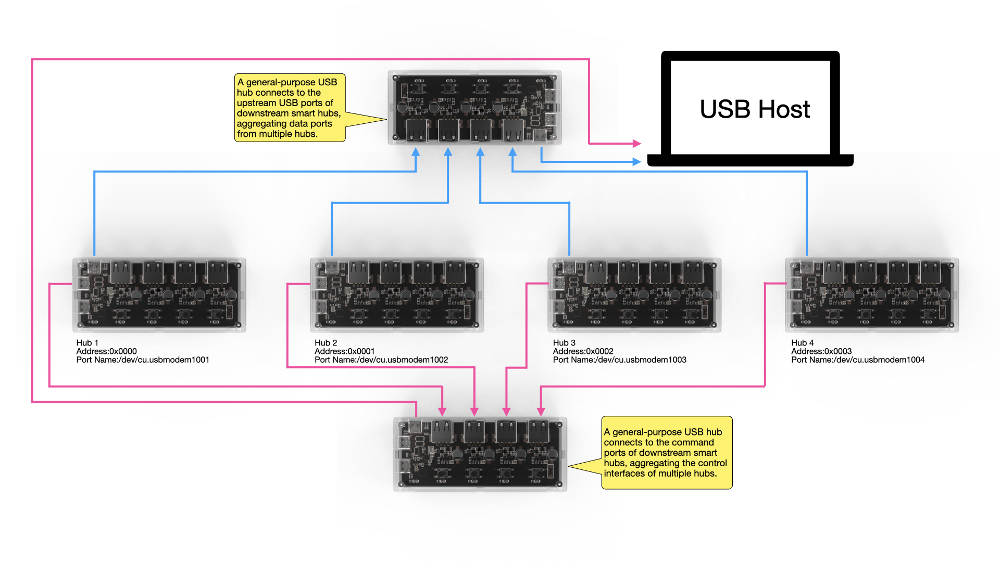
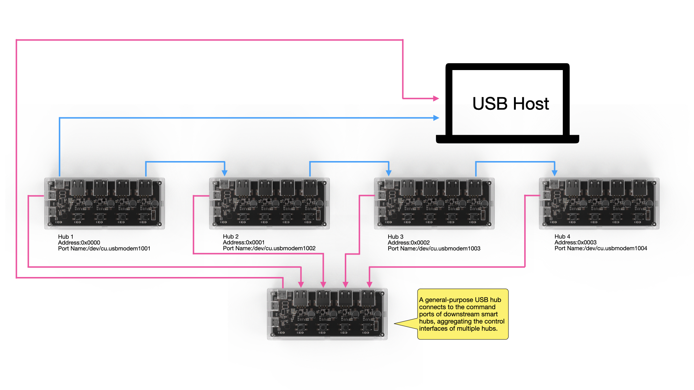

# SmartUSBHub Communication Protocol

[简体中文](./protocol_cn.md)

[Download PDF](./downloads/protocol-en.pdf)

[Product Documentation](./README.md) · [Python SDK](../README.md)

This document describes the shared serial settings, protocol frame format, complete command set, and command examples for the SmartUSBHub family. Channel counts and optional capabilities vary by product; the channel values and frames below primarily use a four-channel model as the example.

## Document Navigation

- [Command set](#command-set)
- [Frame format](#frame-format)
- [Command examples](#command-examples)
- [Product documentation](./README.md)
- [Python SDK](../README.md)

## **Command Set**

**The device uses a simple request-response communication protocol for control. The available commands are:**

| **Function**                       | **CMD** | **Description**                                              |
| :--------------------------------- | ------- | ------------------------------------------------------------ |
| Control channel power              | 0x01    | Control the VBUS power state of a specified channel          |
| Query channel power state          | 0x00    | Query whether a channel’s VBUS power is on                   |
| Control power in interlock mode    | 0x02    | Enable power on only one channel at a time                   |
| Query voltage                      | 0x03    | Query the channel’s VBUS voltage (unit: mV)                  |
| Query current                      | 0x04    | Query the channel’s current (unit: mA)                       |
| Control USB data lines             | 0x05    | Control whether D+/D− are connected                          |
| Query USB data line status         | 0x08    | Query the current on/off status of D+/D−                     |
| Set button control permission      | 0x09    | Enable or disable the physical button control                |
| Query button control permission    | 0x0A    | Query whether button control is enabled                      |
| Set power default state            | 0x0B    | Configure the default on/off state of VBUS after power-up    |
| Query power default state          | 0x0C    | Query the channel’s power default state                      |
| Set data default state             | 0x0D    | Configure the default on/off state of D+/D− after power-up   |
| Query data default state           | 0x0E    | Query the default state of D+/D−                             |
| Set power-loss state Persistence   | 0x0F    | Enable/disable remembering channel state on power loss       |
| Query power-loss Persistence state | 0x10    | Query if power-loss state Persistence is enabled             |
| Set Device Address                 | 0x11    | Set the device address, used to identify and distinguish hubs in multi-hub setups |
| Get Device Address                 | 0x12    | Get the device address, used to identify and distinguish hubs in multi-hub setups |
| Set operation mode                 | 0x06    | Switch Normal/Interlock mode                                 |
| Query operation mode               | 0x07    | Query the current operating mode                             |
| Restore factory settings           | 0xFC    | Restore factory settings                                     |
| Query firmware version             | 0xFD    | Query the device firmware version                            |
| Query hardware version             | 0xFE    | Query the current hardware version                           |


## Frame format

SmartUSBHub uses V1, V2, and V3 frames on the same serial link. Numbers in the layouts below are bit offsets; each regular field occupies 8 bits (one byte).

### V1 frame: one data byte

| Offset | Field | Size | Description |
| ---: | --- | ---: | --- |
| 0 | SOF1 | 1 | Fixed `0x55` |
| 1 | SOF2 | 1 | Fixed `0x5A` |
| 2 | CMD | 1 | Command code |
| 3 | CHANNEL | 1 | Channel bitmask; bit 0 is channel 1 |
| 4 | VALUE | 1 | One-byte command argument or status |
| 5 | SUM8 | 1 | `(CMD + CHANNEL + VALUE) & 0xFF` |

V1 is always 6 bytes and carries most set, query, and acknowledgement messages.

### V2 frame: two data bytes

| Offset | Field | Size | Description |
| ---: | --- | ---: | --- |
| 0–1 | SOF | 2 | Fixed `55 5A` |
| 2 | CMD | 1 | Command code |
| 3 | CHANNEL | 1 | Channel bitmask |
| 4 | VALUE0 | 1 | High byte of voltage/current, or the `enable` field |
| 5 | VALUE1 | 1 | Low byte of voltage/current, or the `status` field |
| 6 | SUM8 | 1 | `(CMD + CHANNEL + VALUE0 + VALUE1) & 0xFF` |

V2 is always 7 bytes. It currently carries voltage/current replies and default power/data-line states that need two data bytes. Parse a 16-bit measurement as `VALUE0 << 8 | VALUE1`.

### V3 frame: variable-length data

| Offset | Field | Size | Description |
| ---: | --- | ---: | --- |
| 0–3 | MAGIC | 4 | Fixed `55 AB CD EF` |
| 4 | CMD | 1 | Command code |
| 5 | FLAGS | 1 | bit 0=`STREAM`; set for unsolicited stream notifications |
| 6–7 | LENGTH | 2 | Payload length, little-endian: `LEN_L, LEN_H` |
| 8–9 | CRC16 | 2 | Little-endian: `CRC_L, CRC_H` |
| 10… | PAYLOAD | LENGTH | Command-specific variable data |

The total V3 frame size is `10 + LENGTH` bytes. The current maximum is 64 bytes, leaving up to 54 payload bytes. CRC16 uses polynomial `0x8005` and initial value `0xFFFF`; zero both CRC field bytes before calculating across the complete frame from MAGIC through the end of PAYLOAD. V3 carries batch measurements, measurement streams, channel names, device aliases, debug logs, and other variable-length data.

> [!NOTE]
> The SDK selects and parses the frame version automatically. Normal API calls do not need to specify V1, V2, or V3.


## **Command Examples**

> [!NOTE]
>
> - All data values below are in hexadecimal.
> - Channel values use the `Channel_e` enum, not the channel number. In control and query commands, bitwise OR can be used for batch control and query; if the device is in *interlock* mode, only the `interlock control command [0x02]` can be used for control; bitwise combination is ineffective.
> - Frames with an incorrect format or unsupported commands will not receive a response.
> - When a button is pressed, a `status report [0x00] command` of that channel’s current state will be sent.
> - The provided package includes a UART assistant tool (uart_tool) for quick start.
> - A Python control library [smartusbhub](https://github.com/mixedsignal-labs/smartusbhub) is available.
> - In this document, USB downstream port is referred to simply as a channel.


**Channel Enum Values (Channel_e):**

```c
typedef enum
{
    CH1 = 0x01,
    CH2 = 0x02,
    CH3 = 0x04,
    CH4 = 0x08,
    CH5 = 0x10,
    CH6 = 0x20,
    CH7 = 0x40,
}Channel_e;

```
The available channels depend on the product model: four-channel products use CH1 through CH4, while seven-channel products use CH1 through CH7.

> [!NOTE]
>
> **Device Communication Parameters:**
>
> - Baud Rate: 115200 – 921600 (Default: `115200`)
>
> - Data Bits: `8`
>
> - Parity: `None`
>
> - Stop Bits: `1`
>
> **Device Name:**
>
> - Windows: `COMx`
>
> - Linux: `/dev/ttyACMx`
>
> - macOS: `/dev/cu.usbmodemx`


------


### **Control Channel Power Switch (CMD: 0x01)**

> [!NOTE]
>
> If the device is in interlock mode, the normal control command (CMD: 0x01) is ineffective; you must use the interlock control command (CMD: 0x02) instead.
>
> If a control command is sent in interlock mode, an “invalid command” frame will be returned:
>
> *Invalid Command:*
>
> ```
> 55 5A 01 FF FF FF
> ```

#### **Data Field Description:**

| data[0]     | data[1]             |
| ----------- | ------------------- |
| Channel ID  | Channel Power State |
| `Channel_e` | 0 (OFF), 1 (ON)     |


#### **Turn On Channel 1 Power**

**Command**:

```
55 5A 01 01 01 03
```

**Response**:

```
55 5A 01 01 01 03
```

#### **Turn Off Channel 1 Power**

**Command**:

```
55 5A 01 01 00 02
```

**Response**:

```
55 5A 01 01 00 02
```


#### **Turn On Channel 2 Power**

**Command**:

```
55 5A 01 02 01 04
```

**Response**:

```
55 5A 01 02 01 04
```

#### **Turn Off Channel 2 Power**

**Command**:

```
55 5A 01 02 00 03
```

**Response**:

```
55 5A 01 02 00 03
```


#### **Turn On Channel 3 Power**

**Command**:

```
55 5A 01 04 01 06
```

**Response**:

```
55 5A 01 04 01 06
```

#### **Turn Off Channel 3 Power**

**Command**:

```
55 5A 01 04 00 05
```

**Response**:

```
55 5A 01 04 00 05
```


#### **Turn On Channel 4 Power**

**Command**:

```
55 5A 01 08 01 0A
```

**Response**:

```
55 5A 01 08 01 0A
```

#### **Turn Off Channel 4 Power**

**Command**:

```
55 5A 01 08 00 09
```

**Response**:

```
55 5A 01 08 00 09
```


#### **Combined Control Example**

##### **Turn On Channel 1 and Channel 3 Power**

**Command**:

```
55 5A 01 05 01 07
```

**Response**:

```
55 5A 01 05 01 07
```

##### **Turn Off Channel 1 and Channel 3 Power**

**Command**:

```
55 5A 01 05 00 06
```

**Response**:

```
55 5A 01 05 00 06
```

##### **Turn On All Channels**

**Command**:

```
55 5A 01 0F 01 11
```

**Response**:

```
55 5A 01 0F 01 11
```

##### **Turn Off All Channels**

**Command**:

```
55 5A 01 0F 00 10
```

**Response**:

```
55 5A 01 0F 00 10
```


### **Query Channel Power State (CMD: 0x00)**

#### **Data Field Description:**

| data[0]     | data[1]             |
| ----------- | ------------------- |
| Channel ID  | Channel Power State |
| `Channel_e` | 0 (OFF), 1 (ON)     |


#### **Query Channel 1 Power State**

**Command**:

```
55 5A 00 01 00 01
```

**Response**:

**If channel 1 power is OFF**:

```
55 5A 00 01 00 01
```

**If channel 1 power is ON**:

```
55 5A 00 01 01 02
```


#### **Query Channel 2 Power State**

**Command**:

```
55 5A 00 02 00 02
```

**Response**:

**If channel 2 power is OFF**:

```
55 5A 00 02 00 02
```

**If channel 2 power is ON**:

```
55 5A 00 02 01 03
```


#### **Query Channel 3 Power State**

**Command**:

```
55 5A 00 04 00 04
```

**Response**:

**If channel 3 power is OFF**:

```
55 5A 00 04 00 04
```

**If channel 3 power is ON**:

```
55 5A 00 04 01 05
```


#### **Query Channel 4 Power State**

**Command**:

```
55 5A 00 08 00 08
```

**Response**:

**If channel 4 power is OFF**:

```
55 5A 00 08 00 08
```

**If channel 4 power is ON**:

```
55 5A 00 08 01 09
```


#### **Combined Control Example**:

##### **Query All Channels’ Power States**

**Command**:

```
55 5A 00 0F 00 0F
```

**Response**:

```
55 5A 00 01 01 02
55 5A 00 02 00 02
55 5A 00 04 00 04
55 5A 00 08 01 09
```

- **Channel 1 Power: ON**

- **Channel 2 Power: OFF**

- **Channel 3 Power: OFF**

- **Channel 4 Power: ON**


### **Control Channel USB Data Line Switch (CMD: 0x05)**

The device can control the connectivity of the D+ and D− differential pair for a specified channel, allowing scenarios where power is maintained but data is disconnected.

> [!NOTE]
>
> - By default, each channel’s USB data (D+/D−) lines are connected unless the user sends a control command (CMD: 0x05) to manually disconnect them.
>
> - If power-loss state Persistence is enabled, the data line on/off state will be remembered.

#### **Data Field Description:**

| data[0]     | data[1]                 |
| ----------- | ----------------------- |
| Channel ID  | Channel Data Line State |
| `Channel_e` | 0 (OFF), 1 (ON)         |


#### **Connect Channel 1 Data Lines**

**Command**:

```
55 5A 05 01 01 07
```

**Response**:

```
55 5A 05 01 01 07
```

#### **Disconnect Channel 1 Data Lines**

**Command**:

```
55 5A 05 01 00 06
```

**Response**:

```
55 5A 05 01 00 06
```


#### **Connect Channel 2 Data Lines**

**Command**:

```
55 5A 05 02 01 08
```

**Response**:

```
55 5A 05 02 01 08
```

#### **Disconnect Channel 2 Data Lines**

**Command**:

```
55 5A 05 02 00 07
```

**Response**:

```
55 5A 05 02 00 07
```


#### **Connect Channel 3 Data Lines**

**Command**:

```
55 5A 05 04 01 0A
```

**Response**:

```
55 5A 05 04 01 0A
```

#### **Disconnect Channel 3 Data Lines**

**Command**:

```
55 5A 05 04 00 09
```

**Response**:

```
55 5A 05 04 00 09
```


#### **Connect Channel 4 Data Lines**

**Command**:

```
55 5A 05 08 01 0E
```

**Response**:

```
55 5A 05 08 01 0E
```

#### **Disconnect Channel 4 Data Lines**

**Command**:

```
55 5A 05 08 00 0D
```

**Response**:

```
55 5A 05 08 00 0D
```


#### **Combined Control Example**:

##### **Connect Data Lines on All Channels**

**Command**:

```
55 5A 05 0F 01 15
```

**Response**:

```
55 5A 05 0F 01 15
```

##### **Disconnect Data Lines on All Channels**

**Command**:

```
55 5A 05 0F 00 14
```

**Response**:

```
55 5A 05 0F 00 14
```


### **Query Channel USB Data Line State (CMD: 0x08)**

#### **Data Field Description:**

| data[0]     | data[1]                 |
| ----------- | ----------------------- |
| Channel ID  | Channel Data Line State |
| `Channel_e` | 0 (OFF), 1 (ON)         |


#### **Query Channel 1 Data Line State**

**Command**:

```
55 5A 08 01 00 09
```

**Response**:

**If channel 1 data is DISCONNECTED**:

```
55 5A 08 01 00 09
```

**If channel 1 data is CONNECTED**:

```
55 5A 08 01 01 0A
```


#### **Query Channel 2 Data Line State**

**Command**:

```
55 5A 08 02 00 0A
```

**Response**:

**If channel 2 data is DISCONNECTED**:

```
55 5A 08 02 00 0A
```

**If channel 2 data is CONNECTED**:

```
55 5A 08 02 01 0B
```


#### **Query Channel 3 Data Line State**

**Command**:

```
55 5A 08 04 00 0C
```

**Response**:

**If channel 3 data is DISCONNECTED**:

```
55 5A 08 04 00 0C
```

**If channel 3 data is CONNECTED**:

```
55 5A 08 04 01 0D
```


#### **Query Channel 4 Data Line State**

**Command**:

```
55 5A 08 08 00 10
```

**Response**:

**If channel 4 data is DISCONNECTED**:

```
55 5A 08 08 00 10
```

**If channel 4 data is CONNECTED**:

```
55 5A 08 08 01 11
```


#### **Combined Control Example**:

##### **Combined Control Example: Query All Channels’ Data Line States**

**Command**:

```
55 5A 08 0F 00 17
```

**Response**:

```
55 5A 08 01 01 0A
55 5A 08 02 01 0B
55 5A 08 04 01 0D
55 5A 08 08 01 11
```

- **Channel 1 Data: CONNECTED**

- **Channel 2 Data: CONNECTED**
- **Channel 3 Data: CONNECTED**
- **Channel 4 Data: CONNECTED**


### **Control Power in Interlock Mode (CMD: 0x02)**

> [!IMPORTANT]
> In interlock mode, use only this command to select the powered channel; the regular power command (CMD: 0x01) cannot control channels. Turning a channel's power off also disconnects its data line. CMD: 0x02 itself controls power; use the data-line command (CMD: 0x05) when the selected channel's USB2 data line also needs to be controlled.

**Control Truth Table:**

| **Channel 1** | **Channel 2** | **Channel 3** | **Channel 4** |
| ------------- | ------------- | ------------- | ------------- |
| Closed        | Closed        | Closed        | Closed        |
| **Open**      | Closed        | Closed        | Closed        |
| Closed        | **Open**      | Closed        | Closed        |
| Closed        | Closed        | **Open**      | Closed        |
| Closed        | Closed        | Closed        | **Open**      |

#### **Data Field Description:**

| data[0]     | data[1]             |
| ----------- | ------------------- |
| Channel ID  | Channel Power State |
| `Channel_e` | 0 (OFF), 1 (ON)     |


#### **Turn On Channel 1 Power (others off)**

**Command**:

```
55 5A 02 01 01 04
```

**Response**:

```
55 5A 02 01 01 04
```


#### **Turn On Channel 2 Power (others off)**

**Command**:

```
55 5A 02 02 01 05
```

**Response**:

```
55 5A 02 02 01 05
```


#### **Turn On Channel 3 Power (others off)**

**Command**:

```
55 5A 02 04 01 07
```

**Response**:

```
55 5A 02 04 01 07
```


#### **Turn On Channel 4 Power (others off)**

**Command**:

```
55 5A 02 08 01 0B
```

**Response**:

```
55 5A 02 08 01 0B
```


#### **Turn Off All Channels**

**Command**:

```
55 5A 02 0F 01 12
```

**Response**:

```
55 5A 02 0F 01 12
```


### **Query Channel Voltage (CMD: 0x03)**


> [!NOTE]
>
> - The device can measure the output voltage (VBUS) of each channel, which can be used to check if the bus is functioning normally.
> - The voltage unit is mV (millivolts).
> - Voltage resolution is 0.1 V

#### **Data Field Description:**

| data[0]     | data[1]                     | data[2]                    |
| ----------- | --------------------------- | -------------------------- |
| Channel ID  | Channel Voltage value[15:8] | Channel Voltage value[7:0] |
| `Channel_e` | -                           | -                          |


#### **Query Channel 1 Voltage**:

**Command**:

```
55 5A 03 01 00 04
```

**Response**:

```
55 5A 03 01 13 56 6D
```

**Channel 1 Voltage = 0x1356 = 4950 mV (channel ON)**


#### **Query Channel 2 Voltage**:

**Command**:

```
55 5A 03 02 00 05
```

**Response**:

```
55 5A 03 02 00 0C 11
```

**Channel 2 Voltage = 0x000C = 12 mV (channel OFF)**


#### **Query Channel 3 Voltage**:

**Command**:

```
55 5A 03 04 00 07
```

**Response**:

```
55 5A 03 04 00 09 10
```

**Channel 3 Voltage = 0x0009 = 9 mV (channel OFF)**


#### **Query Channel 4 Voltage**:

**Command**:

```
55 5A 03 08 00 0B
```

**Response**:

```
55 5A 03 08 00 08 13
```

**Channel 4 Voltage = 0x0008 = 8 mV (channel OFF)**


### **Query Channel Current (CMD: 0x04)**

> [!NOTE]
>
> - The device can measure the current of each channel, which can be used to assess the device’s operating status.
> - The current unit is mA (milliamps).
> - Current resolution is 0.1 A

#### **Data Field Description:**

| data[0]     | data[1]                      | data[2]                     |
| ----------- | ---------------------------- | --------------------------- |
| Channel ID  | Channel Current value [15:8] | Channel Current value [7:0] |
| `Channel_e` | -                            | -                           |


#### **Query Channel 1 Current**:

**Command**:

```
55 5A 04 01 00 05
```

**Response**:

```
55 5A 04 01 01 29 2F
```

**Channel 1 Current = 0x0129 = 297 mA**


#### **Query Channel 2 Current**:

**Command**:

```
55 5A 04 02 00 06
```

**Response**:

```
55 5A 04 02 00 00 06
```

**Channel 2 Current = 0x0000 = 0 mA**


#### **Query Channel 3 Current**:

**Command**:

```
55 5A 04 04 00 08
```

**Response**:

```
55 5A 04 04 00 00 08
```

**Channel 3 Current = 0x0000 = 0 mA**


#### **Query Channel 4 Current**:

**Command**:

```
55 5A 04 08 00 0C
```

**Response**:

```
55 5A 04 08 00 00 0C
```

**Channel 4 Current = 0x0000  = 0ma**


### **Set Button Control Permission (CMD: 0x09)**

> [!NOTE]
>
> - By default, the device allows channel control via the buttons.
>
> -  This setting applies to all buttons and channels.
>
> - Long-press button functions are not affected.
>
> - This setting is retained after power off.

#### **Data Field Description:**

| data[0] | data[1]               |
| ------- | --------------------- |
| Fixed   | Enable Button Control |
| 0x00    | 0 (false), 1 (true)   |


#### **Disable Control via Buttons**

**Command**:

```
55 5A 09 00 00 09
```

**Response**:

```
55 5A 09 00 00 09
```


#### **Enable Control via Buttons**

**Command**:

```
55 5A 09 00 01 0A
```

**Response**:

```
55 5A 09 00 01 0A
```


### **Query Button Control Permission (CMD: 0x0A)**

#### **Data Field Description:**

| data[0] | data[1]               |
| ------- | --------------------- |
| Fixed   | Enable Button Control |
| 0x00    | 0 (false), 1 (true)   |

**Command**:

```
55 5A 0A 00 00 0A
```

**Response**:

**Button control enabled**:

```
55 5A 0A 00 01 0B
```

**Button control disabled**:

```
55 5A 0A 00 00 0A
```


### **Set Channel Power Default State (CMD: 0x0B)**

> [!NOTE]
>
> - When determining channel states after power-up, the default state has higher priority than the power-loss Persistence feature. If the default state feature is enabled, even if the power-loss Persistence feature is also enabled, the system on power-up will still use the default state to decide each channel’s power or data on/off status.
>- When the default state feature is disabled, the channels’ power-on state will be decided by the power-loss Persistence setting. If power-loss Persistence is also disabled (default configuration), then upon power-up all channels will default to OFF.
> - Factory default configuration: all channel power outputs are `OFF`.

#### **Data Field Description:**

| data[0]     | data[1]                    | data[2]             |
| ----------- | -------------------------- | ------------------- |
| Channel ID  | Enable Default Power State | Default Power Value |
| `Channel_e` | 0 (false), 1 (true)        | 0 (OFF), 1 (ON)     |


#### **Set Channel 1 Power Default to ON**

**Command**:

```
55 5A 0B 01 01 01 0E
```

**Response**:

```
55 5A 0B 01 01 01 0E
```


#### **Set Channel 1 Power Default to OFF**

**Command**:

```
55 5A 0B 01 01 00 0D
```

**Response**:

```
55 5A 0B 01 01 00 0D
```


#### **Set Channel 2 Power Default to ON**


**Command**:

```
55 5A 0B 02 01 01 0F
```

**Response**:

```
55 5A 0B 02 01 01 0F
```


#### **Set Channel 2 Power Default to OFF**


**Command**:

```
55 5A 0B 02 01 00 0E
```

**Response**:

```
55 5A 0B 02 01 00 0E
```


#### **Set Channel 3 Power Default to ON**


**Command**:

```
55 5A 0B 04 01 01 11
```

**Response**:

```
55 5A 0B 04 01 01 11
```


#### **Set Channel 3 Power Default to OFF**


**Command**:

```
55 5A 0B 04 00 00 0F
```

**Response**:

```
55 5A 0B 04 00 00 0F
```


#### **Set Channel 4 Power Default to ON**


**Command**:

```
55 5A 0B 08 01 01 15
```

**Response**:

```
55 5A 0B 08 01 01 15
```


#### **Set Channel 4 Power Default to OFF**


**Command**:

```
55 5A 0B 08 01 00 14
```

**Response**:

```
55 5A 0B 08 01 00 14
```


#### **Set All Channels Power Default to ON**

**Command**:

```
55 5A 0B 0F 01 01 1C
```

**Response**:

```
55 5A 0B 0F 01 01 1C
```


#### **Set All Channels Power Default to OFF**


**Command**:

```
55 5A 0B 0F 01 00 1B
```

**Response**:

```
55 5A 0B 0F 01 00 1B
```


#### **Disable Default Power State for Channel 1**

**Command**:

```
55 5A 0B 01 00 00 0C
```

**Response**:

```
55 5A 0B 01 00 00 0C
```


#### **Disable Default Power State for Channel 2**


**Command**:

```
55 5A 0B 02 00 00 0D
```

**Response**:

```
55 5A 0B 02 00 00 0D
```


#### **Disable Default Power State for Channel 3**


**Command**:

```
55 5A 0B 04 00 00 0F
```

**Response**:

```
55 5A 0B 04 00 00 0F
```


#### **Disable Default Power State for Channel 4**


**Command**:

```
55 5A 0B 08 00 00 13
```

**Response**:

```
55 5A 0B 08 00 00 13
```


#### **Disable Default Power State for All Channels**


**Command**:

```
55 5A 0B 0F 00 00 1A
```

**Response**:

```
55 5A 0B 0F 00 00 1A
```


### **Query Channel Power Default State (CMD: 0x0C)**

#### **Data Field Description:**

| data[0]     | data[1]                    | data[2]             |
| ----------- | -------------------------- | ------------------- |
| Channel ID  | Enable Default Power State | Default Power Value |
| `Channel_e` | 0 (false), 1 (true)        | 0 (OFF), 1 (ON)     |


#### **Query Channel 1 Power Default State**

**Command**:

```
55 5A 0C 01 00 00 0D
```

**Response**:

**Default state disabled:**

```
55 5A 0C 01 00 00 0D
```

**Default OFF:**

```
55 5A 0C 01 00 00 0D
```
**Default ON:**

```
55 5A 0C 01 01 01 0F
```


#### **Query Channel 2 Power Default State**

**Command**:

```
55 5A 0C 02 00 00 0E
```

**Response**:

**Default state disabled:**

```
55 5A 0C 02 00 00 0E
```

**Default OFF:**

```
55 5A 0C 02 00 00 0E
```
**Default ON:**

```
55 5A 0C 02 01 01 10
```


#### **Query Channel 3 Power Default State**

**Command**:

```
55 5A 0C 04 00 00 10
```

**Response**:

**Default state disabled:**

```
55 5A 0C 04 00 00 10
```

**Default OFF:**

```
55 5A 0C 04 00 00 10
```
**Default ON:**

```
55 5A 0C 04 01 01 12
```


#### **Query Channel 4 Power Default State**

**Command**:

```
55 5A 0C 08 00 00 14
```

**Response**:

**Default state disabled:**

```
55 5A 0C 08 00 00 14
```

**Default OFF:**

```
55 5A 0C 08 00 00 14
```
**Default ON:**

```
55 5A 0C 08 01 01 16
```


#### **Query All Channels Power Default State**

**Command**:

```
55 5A 0C 0F 00 00 1B
```

**Response**:

```
55 5A 0C 01 01 01 0F
55 5A 0C 02 01 01 10
55 5A 0C 04 01 01 12
55 5A 0C 08 01 01 16
```
- **Channel 1 Power: Default ON**

- **Channel 2 Power: Default ON**
- **Channel 3 Power: Default ON**
- **Channel 4 Power: Default ON**


### **Set Default Data Connectivity State (CMD: 0x0D)**

> [!NOTE]
>
> - When determining channel states after power-up, the default state has higher priority than the power-loss Persistence feature. If the default state feature is enabled, even if the power-loss Persistence feature is also enabled, the system on power-up will still use the default state to decide each channel’s power or data on/off status.
>
> - When the default state feature is disabled, the channels’ power-on state will be decided by the power-loss Persistence setting. If power-loss Persistence is also disabled (default configuration), then upon power-up all channels will default to OFF.
>
> - Factory default configuration: all channels’ data lines are connected by default.

#### **Data Field Description:**

| data[0]     | data[1]                        | data[2]                     |
| ----------- | ------------------------------ | --------------------------- |
| Channel ID  | Enable Default Data Line State | Default Data Line Value     |
| `Channel_e` | 0 (false), 1 (true)            | 0 (disconnect), 1 (connect) |


#### **Set Channel 1 Data Default to Connected**


**Command**:

```
55 5A 0D 01 01 01 10
```

**Response**:

```
55 5A 0D 01 01 01 10
```


#### **Set Channel 1 Data Default to Disconnected**


**Command**:

```
55 5A 0D 01 01 00 0F
```

**Response**:

```
55 5A 0D 01 01 00 0F
```


#### **Set Channel 2 Data Default to Connected**


**Command**:

```
55 5A 0D 02 01 01 11
```

**Response**:

```
55 5A 0D 02 01 01 11
```


#### **Set Channel 2 Data Default to Disconnected**


**Command**:

```
55 5A 0D 02 01 00 10
```

**Response**:

```
55 5A 0D 02 01 00 10
```


#### **Set Channel 3 Data Default to Connected**


**Command**:

```
55 5A 0D 04 01 01 13
```

**Response**:

```
55 5A 0D 04 01 01 13
```


#### **Set Channel 3 Data Default to Disconnected**


**Command**:

```
55 5A 0D 04 01 00 12
```

**Response**:

```
55 5A 0D 04 01 00 12
```


#### **Set Channel 4 Data Default to Connected**


**Command**:

```
55 5A 0D 08 01 01 17
```

**Response**:

```
55 5A 0D 08 01 01 17
```


#### **Set Channel 4 Data Default to Disconnected**


**Command**:

```
55 5A 0D 08 01 00 16
```

**Response**:

```
55 5A 0D 08 01 00 16
```


#### **Set All Channels Data Default to Connected**


**Command**:

```
55 5A 0D 0F 01 01 1E
```

**Response**:

```
55 5A 0D 0F 01 01 1E
```


#### **Set All Channels Data Default to Disconnected**


**Command**:

```
55 5A 0D 0F 01 00 1D
```

**Response**:

```
55 5A 0D 0F 01 00 1D
```


#### **Disable Default Data State for Channel 1**

**Command**:

```
55 5A 0D 01 00 00 0E
```

**Response**:

```
55 5A 0D 01 00 00 0E
```


#### **Disable Default Data State for Channel 2**


**Command**:

```
55 5A 0D 02 00 00 0F
```

**Response**:

```
55 5A 0D 02 00 00 0F
```


#### **Disable Default Data State for Channel 3**


**Command**:

```
55 5A 0D 04 00 00 11
```

**Response**:

```
55 5A 0D 04 00 00 11
```


#### **Disable Default Data State for Channel 4**


**Command**:

```
55 5A 0D 08 00 00 15
```

**Response**:

```
55 5A 0D 08 00 00 15
```


#### **Disable Default Data State for All Channels**


**Command**:

```
55 5A 0D 0F 00 01 1D
```

**Response**:

```
55 5A 0D 0F 00 01 1D
```


### **Query Default Data Connectivity State (CMD: 0x0E)**

#### **Data Field Description:**

| data[0]     | data[1]                              | data[2]                     |
| ----------- | ------------------------------------ | --------------------------- |
| Channel ID  | Enable Default Data Connection State | Default Connection Value    |
| `Channel_e` | 0 (false), 1 (true)                  | 0 (disconnect), 1 (connect) |


#### **Query Channel 1 Data Default State**

**Command**:

```
55 5A 0E 01 00 00 0F
```

**Response**:

**Default disabled, data line default is connected**:

```
55 5A 0E 01 00 01 10
```

**Default disabled, data line default is connected**:

```
55 5A 0E 01 01 00 10
```

**Default enabled, data line default is connected**:

```
55 5A 0E 01 01 01 11
```


#### **Query Channel 2 Data Default State**

**Command**:

```
55 5A 0E 02 00 00 10
```

**Response**:

**Default disabled, data line default is connected**:

```
55 5A 0E 02 00 01 11
```

**Default disabled, data line default is connected**:

```
55 5A 0E 02 01 00 11
```

**Default enabled, data line default is connected**:

```
55 5A 0E 02 01 01 12
```


#### **Query Channel 3 Data Default State**

**Command**:

```
55 5A 0E 04 00 00 12
```

**Response**:

**Default disabled, data line default is connected**:

```
55 5A 0E 04 00 01 13
```

**Default disabled, data line default is connected**:

```
55 5A 0E 04 01 00 13
```

**Default enabled, data line default is connected**:

```
55 5A 0E 04 01 01 14
```


#### **Query Channel 4 Data Default State**

**Command**:

```
55 5A 0E 08 00 00 16
```

**Response**:

**Default disabled, data line default is connected。**

```
55 5A 0E 08 00 01 17
```

**Default disabled, data line default is connected**:

```
55 5A 0E 08 01 00 17
```

**Default enabled, data line default is connected**:

```
55 5A 0E 08 01 01 18
```


#### **Query All Channels data line Default State**

**Command**:

```
55 5A 0E 0F 00 00 1D
```

**Response (scenario 1)**:

```
55 5A 0E 01 00 01 10
55 5A 0E 02 00 01 11
55 5A 0E 04 00 01 13
55 5A 0E 08 00 01 17
```

- Channel 1 data line: Default disabled, data connected
- Channel 2 data line: Default disabled, data connected
- Channel 3 data line: Default disabled, data connected
- Channel 4 data line: Default disabled, data connected


**Response (scenario 2)**:

```
55 5A 0E 01 01 00 10
55 5A 0E 02 01 00 11
55 5A 0E 04 01 00 13
55 5A 0E 08 01 00 17
```

- Channel 1 data line: Default enabled, data line disconnected
- Channel 2 data line: Default enabled, data line disconnected
- Channel 3 data line: Default enabled, data line disconnected
- Channel 4 data line: Default enabled, data line disconnected


### **Set Power-Loss State Persistence (CMD: 0x0F)**

> [!NOTE]
>
> This feature can be toggled by long-pressing `Button [2]`. When enabled, the current channel states will be saved, and upon re-powering, all channels will restore to their state before power loss.

#### **Data Field Description:**

| data[0] | data[1]                      |
| ------- | ---------------------------- |
| Fixed   | Enable Power-Off Persistence |
| 0x00    | 0 (false), 1 (true)          |

#### **Enable Power-Loss State Persistence**


**Command**:

```
55 5A 0F 00 01 10
```

**Response**:

```
55 5A 0F 00 01 10
```


#### **Disable Power-Loss State Persistence**


**Command**:

```
55 5A 0F 00 00 0F
```

**Response**:

```
55 5A 0F 00 00 0F
```


### **Query Power-Loss State Persistence (CMD: 0x10)**

#### **Data Field Description:**

| data[0] | data[1]                      |
| ------- | ---------------------------- |
| Fixed   | Enable Power-Off Persistence |
| 0x00    | 0 (false), 1 (true)          |


**Command**:

```
55 5A 10 00 00 10
```

**Response**:

- **Power-loss Persistence enabled:**

```
55 5A 10 00 01 11
```

- **Power-loss Persistence disabled:**

```
55 5A 10 00 00 10
```


### Set Device Address (CMD: 0x11)

> [!NOTE]
>
> - The device address is used to identify and distinguish each hub when multiple hubs are connected.
> - The address is user-defined and must be in the range: `0x0000 - 0xFFFF`.
> - The default address is `0x0000`.
> - **Supported Products**: All products (including SmartUSBHub Pro and FlexConnect) support the device address feature.
>
> **Usage:**
>
> 1. Assign a unique device address to each hub (this only needs to be done once).
> 2. In your program, sequentially read the device addresses of all connected hubs and bind them to their respective serial ports or instances.
> 3. After completing the above steps, each hub will have a clear and consistent index and mapping.


#### **Connection Topology**

##### Topology Structure 1

- The upstream data ports of multiple hubs are connected to a higher-level hub.
- The command ports of multiple hubs are connected to a higher-level hub.
- Two top-level hubs are connected to the host.

The number of available downstream ports in this topology is *4n*.




##### Topology Structure 2

- The upstream data port of the next hub is connected to the downstream data port of the previous hub.
- The command ports of multiple hubs are connected to a higher-level hub.
- The upstream data port of the first hub is connected to the host.
- The top-level hub in the control chain is connected to the host.

The number of available downstream ports in this topology is *3n+1*.




#### **Data Field Description:**

| data[0]        | data[1]       |
| -------------- | ------------- |
| Address [15–8] | Address [7–0] |


#### **Example**:

> Set the hubs device  address to `0x0001`
>
> **Command**:
>
> ```
> 55 5A 11 00 01 12
> ```
>
> **Response**:
>
> ```
> 55 5A 11 00 01 12
> ```


### Get Device Address (CMD: 0x12)

#### **Data Field Description:**

| data[0]    | data[1]   |
|------------|-----------|
| Address [15–8] | Address [7–0] |
| -          | -         |


#### **Example**:

> Get the hub's device address
>
> **Command**:
>
> ```
> 55 5A 12 00 00 12
> ```
>
> **Response**:
>
> ```
> 55 5A 12 00 01 13
> ```
>
> The device address of this hub is: `0x0001`


### **Set Operation Mode (CMD: 0x06)**

> [!NOTE]
>
> **The device has two operation modes:**
>
> 1. **Normal Mode:** Each channel can be controlled independently.
>
> 2. **Interlock Mode:** Channels are mutually exclusive; only one channel can be on at a time.
>
>    - This setting is retained after power off.
>
>    - It can be toggled by long-pressing `Button 1` (>3 s). The LED indicator pattern reflects the current mode.
>
>    **LED Indicator patterns:**
>
>    | **Blink Pattern**              | **Meaning**                       |
>    | ------------------------------ | --------------------------------- |
>    | 0.5 s on, 0.5 s off            | Normal operating mode             |
>    | 0.25 s on, 0.25 s off          | Channel interlock mode            |
>    | Momentary off flash (overlaid) | Receiving a control command frame |
>

#### **Data Field Description:**

| data[0] | data[1]                          |
|---------|----------------------------------|
| Fixed   | Operating Mode                   |
| 0x00    | 0 (Normal Mode), 1 (Interlock Mode) |


#### **Set to Normal Mode**

**Command**:

```
55 5A 06 00 00 06
```

**Response**:

```
55 5A 06 00 00 06
```


#### **Set to Interlock Mode**

**Command**:

```
55 5A 06 00 01 07
```

**Response**:

```
55 5A 06 00 01 07
```


### **Query Operation Mode (CMD: 0x07)**

#### **Data Field Description:**

| data[0] | data[1]                             |
| ------- | ----------------------------------- |
| Fixed   | Operating Mode                      |
| 0x00    | 0 (Normal Mode), 1 (Interlock Mode) |


**Command**:

```
55 5A 07 00 00 07
```

**Response**:

- **Device in Normal Mode:**

```
55 5A 07 00 00 07
```

- **Device in Interlock Mode:**

```
55 5A 07 00 01 08
```


### **Reset Factory Settings (CMD: 0xFC)**

#### **Data Field Description:**

| data[0] | data[1] |
| ------- | ------- |
| Fixed   | Fixed   |
| 0x00    | 0x00    |


**Command**:

```
55 5A FC 00 00 FC
```

**Response**:

```
55 5A FC 00 00 FC
```


### **Query Firmware Version (CMD: 0xFD)**

#### **Data Field Description:**

| data[0]        | data[1]       |
| -------------- | ------------- |
| Version [15–8] | Version [7–0] |
| -              | -             |


**Command**:

```
55 5A FD 00 00 FD
```

**Response**:

```
55 5A FD 00 0F 0C
```

**Firmware Version: 15**


### **Query Hardware Version (CMD: 0xFE)**

#### **Data Field Description:**

| data[0]        | data[1]       |
| -------------- | ------------- |
| Version [15–8] | Version [7–0] |
| -              | -             |


**Command**:

```
55 5A FE 00 00 FE
```

**Response**:

```
55 5A FE 00 03 01
```

**Hardware Version: 3 / V1.3**
