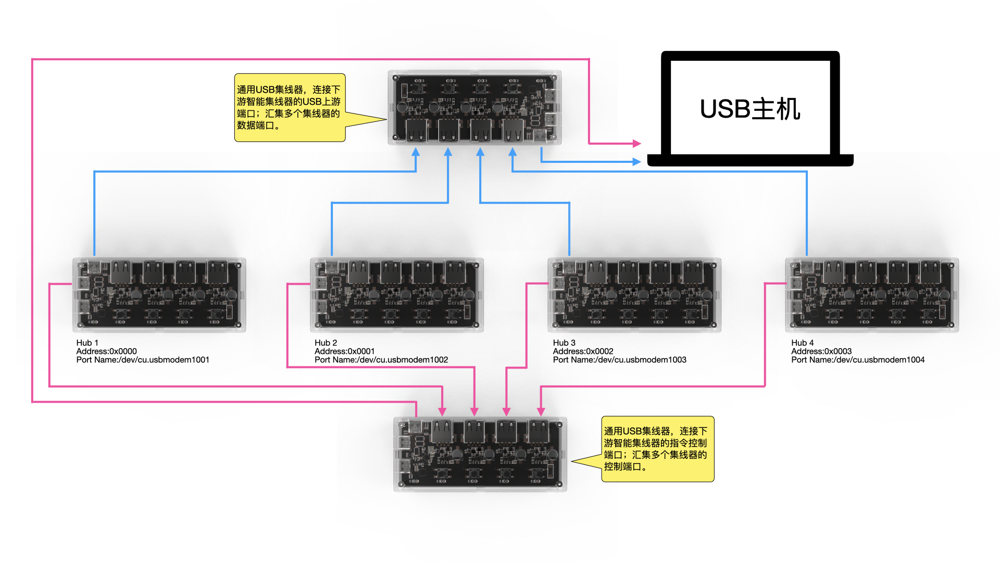
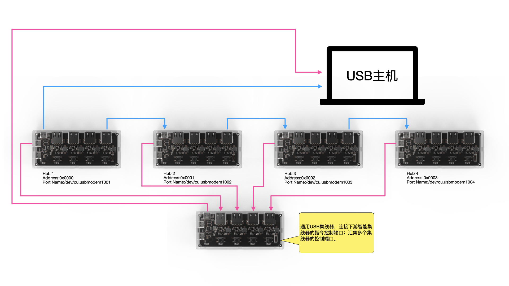

# SmartUSBHub 通信协议

[English](./protocol.md)

[下载 PDF](./downloads/protocol-zh.pdf)

[产品文档](./README_cn.md) · [Python SDK](../README_cn.md)

本文档说明 SmartUSBHub 系列共用的串口通信参数、协议帧格式、完整指令集及命令示例。不同产品支持的通道数量和可选功能可能不同；下文的通道值与命令帧主要以 4 通道型号为例。

## 文档导航

- [指令集](#指令集)
- [帧格式](#帧格式)
- [命令示例](#命令示例)
- [产品文档](./README_cn.md)
- [Python SDK](../README_cn.md)

## **指令集**

**设备通过简易的请求-响应通信协议进行交互控制，有以下命令**：

| **功能分类**           | **指令码** | **描述说明**                                                 |
| :--------------------- | ---------- | ------------------------------------------------------------ |
| 控制通道电源开关       | 0x01       | 控制指定通道的VBUS供电状态                                   |
| 查询通道电源状态       | 0x00       | 查询通道当前VBUS供电是否开启                                 |
| 控制互锁模式下电源开关 | 0x02       | 通道互锁下，仅允许一路通道电源开启                           |
| 查询电压采样           | 0x03       | 查询通道VBUS电压值（单位：mV）                               |
| 查询电流采样           | 0x04       | 查询通道电流值（单位：mA）                                   |
| 控制USB数据开关        | 0x05       | 控制D+/D−是否连通                                            |
| 查询USB差分线状态      | 0x08       | 查询D+/D−当前开关状态                                        |
| 设置按键控制权限       | 0x09       | 使能或禁用按键控制功能                                       |
| 查询按键控制权限       | 0x0A       | 查询当前是否启用按键控制                                     |
| 设置电源默认状态       | 0x0B       | 配置上电后VBUS默认开启/关闭                                  |
| 查询电源默认状态       | 0x0C       | 查询通道电源默认状态                                         |
| 设置数据连通的默认状态 | 0x0D       | 配置D+/D−默认开关状态                                        |
| 查询数据连通的默认状态 | 0x0E       | 查询D+/D−默认状态                                            |
| 设置断电状态记忆       | 0x0F       | 开启/关闭通道状态记忆                                        |
| 查询断电保存状态       | 0x10       | 查询是否启用断电状态记忆功能                                 |
| 设置设备地址           | 0x11       | 设置设备的地址，用于在多台集线器连接的场景中，标识和区分各个集线器 |
| 获取设备地址           | 0x12       | 获取设备的地址，用于在多台集线器连接的场景中，标识和区分各个集线器 |
| 设置工作模式           | 0x06       | 切换普通/互锁模式                                            |
| 查询工作模式           | 0x07       | 查询当前工作模式                                             |
| 恢复出厂设置           | 0xFC       | 恢复出厂设置                                                 |
| 查询固件版本号         | 0xFD       | 查询设备固件版本                                             |
| 查询硬件版本号         | 0xFE       | 查询当前硬件版本                                             |


## 帧格式

SmartUSBHub 在同一串口上使用 V1、V2、V3 三种帧。以下布局图中的数字为位偏移，每个普通字段占 8 位（1 字节）。

### V1 帧：单数据字节

| 偏移 | 字段 | 长度 | 说明 |
| ---: | --- | ---: | --- |
| 0 | SOF1 | 1 | 固定为 `0x55` |
| 1 | SOF2 | 1 | 固定为 `0x5A` |
| 2 | CMD | 1 | 指令码 |
| 3 | CHANNEL | 1 | 通道位掩码；bit0 对应通道 1 |
| 4 | VALUE | 1 | 单字节命令参数或状态 |
| 5 | SUM8 | 1 | `(CMD + CHANNEL + VALUE) & 0xFF` |

V1 总长度固定为 6 字节，适用于大多数设置、查询和应答。

### V2 帧：双数据字节

| 偏移 | 字段 | 长度 | 说明 |
| ---: | --- | ---: | --- |
| 0–1 | SOF | 2 | 固定为 `55 5A` |
| 2 | CMD | 1 | 指令码 |
| 3 | CHANNEL | 1 | 通道位掩码 |
| 4 | VALUE0 | 1 | 电压/电流值的高字节，或 `enable` 字段 |
| 5 | VALUE1 | 1 | 电压/电流值的低字节，或 `status` 字段 |
| 6 | SUM8 | 1 | `(CMD + CHANNEL + VALUE0 + VALUE1) & 0xFF` |

V2 总长度固定为 7 字节。目前用于电压、电流以及默认电源/数据线状态等包含两个数据字节的应答。16 位测量值按 `VALUE0 << 8 | VALUE1` 解析。

### V3 帧：变长数据

| 偏移 | 字段 | 长度 | 说明 |
| ---: | --- | ---: | --- |
| 0–3 | MAGIC | 4 | 固定为 `55 AB CD EF` |
| 4 | CMD | 1 | 指令码 |
| 5 | FLAGS | 1 | bit0=`STREAM`；置位表示主动流式上报 |
| 6–7 | LENGTH | 2 | Payload 长度，小端序：`LEN_L, LEN_H` |
| 8–9 | CRC16 | 2 | 小端序：`CRC_L, CRC_H` |
| 10… | PAYLOAD | LENGTH | 命令相关的变长数据 |

V3 帧总长度为 `10 + LENGTH` 字节，当前最大 64 字节，因此 Payload 最大 54 字节。CRC16 参数为多项式 `0x8005`、初始值 `0xFFFF`；计算时先将帧内 CRC 字段的两个字节置零，再覆盖从 MAGIC 到 Payload 末尾的完整帧。V3 用于批量测量、测量流、通道名称、设备别名和调试日志等变长数据。

> [!NOTE]
> SDK 会根据指令自动选择和解析帧版本，普通 API 调用不需要手动指定 V1、V2 或 V3。


## **命令示例**

> [!NOTE]
>
> - **以下所有数据内容均为16进制。**
> - **通道值的取值为`Channel_e`，<u>并非通道数字</u>，在控制和查询命令集中可用位或批量控制和查询；若设备处于互锁模式，<u>则只能使用互锁控制命令[0x02]，按位与无效</u>。**
> - **发送的帧格式或错误命令将不会响应。**
> - **按键按下时将会上报当前按下的通道状态[0x00]。**
> - **在资料包中的uart_tool中，有串口助手便于快速上手。**
> - **提供python控制库[smartusbhub](https://github.com/mixedsignal-labs/smartusbhub)**
> - **下文将`USB下游端口`称为`通道`。**

**通道值**：

```c
typedef enum
{
    CH1 = 0x01,
    CH2 = 0x02,
    CH3 = 0x04,
    CH4 = 0x08,
    CH5 = 0x10,
    CH6 = 0x20,
    CH7 = 0x40,
}Channel_e;

```
实际可用通道数量由产品型号决定：4 通道产品使用 CH1 - CH4，7 通道产品使用 CH1 - CH7。

> [!NOTE]
>
> **设备通信参数**：
>
> - **波特率：115200 - 921600** 默认：`115200`
> - **数据位：8**
> - **校验位：无**
> - **停止位：1**
>
> **设备名称**：
>
> - **Windows平台:  `COMx`**
> - **Linux平台: `/dev/ttyACMx`**
> - **macOS平台: `/dev/cu.usbmodemx`**


### **控制通道电源开关(CMD:0x01)**

> [!NOTE]
>
> **若设备处于互锁模式下，则控制指令(CMD:0x01)无效，需要使用互锁控制命令(CMD:0x02)控制；**
>
> **若处于互锁模式下，发送控制指令，将会返回指令无效帧**：
>
> **指令无效**：
>
> ```
> 55 5A 01 FF FF FF
> ```

#### **data域描述：**

| data[0]     | data[1]        |
| ----------- | -------------- |
| 通道号      | 通道电源开关值 |
| `Channel_e` | 0 (OFF), 1(ON) |


#### **打开通道1电源**

**命令**：

```
55 5A 01 01 01 03
```

**返回**：

```
55 5A 01 01 01 03
```

#### **关闭通道1电源**

**命令**：

```
55 5A 01 01 00 02
```

**返回**：

```
55 5A 01 01 00 02
```

#### **打开通道2电源**

**命令**：

```
55 5A 01 02 01 04
```

**返回**：

```
55 5A 01 02 01 04
```

#### **关闭通道2电源**

**命令**：

```
55 5A 01 02 00 03
```

**返回**：

```
55 5A 01 02 00 03
```

#### **打开通道3电源**

**命令**：

```
55 5A 01 04 01 06
```

**返回**：

```
55 5A 01 04 01 06
```

#### **关闭通道3电源**

**命令**：

```
55 5A 01 04 00 05
```

**返回**：

```
55 5A 01 04 00 05
```

#### **打开通道4电源**

**命令**：

```
55 5A 01 08 01 0A
```

**返回**：

```
55 5A 01 08 01 0A
```

#### **关闭通道4电源**

**命令**：

```
55 5A 01 08 00 09
```

**返回**：

```
55 5A 01 08 00 09
```

#### **组合控制示例**

#### **打开通道1和通道3电源**

**命令**：

```
55 5A 01 05 01 07
```

**返回**：

```
55 5A 01 05 01 07
```

#### **关闭通道1和通道3电源**

**命令**：

```
55 5A 01 05 00 06
```

**返回**：

```
55 5A 01 05 00 06
```

#### **打开所有通道电源**

**命令**：

```
55 5A 01 0F 01 11
```

**返回**：

```
55 5A 01 0F 01 11
```

#### **关闭所有通道电源**

**命令**：

```
55 5A 01 0F 00 10
```

**返回**：

```
55 5A 01 0F 00 10
```


### **查询通道电源开关值(CMD:0x00)**

#### **data域描述：**

| data[0]     | data[1]        |
| ----------- | -------------- |
| 通道号      | 通道电源开关值 |
| `Channel_e` | 0 (OFF), 1(ON) |


#### **查询通道1电源的开关值**

**命令**：

```
55 5A 00 01 00 01
```

**返回**：

**如果通道1电源关闭**：

```
55 5A 00 01 00 01
```

**如果通道1电源打开**：

```
55 5A 00 01 01 02
```

#### **查询通道2电源的开关值**

**命令**：

```
55 5A 00 02 00 02
```

**返回**：

**如果通道2电源关闭**：

```
55 5A 00 02 00 02
```

**如果通道2电源打开**：

```
55 5A 00 02 01 03
```

#### **查询通道3电源的开关值**

**命令**：

```
55 5A 00 04 00 04
```

**返回**：

**如果通道3电源关闭**：

```
55 5A 00 04 00 04
```

**如果通道3电源打开**：

```
55 5A 00 04 01 05
```

#### **查询通道4电源的开关值**

**命令**：

```
55 5A 00 08 00 08
```

**返回**：

**如果通道4电源关闭**：

```
55 5A 00 08 00 08
```

**如果通道4电源打开**：

```
55 5A 00 08 01 09
```

#### **组合控制示例**：

#### **查询所有通道的电源开关值**

**命令**：

```
55 5A 00 0F 00 0F
```

**返回**：

```
55 5A 00 01 01 02
55 5A 00 02 00 02
55 5A 00 04 00 04
55 5A 00 08 01 09
```

- **通道1电源：打开**

- **通道2电源：关闭**

- **通道3电源：关闭**

- **通道4电源：打开**


### **控制通道USB 数据开关 (CMD:0x05)**

**设备可控制指定通道的USB差分对（D+ D-）的通断，从而满足保持供电但断开数据的应用场景。**

> [!NOTE]
>
> 1. **设备默认每个通道的USB 数据信号是连通的，除非用户发送控制通道数据开关指令(CMD:0x05)手动切断。**
> 2. **如果启用断电状态记忆，数据开关状态将记忆。**

#### **data域描述：**

| data[0]     | data[1]        |
| ----------- | -------------- |
| 通道号      | 通道数据开关值 |
| `Channel_e` | 0 (OFF), 1(ON) |


#### **连通通道1数据**

**命令**：

```
55 5A 05 01 01 07
```

**返回**：

```
55 5A 05 01 01 07
```

#### **断开通道1数据**

**命令**：

```
55 5A 05 01 00 06
```

**返回**：

```
55 5A 05 01 00 06
```

#### **连通通道2数据**

**命令**：

```
55 5A 05 02 01 08
```

**返回**：

```
55 5A 05 02 01 08
```

#### **断开通道2数据**

**命令**：

```
55 5A 05 02 00 07
```

**返回**：

```
55 5A 05 02 00 07
```

#### **连通通道3数据**

**命令**：

```
55 5A 05 04 01 0A
```

**返回**：

```
55 5A 05 04 01 0A
```

#### **断开通道3数据**

**命令**：

```
55 5A 05 04 00 09
```

**返回**：

```
55 5A 05 04 00 09
```

#### **连通通道4数据**

**命令**：

```
55 5A 05 08 01 0E
```

**返回**：

```
55 5A 05 08 01 0E
```

#### **断开通道4数据**

**命令**：

```
55 5A 05 08 00 0D
```

**返回**：

```
55 5A 05 08 00 0D
```

#### **组合控制示例**：

#### **连通所有通道数据**

**命令**：

```
55 5A 05 0F 01 15
```

**返回**：

```
55 5A 05 0F 01 15
```

#### **断开所有通道数据**

**命令**：

```
55 5A 05 0F 00 14
```

**返回**：

```
55 5A 05 0F 00 14
```


### **查询通道USB 数据开关值(CMD:0x08)**

#### **data域描述：**

| data[0]     | data[1]        |
| ----------- | -------------- |
| 通道号      | 通道数据开关值 |
| `Channel_e` | 0 (OFF), 1(ON) |


#### **查询通道1数据的连通状态**

**命令**：

```
55 5A 08 01 00 09
```

**返回**：

**如果通道1数据断开**：

```
55 5A 08 01 00 09
```

**如果通道1数据连通**：

```
55 5A 08 01 01 0A
```

#### **查询通道2数据的连通状态**

**命令**：

```
55 5A 08 02 00 0A
```

**返回**：

**如果通道2数据断开**：

```
55 5A 08 02 00 0A
```

**如果通道2数据连通**：

```
55 5A 08 02 01 0B
```

#### **查询通道3数据的连通状态**

**命令**：

```
55 5A 08 04 00 0C
```

**返回**：

**如果通道3数据断开**：

```
55 5A 08 04 00 0C
```

**如果通道3数据连通**：

```
55 5A 08 04 01 0D
```

#### **查询通道4数据的连通状态**

**命令**：

```
55 5A 08 08 00 10
```

**返回**：

**如果通道4数据断开**：

```
55 5A 08 08 00 10
```

**如果通道4数据连通**：

```
55 5A 08 08 01 11
```

#### **组合控制示例**：

#### **查询所有通道的数据连通状态**

**命令**：

```
55 5A 08 0F 00 17
```

**返回**：

```
55 5A 08 01 01 0A
55 5A 08 02 01 0B
55 5A 08 04 01 0D
55 5A 08 08 01 11
```

- **通道1数据：连通**

- **通道2数据：连通**

- **通道3数据：连通**

- **通道4数据：连通**


### **控制互锁模式下电源开关(CMD:0x02)**

> [!IMPORTANT]
> 互锁模式下只能使用本互锁指令选择供电通道，普通电源指令（CMD:0x01）不能控制通道。通道电源关闭时，数据线也会随之断开；协议指令 0x02 本身控制电源，如需控制所选通道的 USB2 数据线，请使用数据线指令（CMD:0x05）。

**控制真值表**：

| 通道1    | 通道2    | 通道3    | 通道4    |
| -------- | -------- | -------- | -------- |
| 关闭     | 关闭     | 关闭     | 关闭     |
| **打开** | 关闭     | 关闭     | 关闭     |
| 关闭     | **打开** | 关闭     | 关闭     |
| 关闭     | 关闭     | **打开** | 关闭     |
| 关闭     | 关闭     | 关闭     | **打开** |

#### **data域描述：**

| data[0]     | data[1]        |
| ----------- | -------------- |
| 通道号      | 通道电源开关值 |
| `Channel_e` | 0 (OFF), 1(ON) |


#### **打开通道1电源，其余通道关闭**

**命令**：

```
55 5A 02 01 01 04
```

**返回**：

```
55 5A 02 01 01 04
```

#### **打开通道2电源，其余通道关闭**

**命令**：

```
55 5A 02 02 01 05
```

**返回**：

```
55 5A 02 02 01 05
```

#### **打开通道3电源，其余通道关闭**

**命令**：

```
55 5A 02 04 01 07
```

**返回**：

```
55 5A 02 04 01 07
```

#### **打开通道4电源，其余通道关闭**

**命令**：

```
55 5A 02 08 01 0B
```

**返回**：

```
55 5A 02 08 01 0B
```


#### **关闭所有通道**

**命令**：

```
55 5A 02 0F 01 12
```

**返回**：

```
55 5A 02 0F 01 12
```


### **查询通道电压(CMD:0x03)**

> [!NOTE]
>
> - 设备可测量每一路通道输出端(VBUS)的电压值，可用于判断总线是否正常。
>
> - 电压单位为mv
>
> - 电压分辨率为0.1V

#### **data域描述：**

| data[0]     | data[1]          | data[2]         |
| ----------- | ---------------- | --------------- |
| 通道号      | 通道电压值[15:8] | 通道电压值[7:0] |
| `Channel_e` | -                | -               |


#### **查询通道1的电压值**：

**命令**：

```
55 5A 03 01 00 04
```

**返回**：

```
55 5A 03 01 13 56 6D
```

**通道1电压值为：0x1356 = 4950mv (通道打开)**

#### **查询通道2的电压值**：

**命令**：

```
55 5A 03 02 00 05
```

**返回**：

```
55 5A 03 02 00 0C 11
```

**通道2电压值为：0x000C = 12mv (通道关闭)**

#### **查询通道3的电压值**：

**命令**：

```
55 5A 03 04 00 07
```

**返回**：

```
55 5A 03 04 00 09 10
```

**通道3电压值为：0x0009  = 9mv (通道关闭)**

#### **查询通道4的电压值**：

**命令**：

```
55 5A 03 08 00 0B
```

**返回**：

```
55 5A 03 08 00 08 13
```

**通道4电压值为：0x0008  = 8mv (通道关闭)**


### **查询通道电流(CMD:0x04)**

> [!NOTE]
>
> 设备可测量每一路通道的电流值，可用于判断设备工作状态。
>
> 电流单位为mA
>
> 电流分辨率为0.1A

#### **data域描述：**

| data[0]     | data[1]          | data[2]         |
| ----------- | ---------------- | --------------- |
| 通道号      | 通道电流值[15:8] | 通道电流值[7:0] |
| `Channel_e` | -                | -               |


#### **查询通道1的电流值**：

**命令**：

```
55 5A 04 01 00 05
```

**返回**：

```
55 5A 04 01 01 29 2F
```

**通道1电流值为：0x0129  = 297ma**

#### **查询通道2的电流值**：

**命令**：

```
55 5A 04 02 00 06
```

**返回**：

```
55 5A 04 02 00 00 06
```

**通道2电流值为：0x0000  = 0ma**

#### **查询通道3的电流值**：

**命令**：

```
55 5A 04 04 00 08
```

**返回**：

```
55 5A 04 04 00 00 08
```

**通道3电流值为：0x0000  = 0ma**

#### **查询通道4的电流值**：

**命令**：

```
55 5A 04 08 00 0C
```

**返回**：

```
55 5A 04 08 00 00 0C
```

**通道4电流值为：0x0000  = 0ma**


### **设置按键控制权限(CMD:0x09)**

> [!NOTE]
>
> 1. **设备默认能通过按键控制对应通道。**
>
> 2. **该配置影响范围为所有按键及通道。**
>
> 3. **长按功能不受影响。**
>
> 4. **该指令断电仍然保存。**

#### **data域描述：**

| data[0] | data[1]             |
| ------- | ------------------- |
| 固定    | 启用按键            |
| 0x00    | 0 (false), 1 (true) |


#### **禁用通过按键控制**

**命令**：

```
55 5A 09 00 00 09
```

**返回**：

```
55 5A 09 00 00 09
```

#### **启用通过按键控制**

**命令**：

```
55 5A 09 00 01 0A
```

**返回**：

```
55 5A 09 00 01 0A
```


### **查询按键控制权限(CMD:0x0A)**

#### **data域描述：**

| data[0] | data[1]             |
| ------- | ------------------- |
| 固定    | 启用按键            |
| 0x00    | 0 (false), 1 (true) |


**命令**：

```
55 5A 0A 00 00 0A
```

**返回**：

**启用按键控制**

```
55 5A 0A 00 01 0B
```

**关闭按键控制功能**

```
55 5A 0A 00 00 0A
```


### **设置通道电源默认状态(CMD:0x0B)**

> [!NOTE]
>
> - **在系统上电后的通道状态判断中，默认通道状态优先级高于断电状态记忆功能。当默认通道状态功能开启时，即使断电状态记忆功能也处于开启状态，系统上电后仍将按照默认通道状态决定各通道电源或数据的开启/关闭状态。**
>
> - **当默认通道状态功能关闭时，通道的上电状态将依据断电状态记忆功能的设置决定。若断电状态记忆功能也处于关闭状态（默认配置），则系统上电后所有通道默认保持关闭状态。**
>
> - **出厂配置默认所有通道的电源都是关闭的。**

#### **data域描述：**

| data[0]     | data[1]             | data[2]        |
| :---------- | ------------------- | -------------- |
| 通道号      | 启用电源默认状态    | 默认值         |
| `Channel_e` | 0 (false), 1 (true) | 0 (OFF), 1(ON) |


#### **设置通道1电源默认状态为打开**


**命令**：

```
55 5A 0B 01 01 01 0E
```

**返回**：

```
55 5A 0B 01 01 01 0E
```


#### **设置通道1电源默认状态为关闭**

**命令**：

```
55 5A 0B 01 01 00 0D
```

**返回**：

```
55 5A 0B 01 01 00 0D
```


#### **设置通道2电源默认状态为打开**


**命令**：

```
55 5A 0B 02 01 01 0F
```

**返回**：

```
55 5A 0B 02 01 01 0F
```


#### **设置通道2电源默认状态为关闭**


**命令**：

```
55 5A 0B 02 01 00 0E
```

**返回**：

```
55 5A 0B 02 01 00 0E
```


#### **设置通道3电源默认状态为打开**


**命令**：

```
55 5A 0B 04 01 01 11
```

**返回**：

```
55 5A 0B 04 01 01 11
```


#### **设置通道3电源默认状态为关闭**


**命令**：

```
55 5A 0B 04 00 00 0F
```

**返回**：

```
55 5A 0B 04 00 00 0F
```


#### **设置通道4电源默认状态为打开**


**命令**：

```
55 5A 0B 08 01 01 15
```

**返回**：

```
55 5A 0B 08 01 01 15
```


#### **设置通道4电源默认状态为关闭**


**命令**：

```
55 5A 0B 08 01 00 14
```

**返回**：

```
55 5A 0B 08 01 00 14
```


#### **设置所有通道电源默认状态为打开**


**命令**：

```
55 5A 0B 0F 01 01 1C
```

**返回**：

```
55 5A 0B 0F 01 01 1C
```


#### **设置所有通道电源默认状态为关闭**


**命令**：

```
55 5A 0B 0F 01 00 1B
```

**返回**：

```
55 5A 0B 0F 01 00 1B
```


#### **禁用通道1电源使用默认状态**

**命令**：

```
55 5A 0B 01 00 00 0C
```

**返回**：

```
55 5A 0B 01 00 00 0C
```


#### **禁用通道2电源使用默认状态**


**命令**：

```
55 5A 0B 02 00 00 0D
```

**返回**：

```
55 5A 0B 02 00 00 0D
```


#### **禁用通道3电源使用默认状态**


**命令**：

```
55 5A 0B 04 00 00 0F
```

**返回**：

```
55 5A 0B 04 00 00 0F
```


#### **禁用通道4电源使用默认状态**


**命令**：

```
55 5A 0B 08 00 00 13
```

**返回**：

```
55 5A 0B 08 00 00 13
```


#### **禁用所有通道电源使用默认状态**


**命令**：

```
55 5A 0B 0F 00 00 1A
```

**返回**：

```
55 5A 0B 0F 00 00 1A
```


### **查询通道电源默认状态(CMD:0x0C)**

#### **data域描述：**

| data[0]     | data[1]             | data[2]        |
| :---------- | ------------------- | -------------- |
| 通道号      | 启用电源默认状态    | 默认值         |
| `Channel_e` | 0 (false), 1 (true) | 0 (OFF), 1(ON) |


#### **查询通道1的电源默认状态**

**命令**：

```
55 5A 0C 01 00 00 0D
```

**返回**：

**默认状态禁用**

```
55 5A 0C 01 00 00 0D
```

**默认关闭**

```
55 5A 0C 01 00 00 0D
```
**默认开启**

```
55 5A 0C 01 01 01 0F
```


#### **查询通道2的电源默认状态**

**命令**：

```
55 5A 0C 02 00 00 0E
```

**返回**：

**默认状态禁用**

```
55 5A 0C 02 00 00 0E
```

**默认关闭**

```
55 5A 0C 02 00 00 0E
```
**默认开启**

```
55 5A 0C 02 01 01 10
```

#### **查询通道3的电源默认状态**

**命令**：

```
55 5A 0C 04 00 00 10
```

**返回**：

**默认状态禁用**

```
55 5A 0C 04 00 00 10
```

**默认关闭**

```
55 5A 0C 04 00 00 10
```
**默认开启**

```
55 5A 0C 04 01 01 12
```

#### **查询通道4的电源默认状态**

**命令**：

```
55 5A 0C 08 00 00 14
```

**返回**：

**默认状态禁用**

```
55 5A 0C 08 00 00 14
```

**默认关闭**

```
55 5A 0C 08 00 00 14
```
**默认开启**

```
55 5A 0C 08 01 01 16
```


#### **查询所有通道的电源默认状态**

**命令**：

```
55 5A 0C 0F 00 00 1B
```

**返回**：

```
55 5A 0C 01 01 01 0F
55 5A 0C 02 01 01 10
55 5A 0C 04 01 01 12
55 5A 0C 08 01 01 16
```
- **通道1电源: 默认开启**

- **通道2电源: 默认开启**

- **通道3电源: 默认开启**

- **通道4电源: 默认开启**


### **设置通道数据连通的默认状态(CMD:0x0D)**

> [!NOTE]
>
> - **在系统上电后的通道状态判断中，默认通道状态优先级高于断电状态记忆功能。当默认通道状态功能开启时，即使断电状态记忆功能也处于开启状态，系统上电后仍将按照默认通道状态决定各通道电源或数据的开启/关闭状态。**
>
> - **当默认通道状态功能关闭时，通道的上电状态将依据断电状态记忆功能的设置决定。若断电状态记忆功能也处于关闭状态（默认配置），则系统上电后所有通道默认保持关闭状态。**
> - **出厂配置默认所有通道的数据都是联通的。**

#### **data域描述：**

| data[0]     | data[1]              | data[2]                    |
| :---------- | -------------------- | -------------------------- |
| 通道号      | 启用数据连接默认状态 | 默认值                     |
| `Channel_e` | 0 (false), 1 (true)  | 0 (disconnect), 1(connect) |


#### **设置通道1数据连通的默认状态为连接**


**命令**：

```
55 5A 0D 01 01 01 10
```

**返回**：

```
55 5A 0D 01 01 01 10
```


#### **设置通道1数据连通的默认状态为断开**


**命令**：

```
55 5A 0D 01 01 00 0F
```

**返回**：

```
55 5A 0D 01 01 00 0F
```


#### **设置通道2数据连通的默认状态为连接**


**命令**：

```
55 5A 0D 02 01 01 11
```

**返回**：

```
55 5A 0D 02 01 01 11
```


#### **设置通道2数据连通的默认状态为断开**


**命令**：

```
55 5A 0D 02 01 00 10
```

**返回**：

```
55 5A 0D 02 01 00 10
```


#### **设置通道3数据连通的默认状态为连接**


**命令**：

```
55 5A 0D 04 01 01 13
```

**返回**：

```
55 5A 0D 04 01 01 13
```


#### **设置通道3数据连通的默认状态为断开**


**命令**：

```
55 5A 0D 04 01 00 12
```

**返回**：

```
55 5A 0D 04 01 00 12
```


#### **设置通道4数据连通的默认状态为连接**


**命令**：

```
55 5A 0D 08 01 01 17
```

**返回**：

```
55 5A 0D 08 01 01 17
```


#### **设置通道4数据连通的默认状态为断开**


**命令**：

```
55 5A 0D 08 01 00 16
```

**返回**：

```
55 5A 0D 08 01 00 16
```


#### **设置所有通道数据连通的默认状态为连接**


**命令**：

```
55 5A 0D 0F 01 01 1E
```

**返回**：

```
55 5A 0D 0F 01 01 1E
```


#### **设置所有通道数据连通的默认状态为断开**


**命令**：

```
55 5A 0D 0F 01 00 1D
```

**返回**：

```
55 5A 0D 0F 01 00 1D
```


#### **禁用通道1通道数据使用默认状态**


**命令**：

```
55 5A 0D 01 00 00 0E
```

**返回**：

```
55 5A 0D 01 00 00 0E
```


#### **禁用通道2通道数据连接使用默认状态**


**命令**：

```
55 5A 0D 02 00 00 0F
```

**返回**：

```
55 5A 0D 02 00 00 0F
```


#### **禁用通道3通道数据连接使用默认状态**


**命令**：

```
55 5A 0D 04 00 00 11
```

**返回**：

```
55 5A 0D 04 00 00 11
```


#### **禁用通道4通道数据连接使用默认状态**


**命令**：

```
55 5A 0D 08 00 00 15
```

**返回**：

```
55 5A 0D 08 00 00 15
```


#### **禁用所有通道数据连接使用默认状态**


**命令**：

```
55 5A 0D 0F 00 01 1D
```

**返回**：

```
55 5A 0D 0F 00 01 1D
```


### **查询通道数据连通的默认状态(CMD:0x0E)**

#### **data域描述：**

| data[0]     | data[1]              | data[2]                    |
| :---------- | -------------------- | -------------------------- |
| 通道号      | 启用数据连接默认状态 | 默认值                     |
| `Channel_e` | 0 (false), 1 (true)  | 0 (disconnect), 1(connect) |


#### **查询通道1数据连通的默认状态**

**命令**：

```
55 5A 0E 01 00 00 0F
```

**返回**：

**默认状态禁用，数据默认连接**：

```
55 5A 0E 01 00 01 10
```

**默认状态启用，数据默认断开**：

```
55 5A 0E 01 01 00 10
```

**默认状态启用，数据默认连接**：

```
55 5A 0E 01 01 01 11
```

#### **查询通道2数据连通的默认状态**

**命令**：

```
55 5A 0E 02 00 00 10
```

**返回**：

**默认状态禁用，数据默认连接**：

```
55 5A 0E 02 00 01 11
```

**默认状态启用，数据默认断开**：

```
55 5A 0E 02 01 00 11
```

**默认状态启用，数据默认连接**：

```
55 5A 0E 02 01 01 12
```

#### **查询通道3数据连通的默认状态**

**命令**：

```
55 5A 0E 04 00 00 12
```

**返回**：

**默认状态禁用，数据默认连接**：

```
55 5A 0E 04 00 01 13
```

**默认状态启用，数据默认断开**：

```
55 5A 0E 04 01 00 13
```

**默认状态启用，数据默认连接**：

```
55 5A 0E 04 01 01 14
```

#### **查询通道4数据连通的默认状态**

**命令**：

```
55 5A 0E 08 00 00 16
```

**返回**：

**默认状态禁用，数据默认连接。**

```
55 5A 0E 08 00 01 17
```

**默认状态启用，数据默认断开**：

```
55 5A 0E 08 01 00 17
```

**默认状态启用，数据默认连接**：

```
55 5A 0E 08 01 01 18
```


#### **查询所有通道数据连通的默认状态**

**命令**：

```
55 5A 0E 0F 00 00 1D
```

**返回**：

- **通道1数据: 默认状态禁用，数据默认连接。**
- **通道2数据: 默认状态禁用，数据默认连接。**
- **通道3数据: 默认状态禁用，数据默认连接。**
- **通道4数据: 默认状态禁用，数据默认连接。**

```
55 5A 0E 01 00 01 10
55 5A 0E 02 00 01 11
55 5A 0E 04 00 01 13
55 5A 0E 08 00 01 17
```


- **通道1数据: 默认状态启用，数据默认断开。**
- **通道2数据: 默认状态启用，数据默认断开。**
- **通道3数据: 默认状态启用，数据默认断开。**
- **通道4数据: 默认状态启用，数据默认断开。**

```
55 5A 0E 01 01 00 10
55 5A 0E 02 01 00 11
55 5A 0E 04 01 00 13
55 5A 0E 08 01 00 17
```


### **设置断电状态记忆(CMD:0x0F)**


> [!NOTE]
>
> 此功能可通过长按`按键2`开启或者关闭，开启后，将自动保存当前的通道状态，重新上电将会恢复所有通道断电之前的状态

#### **data域描述：**

| data[0] | data[1]             |
| ------- | ------------------- |
| 固定    | 启用断电保存        |
| 0x00    | 0 (false), 1 (true) |


#### **启用断电状态记忆**


**命令**：

```
55 5A 0F 00 01 10
```

**返回**：

```
55 5A 0F 00 01 10
```


#### **关闭断电状态记忆**


**命令**：

```
55 5A 0F 00 00 0F
```

**返回**：

```
55 5A 0F 00 00 0F
```


### **查询断电状态记忆状态(CMD:0x10)**

#### **data域描述：**

| data[0] | data[1]             |
| ------- | ------------------- |
| 固定    | 启用断电保存        |
| 0x00    | 0 (false), 1 (true) |


**命令**：

```
55 5A 10 00 00 10
```

**返回**：

**断电状态记忆启用**

```
55 5A 10 00 01 11
```

**断电状态记忆禁用**

```
55 5A 10 00 00 10
```


### 设置设备地址(CMD:0x11)

> [!NOTE]
>
> - 设备地址用于在多台集线器连接的场景中，标识和区分各个集线器。
>
> - 地址的编号由用户自定义，其取值范围为: `0x0000 - 0xFFFF`
> - 地址默认值为`0x0000`
>
> 使用方法：
>
> 1. 为每台集线器分配唯一的设备地址（只需设置一次）
> 2. 在程序中依次读取所有已连接集线器的设备地址，并将其与各自对应的串口号或实例进行绑定
> 3. 完成上述步骤后，所有集线器即具备了明确的顺序编号和对应关系

#### 连接拓扑图

##### 拓扑结构1:

- 多个Hub的上游数据端口连接到一个上级的Hub

- 多个Hub的控制端口连接到一个上级的Hub

- 两个顶层的Hub连接到主机

该拓扑结构的可用端口为 *4n*



##### 拓扑结构2:

- 下一个Hub的上游数据端口连接到上一个Hub的下游数据端口
- 多个Hub的控制端口连接到一个上级的Hub
- 第一个Hub的上游数据端口连接到主机
- 控制端口的顶层的Hub连接到主机

该拓扑结构的可用端口为 *3n + 1*



#### **data域描述：**

| data[0]    | data[1]   |
| ---------- | --------- |
| 地址[15-8] | 地址[7-0] |
| -          | -         |


#### **例子**：

> 设置集线器地址为0x0001
>
> **命令**：
>
> ```
> 55 5A 11 00 01 12
> ```
>
> **返回**：
>
> ```
> 55 5A 11 00 01 12
> ```
>


### 获取设备地址(CMD:0x12)

#### **data域描述：**

| data[0]    | data[1]   |
| ---------- | --------- |
| 地址[15-8] | 地址[7-0] |
| -          | -         |


#### **例子**：

> 获取集线器地址
>
> **命令**：
>
> ```
> 55 5A 12 00 00 12
> ```
>
> **返回**：
>
> ```
> 55 5A 12 00 01 13
> ```
>
> 该集线器地址为：0x0001


### 设置工作模式(CMD:0x06)

> [!NOTE]
>
> **设备两种工作模式**：
>
> 1. **普通模式：该模式每个通道都可任意控制。**
> 2. **互锁模式：该模式下各个通道为互斥状态，同一时刻只有一个通道打开。**
>
> - **该指令断电仍然保存。**
> - **可以通过长按`按键1`3秒以上切换工作模式，可通过指示灯状态确定当前工作模式。**

#### **data域描述：**

| data[0] | data[1]                    |
| ------- | -------------------------- |
| 固定    | 工作模式                   |
| 0x00    | 0 (普通模式), 1 (互锁模式) |


#### **设置普通模式**

**命令**：

```
55 5A 06 00 00 06
```

**返回**：

```
55 5A 06 00 00 06
```

#### **设置互锁模式**

**命令**：

```
55 5A 06 00 01 07
```

**返回**：

```
55 5A 06 00 01 07
```


### **查询工作模式(CMD:0x07)**

#### **data域描述：**

| data[0] | data[1]                    |
| ------- | -------------------------- |
| 固定    | 工作模式                   |
| 0x00    | 0 (普通模式), 1 (互锁模式) |


**命令**：

```
55 5A 07 00 00 07
```

**返回**：

**设备处于普通模式下**：

```
55 5A 07 00 00 07
```

**设备处于互锁模式下**：

```
55 5A 07 00 01 08
```


### **恢复出厂设置(CMD:0xFC)**

#### **data域描述：**

| data[0] | data[1] |
| ------- | ------- |
| 固定    | 固定    |
| 0x00    | 0x00    |


**命令**：

```
55 5A FC 00 00 FC
```

**返回**：

```
55 5A FC 00 00 FC
```


### **查询固件版本(CMD:0xFD)**

#### **data域描述：**

| data[0]      | data[1]     |
| ------------ | ----------- |
| 版本号[15-8] | 版本号[7-0] |
| -            | -           |


**命令**：

```
55 5A FD 00 00 FD
```

**返回**：

```
55 5A FD 00 0F 0C
```

**固件版本号：15**


### **查询硬件版本(CMD:0xFE)**

#### **data域描述：**

| data[0]      | data[1]     |
| ------------ | ----------- |
| 版本号[15-8] | 版本号[7-0] |
| -            | -           |


**命令**：

```
55 5A FE 00 00 FE
```

**返回**：

```
55 5A FE 00 03 01
```

**硬件版本号：3 / V1.3**
